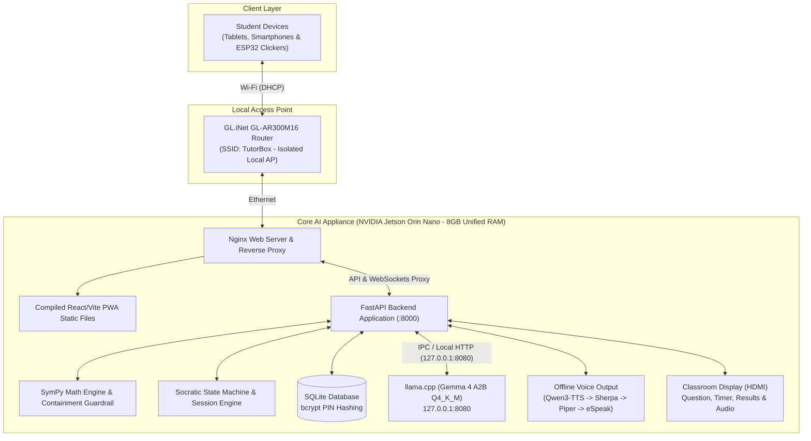

# TutorBox: Autonomous Offline Edge AI Socratic Educational Platform

[](https://github.com/GabGP/TutorBox/actions/workflows/ci-backend.yml)

<div align="center">

| 🏠 **TutorBox** | 📚 [Docs](docs/README.md) | ⚙️ [Backend](backend/README.md) | 📱 [PWA](pwa/README.md) | 🔌 [Infra](infra/README.md) |
| :---: | :---: | :---: | :---: | :---: |

📍 **Root Overview** • **Quick Links:** [Architecture](docs/README.md#1-system-architecture--appliance-modes) • [Roadmap](docs/milestones/roadmap.md) • [API Hub](docs/api/README.md) • [Database Schema](docs/database/README.md)

</div>

---

**TutorBox** is an offline Edge AI educational appliance designed for basic education students in rural and off-grid communities with zero internet connectivity. The appliance delivers interactive classroom quizzes, Socratic math tutoring, and offline educational games with dual-language voice output in Spanish and **K'iche'** (`quc_Latn`).

> [!NOTE]
> **Work in Progress**: This project is under active development as an engineering capstone project. Architecture, schemas, and features are subject to ongoing iteration.

---

## Table of Contents

- [1. Project Architecture](#1-project-architecture)
- [2. Hardware Topology](#2-hardware-topology)
- [3. Software & AI Stack](#3-software--ai-stack)
- [4. System Constraints & Guardrails](#4-system-constraints--guardrails)
- [5. Repository Structure](#5-repository-structure)
- [6. Quick Start](#6-quick-start)
- [7. Technical Documentation](#7-technical-documentation)
- [Next Steps](#next-steps)

---

## <a id="1-project-architecture"></a>1. Project Architecture

TutorBox operates on a local network topology consisting of an isolated Access Point and an integrated Edge AI Core Appliance.



---

## <a id="2-hardware-topology"></a>2. Hardware Topology

All components operate **100% offline** without WAN connectivity.

| Node | Hardware | Role & Responsibilities |
| :--- | :--- | :--- |
| **Core AI Appliance** | NVIDIA Jetson Orin Nano (8GB Unified RAM) | Hosts Nginx, the PWA, FastAPI, `llama.cpp`, offline Spanish/K'iche' audio, SymPy, SQLite, and classroom HDMI output. |
| **Wireless AP** | GL.iNet GL-AR300M16 Router | Isolated local Access Point broadcasting SSID `TutorBox` and handling DHCP. |

---

## <a id="3-software--ai-stack"></a>3. Software & AI Stack

* **Backend**: Python 3.11+, FastAPI, WebSockets, and SQLite with idempotent SQL migrations.
* **Frontend**: React / Vite Progressive Web App (PWA), hosted directly on the Jetson appliance via Nginx.
* **Deterministic Math Engine**: **SymPy** for mathematical parsing, algebraic verification, and equivalence checking.
* **LLM Engine**: **Gemma 4 A2B** quantized to `Q4_K_M` through `llama.cpp` (`llama-server`) on `127.0.0.1:8080`.
* **Voice Output**: Offline **Qwen3-TTS** is the current quality winner for Spanish. Automatic fallback order is **Qwen3-TTS -> Sherpa-ONNX -> Piper VITS -> eSpeak-ng**. eSpeak is robotic, but is retained as the ultimate availability safety net. Production WAV peaks are calibrated to `0.78`.
* **Student Input**: Mobile web clickers and physical ESP32 clickers (strictly zero voice/microphone input).

---

## <a id="4-system-constraints--guardrails"></a>4. System Constraints & Guardrails

1. **No LLM Math**: The LLM is prohibited from evaluating mathematical accuracy. SymPy is the sole authority.
2. **Containment Guardrail**: Mathematical answers are checked before any LLM response is returned.
3. **Audio Feedback & >51% Rule**: TTS speaks only when more than 51% of participating students select one diagnostic distractor; the teacher's device only plays server-synthesized audio.
4. **Security & Privacy**: Student PINs are hashed with `bcrypt` and never logged in plain text.
5. **Memory Budget**: Jetson unified memory is budgeted for classroom sessions and lifecycle-separated LLM/TTS workloads.

---

## <a id="5-repository-structure"></a>5. Repository Structure

```text
TutorBox/
├── backend/      # FastAPI application, Socratic logic, SymPy engine, offline voice, SQLite DB
├── pwa/          # Classroom web clients and static assets
├── infra/        # Systemd, Nginx, captive portal, and router runbooks
├── tools/        # Offline benchmarks and llama.cpp TTS daemon build toolchain
├── docs/         # Architecture specs, pedagogy, API documentation, and milestones
└── run.py        # One-command development and appliance startup runner
```

---

## <a id="6-quick-start"></a>6. Quick Start

TutorBox uses **[uv](https://docs.astral.sh/uv/)** for environment startup:

```bash
# 1. Install uv (if not already installed)
curl -LsSf https://astral.sh/uv/install.sh | sh

# 2. Boot everything with one command
./run.py
```

`run.py` checks prerequisites (`uv`, `espeak-ng`, local `llama-server`, `pnpm`), compiles the PWA, runs database migrations, seeds the question bank, and starts Uvicorn. Qwen3-TTS is discovered from the standard model cache and `llama-tts` locations; set `TTS_QWEN_BINARY` only for a non-standard install.

* **Teacher Host**: `http://localhost:8000/maestro/`
* **Student Voting**: `http://localhost:8000/alumno/`
* **Classroom Screen**: `http://localhost:8000/pantalla/`
* **API Documentation**: `http://localhost:8000/docs`

Or run directly with `uv`:

```bash
uv run --directory backend uvicorn main:app --app-dir src --reload
```

---

## <a id="7-technical-documentation"></a>7. Technical Documentation

* **[Documentation Portal](docs/README.md)**: Index and navigation hub for technical specifications.
* **[Voice Feedback Architecture](docs/architecture/voice-feedback.md)**: TTS hierarchy, CUDA verification, voices, peaks, and sample rates.
* **[Database Schema & ER Model](docs/database/README.md)**: SQLite schema, ER diagrams, indexes, and migrations.
* **[REST API Specifications](docs/api/README.md)**: Domain contracts, RBAC matrix, auth flows, and error formats.
* **[Backend Developer Guide](backend/README.md)**: Backend installation, local execution, benchmarking, and testing.

---

## Next Steps

* **[Explore the Documentation Portal](docs/README.md)**: Deep dive into the database schema, API contracts, and architecture.
* **[Setup Backend Environment](backend/README.md)**: Local developer setup, virtual environment, and testing instructions.
