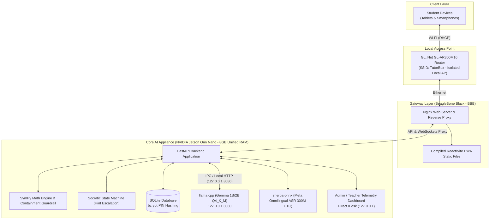

# TutorBox: Autonomous Offline Edge AI Socratic Educational Platform

[](https://github.com/GabGP/TutorBox/actions/workflows/ci-backend.yml)

> **TutorBox** • [Documentation](docs/README.md) • [Backend](backend/README.md) • [Frontend](pwa/README.md) • [Infrastructure](infra/README.md)

---

**TutorBox** is an offline Edge AI educational appliance designed for basic education students in rural and off-grid communities with zero internet connectivity. The system acts as a Socratic math tutor, communicating in the **K'iche' language** (`quc_Latn`) via voice and text.

> [!NOTE]
> **Work in Progress**: This project is under active development as an engineering capstone project. Architecture, schemas, and features are subject to ongoing iteration.

---

## Table of Contents
- [TutorBox: Autonomous Offline Edge AI Socratic Educational Platform](#tutorbox-autonomous-offline-edge-ai-socratic-educational-platform)
  - [Table of Contents](#table-of-contents)
  - [1. Project Architecture](#1-project-architecture)
  - [2. Hardware Topology](#2-hardware-topology)
  - [3. Software \& AI Stack](#3-software--ai-stack)
  - [4. System Constraints \& Guardrails](#4-system-constraints--guardrails)
  - [5. Repository Structure](#5-repository-structure)
  - [6. Technical Documentation](#6-technical-documentation)
  - [Next Steps](#next-steps)

---

## 1. Project Architecture

TutorBox operates on a local network topology consisting of an Access Point, a Headless Gateway, and an Edge AI Core Appliance.



---

## 2. Hardware Topology

All components operate **100% offline** without WAN connectivity.

| Node | Hardware | Role & Responsibilities |
| :--- | :--- | :--- |
| **Core AI Appliance** | NVIDIA Jetson Orin Nano (8GB Unified RAM) | Hosts FastAPI backend, `llama.cpp` LLM engine, `sherpa-onnx` ASR engine, SymPy validation, SQLite database, and the directly connected touchscreen Admin/Teacher Telemetry Dashboard kiosk (`127.0.0.1`). |
| **Headless Gateway** | BeagleBone Black (BBB) | Serves compiled React/Vite PWA static assets via Nginx and acts as a lightweight reverse proxy forwarding API and WebSocket traffic to the Jetson. |
| **Wireless AP** | GL.iNet GL-AR300M16 Router | Isolated local Access Point broadcasting SSID `TutorBox`, handling local DHCP IP assignments for student devices. |

---

## 3. Software & AI Stack

* **Backend**: Python 3.10+, FastAPI, WebSockets (real-time chat & room management), SQLite (with idempotent SQL migrations).
* **Frontend**: React / Vite Progressive Web App (PWA), mobile-first, served from the BBB gateway.
* **Deterministic Math Engine**: **SymPy** for all mathematical parsing, algebraic verification, and equivalence checking.
* **LLM Engine**: **Gemma 1B/2B** quantized to `Q4_K_M` running via `llama.cpp` (`llama-server`) bound strictly to `127.0.0.1:8080`.
* **ASR Engine**: **Meta Omnilingual ASR 300M CTC int8** (`quc_Latn`) running locally via `sherpa-onnx`.
* **Voice Output**: 1:1 mapped pre-recorded audio templates spoken by native K'iche' speakers (completely bypassing generative TTS to avoid hallucinations).

---

## 4. System Constraints & Guardrails

1. **No LLM Math**: The LLM is strictly prohibited from evaluating mathematical accuracy. SymPy is the sole authority for verification.
2. **Containment Guardrail**: Before any LLM response is returned to the user, SymPy solves the mathematical problem. If the generated text contains the final solution or an equivalent symbolic answer, the response is intercepted and regenerated.
3. **No Generative TTS**: Audio responses use human pre-recorded native speaker templates.
4. **Security & Privacy**: Student PINs are hashed using `bcrypt` and must never appear in plain text in the database, memory dumps, or log files.
5. **Memory Budget**: The 8GB unified memory on the Jetson Orin Nano is strictly budgeted to support **15–20 concurrent student sessions** without triggering Out-Of-Memory (OOM) failures.

---

## 5. Repository Structure

```text
TutorBox/
├── backend/      # FastAPI application, Socratic logic, SymPy engine, ASR integration, SQLite DB
├── pwa/          # React/Vite Progressive Web App source code (served by BBB)
├── infra/        # Systemd service definitions, Nginx reverse proxy configs, setup scripts
└── docs/         # Architecture specs, pedagogical state machine rules, API documentation
```

---

## 6. Technical Documentation

* **[Documentation Portal](docs/README.md)**: Index and navigation hub for technical specifications.
* **[Database Schema & ER Model](docs/database-schema.md)**: SQLite schema dictionaries, indexes, and migration log.
* **[REST API Reference & Contracts](docs/api-reference.md)**: RBAC matrix, auth flows, error formats, and 13 endpoint specifications.
* **[Backend Developer Guide](backend/README.md)**: Backend installation, local execution, and testing guide.

---

## Next Steps

* **[Explore the Documentation Portal](docs/README.md)**: Deep dive into the database schema, API contracts, and architecture.
* **[Setup Backend Environment](backend/README.md)**: Local developer setup, virtual environment, and testing instructions.
