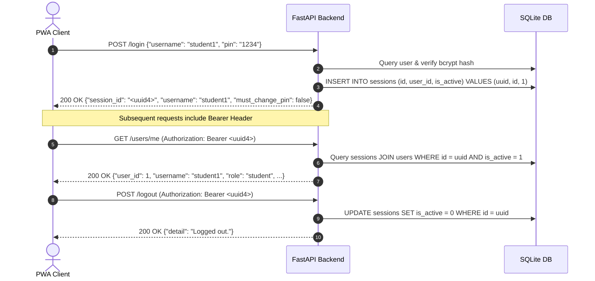

# REST API Reference & Contract Specification

Comprehensive technical specification and integration contracts for the **TutorBox** backend REST API.

<div align="center">

| 🏠 [TutorBox](../README.md) | 📚 [Docs](README.md) | ⚙️ [Backend](../backend/README.md) | 📱 [PWA](../pwa/README.md) | 🔌 [Infra](../infra/README.md) |
| :---: | :---: | :---: | :---: | :---: |

📍 **Docs** › **REST API Reference** • **Related:** [Database Schema](database-schema.md) • [Backend Guide](../backend/README.md)

</div>

---

## Table of Contents
- [1. System Overview & Base URL](#1-system-overview--base-url)
- [2. Authentication & Session Flow](#2-authentication--session-flow)
- [3. Role-Based Access Control (RBAC) Matrix](#3-role-based-access-control-rbac-matrix)
- [4. Security Policies & Guards](#4-security-policies--guards)
  - [A. Forced PIN Rotation Policy](#a-forced-pin-rotation-policy)
  - [B. Anti-Oracle Check Ordering](#b-anti-oracle-check-ordering)
  - [C. Rate Limiting Protection](#c-rate-limiting-protection)
- [5. Unified Error Response Format](#5-unified-error-response-format)
- [6. Detailed Endpoint Contracts](#6-detailed-endpoint-contracts)
  - [6.1 System & Health (`GET /health`)](#61-system--health)
  - [6.2 Authentication (`POST /login`, `POST /logout`)](#62-authentication)
  - [6.3 User Self-Service (`POST /signup`, `GET /users/me`, `PATCH /users/me/pin`, `PATCH /users/me/username`)](#63-user-self-service)
  - [6.4 Staff Administration (`GET /users`, `POST /users`, `POST /users/{id}/reset-pin`, `DELETE /users/{id}`, `POST /users/{id}/recover`)](#64-staff-administration)
  - [6.5 System Audit (`GET /audit-logs`)](#65-system-audit)
- [Next Steps](#next-steps)


## 1. System Overview & Base URL

The TutorBox API runs on the NVIDIA Jetson Orin Nano edge appliance and communicates with the React/Vite Progressive Web Application (PWA) over the local classroom WLAN/Ethernet network.

* **Base URL**: `http://<appliance-ip>:8000` (e.g., `http://127.0.0.1:8000` in local development)
* **Interactive Swagger UI**: `http://<appliance-ip>:8000/docs`
* **Raw OpenAPI JSON Schema**: `http://<appliance-ip>:8000/openapi.json`
* **Content-Type**: `application/json` (unless otherwise noted)

---

## 2. Authentication & Session Flow

TutorBox uses stateful **Bearer Session Tokens** stored in the local SQLite database.



### Authorization Header Format
For all protected routes, the client must transmit the session token in the HTTP `Authorization` header:

```http
Authorization: Bearer <session_id>
```

---

## 3. Role-Based Access Control (RBAC) Matrix

TutorBox enforces strict role-based access across three user roles:
* **`student`**: Self-service learner account.
* **`teacher`**: Classroom supervisor (can manage students and other teachers).
* **`admin`**: System administrator (can manage all accounts, create/recover admins, and view audit logs).

| Endpoint | Method | Public | Student | Teacher | Admin | Gated by Pending Rotation? |
| :--- | :--- | :---: | :---: | :---: | :---: | :---: |
| `/health` | `GET` | ✅ | ✅ | ✅ | ✅ | No (Public) |
| `/signup` | `POST` | ✅ | ✅ | ✅ | ✅ | No (Public) |
| `/login` | `POST` | ✅ | ✅ | ✅ | ✅ | No (Public) |
| `/logout` | `POST` | ❌ | ✅ | ✅ | ✅ | No (Allowlist) |
| `/users/me` | `GET` | ❌ | ✅ | ✅ | ✅ | No (Allowlist) |
| `/users/me/pin` | `PATCH` | ❌ | ✅ | ✅ | ✅ | No (Allowlist) |
| `/users/me/username` | `PATCH` | ❌ | ✅ | ✅ | ✅ | **Yes (403 if rotation pending)** |
| `/users` | `GET` | ❌ | ❌ | ✅ | ✅ | **Yes (403 if rotation pending)** |
| `/users` | `POST` | ❌ | ❌ | ✅ (student/teacher) | ✅ (any role) | **Yes (403 if rotation pending)** |
| `/users/{id}/reset-pin` | `POST` | ❌ | ❌ | ✅ (student/teacher) | ✅ (any role) | **Yes (403 if rotation pending)** |
| `/users/{id}` | `DELETE` | ❌ | ❌ | ✅ (student/teacher) | ✅ (any role) | **Yes (403 if rotation pending)** |
| `/users/{id}/recover` | `POST` | ❌ | ❌ | ✅ (student/teacher) | ✅ (any role) | **Yes (403 if rotation pending)** |
| `/audit-logs` | `GET` | ❌ | ❌ | ❌ | ✅ | **Yes (403 if rotation pending)** |

---

## 4. Security Policies & Guards

### A. Forced PIN Rotation Policy
* When a staff member resets an account's PIN or recovers an account, `must_change_pin` is set to `1` in SQLite.
* Upon login, the client receives `"must_change_pin": true`.
* **Allowlist Routes**: The user can **only** call `GET /users/me`, `PATCH /users/me/pin`, and `POST /logout`.
* **Gated Routes**: All other operational and administrative endpoints immediately reject the request with `403 Forbidden` (`{"detail": "PIN change required."}`).
* Once `PATCH /users/me/pin` succeeds, `must_change_pin` is cleared to `0`.

### B. Anti-Oracle Check Ordering
To prevent timing or side-channel oracle attacks during credential modifications:
1. The backend **first** verifies the caller's `current_pin`. If incorrect, it immediately returns `401 Unauthorized`.
2. Only after `current_pin` is cryptographically validated does the backend compare whether `new_pin == current_pin` or `new_username == current_username` (returning `422 Unprocessable Entity`).

### C. Rate Limiting Protection
* **Credential Lockout (`InMemoryRateLimiter`)**: 5 consecutive failed login/credential attempts result in a temporary lockout on the targeted username (returning `429 Too Many Requests`).
* **Registration Throttle (`SlidingWindowLimiter`)**: Global signup requests are capped to prevent brute-force storage exhaustion on edge hardware.

---

## 5. Unified Error Response Format

All error responses return a standardized JSON object:

```json
{
  "detail": "Descriptive error explanation."
}
```

### Standard Status Codes
* **`200 OK`**: Request succeeded.
* **`201 Created`**: Resource created successfully.
* **`400 Bad Request`**: Malformed payload syntax.
* **`401 Unauthorized`**: Missing, invalid, or expired session token, or invalid username/PIN.
* **`403 Forbidden`**: Insufficient role privileges or forced PIN rotation required.
* **`404 Not Found`**: Target user ID does not exist or is soft-deleted.
* **`409 Conflict`**: Username collision or violation of the Last-Admin Guard.
* **`422 Unprocessable Entity`**: Validation failure (field regex, length, or new PIN equal to current PIN).
* **`429 Too Many Requests`**: Rate limit exceeded or account temporarily locked out.
* **`500 Internal Server Error`**: Unexpected backend failure.

---

## 6. Detailed Endpoint Contracts

### 6.1 System & Health

#### `GET /health`
System and database diagnostic probe.

* **Authorization**: Public
* **Responses**:
  * `200 OK`:
    ```json
    {
      "status": "ok",
      "service": "TutorBox Backend",
      "database": "healthy"
    }
    ```

---

### 6.2 Authentication

#### `POST /login`
Authenticate a user with username and PIN to obtain a session token.

* **Authorization**: Public (Rate-limited)
* **Request Body**:
  ```json
  {
    "username": "student1",
    "pin": "1234"
  }
  ```
* **Responses**:
  * `200 OK`:
    ```json
    {
      "session_id": "9b1deb4d-3b7d-4bad-9bdd-2b0d7b3dcb6d",
      "username": "student1",
      "status": "authenticated",
      "must_change_pin": false
    }
    ```
  * `401 Unauthorized`: Invalid credentials.
  * `422 Unprocessable Entity`: Username format or PIN digits invalid.
  * `429 Too Many Requests`: Account locked due to repeated failed attempts.

#### `POST /logout`
Invalidate the current caller's active session.

* **Authorization**: Bearer Token
* **Responses**:
  * `200 OK`:
    ```json
    {
      "detail": "Logged out."
    }
    ```
  * `401 Unauthorized`: Missing, invalid, or already revoked session token.

---

### 6.3 User Self-Service

#### `POST /signup`
Public student self-registration.

* **Authorization**: Public (Rate-limited)
* **Request Body**:
  ```json
  {
    "username": "maria_g",
    "pin": "5678"
  }
  ```
* **Responses**:
  * `201 Created`:
    ```json
    {
      "username": "maria_g",
      "role": "student"
    }
    ```
  * `409 Conflict`: Username is already taken.
  * `422 Unprocessable Entity`: Validation constraint violated.
  * `429 Too Many Requests`: Global signup rate limit exceeded.

#### `GET /users/me`
Retrieve profile metadata for the authenticated user.

* **Authorization**: Bearer Token (Permitted during pending rotation)
* **Responses**:
  * `200 OK`:
    ```json
    {
      "user_id": 1,
      "username": "student1",
      "role": "student",
      "must_change_pin": false
    }
    ```
  * `401 Unauthorized`: Invalid or expired session.

#### `PATCH /users/me/pin`
Change personal PIN. Clears forced rotation flag and invalidates the current session.

* **Authorization**: Bearer Token (Permitted during pending rotation)
* **Request Body**:
  ```json
  {
    "current_pin": "1234",
    "new_pin": "9876"
  }
  ```
* **Responses**:
  * `200 OK`:
    ```json
    {
      "detail": "Credentials updated. Please sign in again."
    }
    ```
  * `401 Unauthorized`: Invalid `current_pin`.
  * `422 Unprocessable Entity`: `new_pin` equals `current_pin` or fails validation.

#### `PATCH /users/me/username`
Change personal username. Frees the old username and invalidates the current session.

* **Authorization**: Bearer Token (Gated by pending rotation)
* **Request Body**:
  ```json
  {
    "current_pin": "1234",
    "new_username": "maria_new"
  }
  ```
* **Responses**:
  * `200 OK`:
    ```json
    {
      "detail": "Credentials updated. Please sign in again."
    }
    ```
  * `401 Unauthorized`: Invalid `current_pin`.
  * `403 Forbidden`: PIN rotation pending.
  * `409 Conflict`: `new_username` is already taken.
  * `422 Unprocessable Entity`: `new_username` equals current username.

---

### 6.4 Staff Administration

#### `GET /users`
List accounts in the school roster.

* **Authorization**: Teacher, Admin
* **Query Parameters**:
  * `include_deleted` (`bool`, optional, default: `false`): If `true`, returns soft-deleted accounts.
* **Responses**:
  * `200 OK` (Active Roster):
    ```json
    {
      "users": [
        {
          "id": 1,
          "username": "student1",
          "role": "student",
          "created_at": "2026-08-27 10:00:00",
          "must_change_pin": false
        }
      ]
    }
    ```
  * `200 OK` (`include_deleted=true`):
    ```json
    {
      "users": [
        {
          "id": 2,
          "role": "student",
          "former_username": "student2",
          "deleted_at": "2026-08-27 12:30:00"
        }
      ]
    }
    ```
  * `403 Forbidden`: Caller is a student or has a pending PIN rotation.

#### `POST /users`
Create a new user account.

* **Authorization**: Teacher (can create `student`, `teacher`), Admin (can create any role)
* **Request Body**:
  ```json
  {
    "username": "carlos_p",
    "pin": "1234",
    "role": "student"
  }
  ```
* **Responses**:
  * `201 Created`:
    ```json
    {
      "username": "carlos_p",
      "role": "student"
    }
    ```
  * `403 Forbidden`: Teacher attempting to create an admin account.
  * `409 Conflict`: Username already taken.

#### `POST /users/{user_id}/reset-pin`
Issue a random 6-digit temporary PIN and require rotation.

* **Authorization**: Teacher (targets `student`, `teacher`), Admin (targets any role)
* **Path Parameters**:
  * `user_id` (`integer`, required): Target user ID.
* **Responses**:
  * `200 OK`:
    ```json
    {
      "username": "student1",
      "temporary_pin": "583921"
    }
    ```
  * `403 Forbidden`: Teacher attempting to reset an admin PIN.
  * `404 Not Found`: User not found or soft-deleted.

#### `DELETE /users/{user_id}`
Soft-delete an account, anonymize username, deactivate sessions, and retain educational logs.

* **Authorization**: Teacher (targets `student`, `teacher`), Admin (targets any role)
* **Path Parameters**:
  * `user_id` (`integer`, required): Target user ID.
* **Responses**:
  * `200 OK`:
    ```json
    {
      "detail": "Account deleted."
    }
    ```
  * `403 Forbidden`: Teacher attempting to delete an admin account.
  * `404 Not Found`: Target user ID not found or already deleted.
  * `409 Conflict`: Attempting to delete the last remaining admin.

#### `POST /users/{user_id}/recover`
Restore a soft-deleted account under a new username with a temporary PIN.

* **Authorization**: Teacher (targets `student`, `teacher`), Admin (targets any role)
* **Path Parameters**:
  * `user_id` (`integer`, required): Target user ID.
* **Request Body**:
  ```json
  {
    "username": "student2_restored"
  }
  ```
* **Responses**:
  * `200 OK`:
    ```json
    {
      "username": "student2_restored",
      "temporary_pin": "847291",
      "detail": "Account recovered. User must set a new PIN on next login."
    }
    ```
  * `403 Forbidden`: Teacher attempting to recover an admin account.
  * `404 Not Found`: Target is not soft-deleted or does not exist.
  * `409 Conflict`: Target recovery username is already taken.

---

### 6.5 System Audit

#### `GET /audit-logs`
Read up to 500 append-only audit trail records.

* **Authorization**: Admin Only
* **Responses**:
  * `200 OK`:
    ```json
    {
      "logs": [
        {
          "id": 10,
          "actor_user_id": 3,
          "action": "pin_reset",
          "target_user_id": 1,
          "created_at": "2026-08-27 14:15:00"
        },
        {
          "id": 9,
          "actor_user_id": null,
          "action": "signup",
          "target_user_id": 5,
          "created_at": "2026-08-27 14:10:00"
        }
      ]
    }
    ```
  * `403 Forbidden`: Caller is not an admin.

---

## Next Steps

* **[Database Schema Reference](database-schema.md)**: Explore the SQLite schema, table data dictionaries, and migration logs.
* **[Documentation Portal](README.md)**: Return to the documentation hub.
* **[Backend Developer Guide](../backend/README.md)**: Setup, local execution, and testing procedures.
