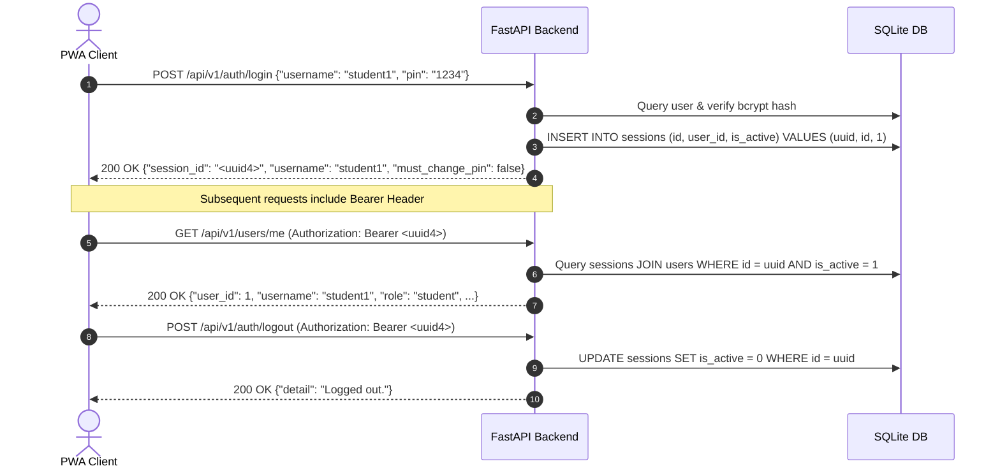

# REST API Reference & Integration Contracts

Comprehensive technical specification, security architecture, and integration contracts for the **TutorBox** REST API.

<div align="center">

| 🏠 [TutorBox](../../README.md) | 📚 [Docs](../README.md) | ⚙️ [Backend](../../backend/README.md) | 📱 [PWA](../../pwa/README.md) | 🔌 [Infra](../../infra/README.md) |
| :---: | :---: | :---: | :---: | :---: |

📍 [Docs](../README.md) › **REST API Hub** • **Endpoints:** [Auth](auth.md) • [Devices](devices.md) • [Quiz](quiz.md) • [Sessions](sessions.md) • [Staff](staff.md) • [System](system.md)

</div>

---

## Table of Contents
- [1. System Overview & Base URL](#1-system-overview--base-url)
- [2. Modular Endpoint Directory](#2-modular-endpoint-directory)
- [3. Authentication & Session Flow](#3-authentication--session-flow)
- [4. Role-Based Access Control (RBAC) Matrix](#4-role-based-access-control-rbac-matrix)
- [5. Security Policies & Guards](#5-security-policies--guards)
  - [A. Forced PIN Rotation Policy](#a-forced-pin-rotation-policy)
  - [B. Anti-Oracle Check Ordering](#b-anti-oracle-check-ordering)
  - [C. Rate Limiting Protection](#c-rate-limiting-protection)
- [6. Unified Error Response Format](#6-unified-error-response-format)
- [Next Steps](#next-steps)

---

## <a id="1-system-overview--base-url"></a>1. System Overview & Base URL

The TutorBox API runs on the NVIDIA Jetson Orin Nano edge appliance and communicates with the React/Vite Progressive Web Application (PWA) and ESP32 hardware clickers over the local classroom WLAN/Ethernet network.

* **Base URL**: `http://<appliance-ip>:8000` (e.g., `http://127.0.0.1:8000` in local development)
* **Classroom client (Pilas)**: served by the same process at `/maestro/`, `/alumno/` and `/pantalla/` (see [PWA](../../pwa/README.md))
* **API v1 Prefix**: `/api/v1` (e.g., `/api/v1/auth/login`, `/api/v1/quiz/generate`)
* **Unversioned Probes**: `/health`
* **Interactive Swagger UI**: `http://<appliance-ip>:8000/docs`
* **Raw OpenAPI JSON Schema**: `http://<appliance-ip>:8000/openapi.json`
* **Content-Type**: `application/json` (unless otherwise noted)

---

## <a id="2-modular-endpoint-directory"></a>2. Modular Endpoint Directory

The API specification is decomposed into cohesive domain modules:

| Domain | Specification Document | Key Endpoints | Roles |
| :--- | :--- | :--- | :---: |
| **System & Health** | **[system.md](system.md)** | `GET /health` | Public |
| **Authentication & Users** | **[auth.md](auth.md)** | `POST /api/v1/auth/login`<br>`POST /api/v1/auth/logout`<br>`POST /api/v1/users/signup`<br>`GET /api/v1/users/me`<br>`PATCH /api/v1/users/me/pin`<br>`PATCH /api/v1/users/me/username` | Public,<br>Student,<br>Staff |
| **Staff Administration** | **[staff.md](staff.md)** | `GET /api/v1/staff/users`<br>`POST /api/v1/staff/users`<br>`POST /api/v1/staff/users/{id}/reset-pin`<br>`DELETE /api/v1/staff/users/{id}`<br>`POST /api/v1/staff/users/{id}/recover`<br>`GET /api/v1/staff/audit-logs` | Teacher,<br>Admin |
| **Hardware Devices** | **[devices.md](devices.md)** | `GET /api/v1/staff/devices`<br>`POST /api/v1/staff/devices`<br>`POST /api/v1/staff/devices/{id}/assign`<br>`POST /api/v1/staff/devices/{id}/unassign`<br>`DELETE /api/v1/staff/devices/{id}` | Teacher,<br>Admin |
| **Quiz Question Bank** | **[quiz.md](quiz.md)** | `GET /api/v1/quiz/topics`<br>`GET /api/v1/quiz/schema`<br>`POST /api/v1/quiz/validate`<br>`POST /api/v1/quiz/generate`<br>`GET /api/v1/quiz/generation-logs`<br>`GET /api/v1/quiz/generation-metrics`<br>`GET /api/v1/quiz/questions`<br>`GET /api/v1/quiz/questions/{id}`<br>`POST /api/v1/quiz/questions`<br>`DELETE /api/v1/quiz/questions/{id}` | Public,<br>Teacher,<br>Admin |
| **Quiz Sessions & Voting** | **[sessions.md](sessions.md)** | `POST /api/v1/session`<br>`GET /api/v1/session/current`<br>`GET /api/v1/session/{id}`<br>`POST /api/v1/session/{id}/start`<br>`POST /api/v1/session/{id}/vote`<br>`POST /api/v1/session/{id}/close`<br>`POST /api/v1/session/{id}/reveal`<br>`POST /api/v1/session/{id}/next`<br>`GET /api/v1/session/{id}/report` | Public,<br>Student,<br>Teacher,<br>Admin |

---

## <a id="3-authentication--session-flow"></a>3. Authentication & Session Flow

TutorBox uses stateful **Bearer Session Tokens** stored in the local SQLite database.



### Authorization Header Format
For all protected routes, the client must transmit the session token in the HTTP `Authorization` header:

```http
Authorization: Bearer <session_id>
```

---

## <a id="4-role-based-access-control-rbac-matrix"></a>4. Role-Based Access Control (RBAC) Matrix

TutorBox enforces strict role-based access across three user roles:
* **`student`**: Self-service learner account.
* **`teacher`**: Classroom supervisor (can manage students, other teachers, hardware clickers, and quiz matches).
* **`admin`**: System administrator (can manage all accounts, create/recover admins, view audit logs, and manage devices).

| Endpoint | Method | Public | Student | Teacher | Admin | Gated by Pending Rotation? | Spec Document |
| :--- | :--- | :---: | :---: | :---: | :---: | :---: | :--- |
| `/health` | `GET` | ✅ | ✅ | ✅ | ✅ | No (Public) | [system.md](system.md) |
| `/api/v1/users/signup` | `POST` | ✅ | ✅ | ✅ | ✅ | No (Public) | [auth.md](auth.md) |
| `/api/v1/auth/login` | `POST` | ✅ | ✅ | ✅ | ✅ | No (Public) | [auth.md](auth.md) |
| `/api/v1/auth/logout` | `POST` | ❌ | ✅ | ✅ | ✅ | No (Allowlist) | [auth.md](auth.md) |
| `/api/v1/users/me` | `GET` | ❌ | ✅ | ✅ | ✅ | No (Allowlist) | [auth.md](auth.md) |
| `/api/v1/users/me/pin` | `PATCH` | ❌ | ✅ | ✅ | ✅ | No (Allowlist) | [auth.md](auth.md) |
| `/api/v1/users/me/username` | `PATCH` | ❌ | ✅ | ✅ | ✅ | **Yes (403)** | [auth.md](auth.md) |
| `/api/v1/staff/users` | `GET` | ❌ | ❌ | ✅ | ✅ | **Yes (403)** | [staff.md](staff.md) |
| `/api/v1/staff/users` | `POST` | ❌ | ❌ | ✅ (No admin) | ✅ (All) | **Yes (403)** | [staff.md](staff.md) |
| `/api/v1/staff/users/{id}/reset-pin` | `POST` | ❌ | ❌ | ✅ (No admin) | ✅ (All) | **Yes (403)** | [staff.md](staff.md) |
| `/api/v1/staff/users/{id}` | `DELETE` | ❌ | ❌ | ✅ (No admin) | ✅ (All) | **Yes (403)** | [staff.md](staff.md) |
| `/api/v1/staff/users/{id}/recover` | `POST` | ❌ | ❌ | ✅ (No admin) | ✅ (All) | **Yes (403)** | [staff.md](staff.md) |
| `/api/v1/staff/audit-logs` | `GET` | ❌ | ❌ | ❌ | ✅ | **Yes (403)** | [staff.md](staff.md) |
| `/api/v1/staff/devices` | `GET` | ❌ | ❌ | ✅ | ✅ | **Yes (403)** | [devices.md](devices.md) |
| `/api/v1/staff/devices` | `POST` | ❌ | ❌ | ✅ | ✅ | **Yes (403)** | [devices.md](devices.md) |
| `/api/v1/staff/devices/{id}/assign` | `POST` | ❌ | ❌ | ✅ | ✅ | **Yes (403)** | [devices.md](devices.md) |
| `/api/v1/staff/devices/{id}/unassign` | `POST` | ❌ | ❌ | ✅ | ✅ | **Yes (403)** | [devices.md](devices.md) |
| `/api/v1/staff/devices/{id}` | `DELETE` | ❌ | ❌ | ✅ | ✅ | **Yes (403)** | [devices.md](devices.md) |
| `/api/v1/quiz/topics` | `GET` | ✅ | ✅ | ✅ | ✅ | No (Public) | [quiz.md](quiz.md) |
| `/api/v1/quiz/schema` | `GET` | ✅ | ✅ | ✅ | ✅ | No (Public) | [quiz.md](quiz.md) |
| `/api/v1/quiz/validate` | `POST` | ✅ | ✅ | ✅ | ✅ | No (Public) | [quiz.md](quiz.md) |
| `/api/v1/quiz/generate` | `POST` | ❌ | ❌ | ✅ | ✅ | **Yes (403)** | [quiz.md](quiz.md) |
| `/api/v1/quiz/generation-logs` | `GET` | ❌ | ❌ | ✅ | ✅ | **Yes (403)** | [quiz.md](quiz.md) |
| `/api/v1/quiz/generation-metrics` | `GET` | ❌ | ❌ | ✅ | ✅ | **Yes (403)** | [quiz.md](quiz.md) |
| `/api/v1/quiz/questions` | `GET` | ❌ | ❌ | ✅ | ✅ | **Yes (403)** | [quiz.md](quiz.md) |
| `/api/v1/quiz/questions/{id}` | `GET` | ❌ | ❌ | ✅ | ✅ | **Yes (403)** | [quiz.md](quiz.md) |
| `/api/v1/quiz/questions` | `POST` | ❌ | ❌ | ✅ | ✅ | **Yes (403)** | [quiz.md](quiz.md) |
| `/api/v1/quiz/questions/{id}` | `DELETE` | ❌ | ❌ | ✅ | ✅ | **Yes (403)** | [quiz.md](quiz.md) |
| `/api/v1/session` | `POST` | ❌ | ❌ | ✅ | ✅ | **Yes (403)** | [sessions.md](sessions.md) |
| `/api/v1/session/current` | `GET` | ✅ | ✅ | ✅ | ✅ | No (Public) | [sessions.md](sessions.md) |
| `/api/v1/session/{id}` | `GET` | ✅ | ✅ | ✅ | ✅ | No (Public) | [sessions.md](sessions.md) |
| `/api/v1/session/{id}/start` | `POST` | ❌ | ❌ | ✅ | ✅ | **Yes (403)** | [sessions.md](sessions.md) |
| `/api/v1/session/{id}/vote` | `POST` | ❌ | ✅ | ✅ | ✅ | **Yes (403)** | [sessions.md](sessions.md) |
| `/api/v1/session/{id}/close` | `POST` | ❌ | ❌ | ✅ | ✅ | **Yes (403)** | [sessions.md](sessions.md) |
| `/api/v1/session/{id}/reveal` | `POST` | ❌ | ❌ | ✅ | ✅ | **Yes (403)** | [sessions.md](sessions.md) |
| `/api/v1/session/{id}/next` | `POST` | ❌ | ❌ | ✅ | ✅ | **Yes (403)** | [sessions.md](sessions.md) |
| `/api/v1/session/{id}/report` | `GET` | ❌ | ❌ | ✅ | ✅ | **Yes (403)** | [sessions.md](sessions.md) |

---

## <a id="5-security-policies--guards"></a>5. Security Policies & Guards

### <a id="a-forced-pin-rotation-policy"></a>A. Forced PIN Rotation Policy
When a user has `must_change_pin = 1` (e.g., following an administrative reset), their session is restricted:
* **Allowed Endpoints**: `GET /api/v1/users/me`, `PATCH /api/v1/users/me/pin`, `POST /api/v1/auth/logout`.
* **Blocked Endpoints**: All other protected routes immediately return `403 Forbidden` (`"PIN rotation required."`).

### <a id="b-anti-oracle-check-ordering"></a>B. Anti-Oracle Check Ordering
To prevent timing attacks and enumeration of valid accounts, verification steps follow deterministic order:
1. Verify PIN format (4–8 numeric digits) before touching storage.
2. Query user record from SQLite.
3. If user is absent, execute a dummy bcrypt verification to maintain constant verification latency.

### <a id="c-rate-limiting-protection"></a>C. Rate Limiting Protection
Two distinct in-memory rate limiters protect the edge appliance:
1. **Credential Lockout Limiter**: Consecutive failed login attempts trigger progressive lockout (5 failed attempts = 60s cooldown).
2. **Global Sliding Window Limiter**: Caps high-frequency public endpoints (e.g. signup) to prevent database flooding.

---

## <a id="6-unified-error-response-format"></a>6. Unified Error Response Format

All error responses return a standardized JSON structure with an actionable `detail` explanation:

```json
{
  "detail": "Descriptive error message."
}
```

### Standard Status Codes
* `400 Bad Request`: Malformed parameters or invalid vote option.
* `401 Unauthorized`: Missing, invalid, or expired session token.
* `403 Forbidden`: Insufficient role privileges or pending PIN rotation.
* `404 Not Found`: Target entity does not exist or has been soft-deleted.
* `409 Conflict`: Unique constraint violation (duplicate username, first-press vote lock, last-admin deletion).
* `422 Unprocessable Content`: Validation schema failure (regex mismatch, range violation).
* `429 Too Many Requests`: Rate limiter triggered.
* `502 Bad Gateway`: Upstream SLM engine failure after retry exhaustion.

---

## Next Steps

* **[Database Schema Reference](../database/README.md)**: Explore table definitions, ER models, and performance indexes.
* **[Diagnostic Distractors](../architecture/diagnostic-distractors.md)**: 32 misconception taxonomy.
* **[Backend Developer Guide](../../backend/README.md)**: Setup, local execution, and test suites.
