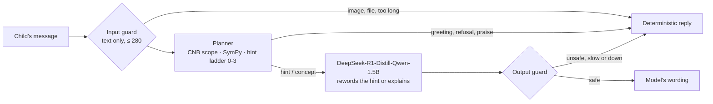

# Socratic Tutor API (Mode 2)

<div align="center">

| 🏠 [Utz'tutor](../../README.md) | 📚 [Docs](../README.md) | ⚙️ [Backend](../../backend/README.md) | 📱 [PWA](../../pwa/README.md) | 🔌 [Infra](../../infra/README.md) |
| :---: | :---: | :---: | :---: | :---: |

📍 [Docs](../README.md) › [REST API Hub](README.md) › **Tutor** • **Related:** [Socratic Pedagogy](../architecture/socratic-pedagogy.md) • [Three Modes](../architecture/three-modes.md#mode-2-socratic-tutor) • [Dialogue Telemetry](../database/dialogue.md)

</div>

---

While the teacher has the class in `tutor` mode ([`PUT /api/v1/mode`](system.md#classroom-mode)), each
logged-in student chats from `/alumno/` with a Socratic math tutor, and the teacher's `/maestro/` shows
who is using it. Code: `backend/src/api/tutor/` (HTTP) and `backend/src/modes/socratic/` (tutor).

## Table of Contents
- [1. Endpoints](#1-endpoints)
- [2. How a Reply Is Made](#2-how-a-reply-is-made)
- [3. Guardrails](#3-guardrails)
- [4. Configuration](#4-configuration)

---

## <a id="1-endpoints"></a>1. Endpoints

| Method & path | Roles | Purpose |
| :--- | :--- | :--- |
| `POST /api/v1/tutor/message` | Student, Teacher, Admin | One chat turn. `409` outside tutor mode, `429` while a reply is pending or past the per-minute cap. |
| `POST /api/v1/tutor/reset` | Student, Teacher, Admin | Forgets the problem in progress ("Empezar de nuevo"). History stays in `turn_logs`. |
| `POST /api/v1/tutor/ping` | Student, Teacher, Admin | The chat is open; the student counts as connected for 45 s. The PWA sends it every 20 s. |
| `GET /api/v1/tutor/students` | Teacher, Admin | Students seen in the last 30 minutes, connected first. |
| `GET /api/v1/tutor/summary` | Public | Class totals for the classroom screen (`/pantalla/` has no login): `{"online", "solved", "need_help"}`, no names. `need_help` counts connected students on hint 3 of 3. |

```http
POST /api/v1/tutor/message
Authorization: Bearer <session_id>

{"message": "¿cuánto es 23 + 45?"}
```

```json
{
  "reply": "¡Vamos a pensarlo juntos! Queremos juntar 23 y 45. ¿Por dónde empiezas?",
  "kind": "hint",
  "hint_level": 0,
  "used_model": false,
  "topic": null
}
```

`message` is the only field (`extra="forbid"`, 1–2000 chars; the tutor itself asks for a shorter text
above 280). `kind` is one of `hint`, `praise`, `explain`, `think`, `idea`, `word_problem`, `social`,
`input`, `beyond`, `negative`, `off_topic`, `orphan`, `show_work`. `used_model` is `true` only when
the reply is the model's wording that passed the output guard.

```json
GET /api/v1/tutor/students →
{"students": [{"username": "ana", "online": true, "seconds_ago": 4, "turns": 6,
               "solved": 1, "problem": "7 × 8", "hint_level": 2}]}
```

Every turn is written to `turn_logs` ([dialogue.md](../database/dialogue.md)): the child's text, the
SymPy expression and target, whether the answer was correct, the raw model output, whether
containment replaced it, the final reply and the hint level. Each row also carries three labels: the
concept practised (`concept_topic`, `concept_subconcept` and the CNB topic `cnb_topic`), the
scaffolding strategy applied and, on a wrong answer, the misconception behind it (`error_type`). The
labels are computed in `backend/src/modes/socratic/telemetry/` and written by
`backend/src/api/tutor/turn_logging.py`; their vocabularies are in
[dialogue.md §2.1](../database/dialogue.md#21-telemetry-label-vocabularies).

---

## <a id="2-how-a-reply-is-made"></a>2. How a Reply Is Made



The **planner** (deterministic) decides the pedagogy: it reads number words as digits ("doscientos más
cien" is 200 + 100), finds the problem in the message ("23 + 45", "7 por 8", "la mitad de 10",
"20% de 50", "x + 5 = 12"), computes the answer exactly, judges the child's answers and climbs the hint
ladder (0 restate, 1 concept, 2 smaller step, 3 worked example with other numbers). A wrong answer or a
request for help moves one level up, never past 3. For an equation, level 2 names the first step to
undo and level 3 solves a parallel equation (`2 × x + 1 = 7` when the child has `2x + 4 = 14`). The
**model** only rewords the chosen hint, or explains a CNB concept in two sentences.

Measured on the Jetson, the 1.5B distill asked to tutor freely invents dialogue turns and states the
answer; asked to reword a given hint it stays close to it. Replies take about 5–15 s (the model always
reasons first); the first one after Ollama unloads the model takes about 30 s.

---

## <a id="3-guardrails"></a>3. Guardrails

| Guard | Rule |
| :--- | :--- |
| Text only | Data URIs, ``/`<svg>` tags, Markdown images, links to image files and base64 blobs are refused (`backend` + the PWA blocks pasted/dropped files). |
| CNB scope | Topics from `pwa/tareas/cnb` (1.º–5.º primaria) in `modes/socratic/cnb_matematicas.json`; later-grade math (derivadas, raíz cuadrada, negativos…) and non-math are refused with a pointer to what the tutor can do. |
| Bounded math | Operations run on exact fractions with `+ − × ÷` only (`core/math_engine/exact_arithmetic.py`): powers, names and a doubled `××` (a power in Python) are not arithmetic, so no message can make the backend compute without end. Equations with `××` are refused; the rest go through `safe_parse`, which never accepts a power of a power. Equations with a decimal (`x + 1 = 2.5`) are refused too, because the equation parser would read `= 2`. Expressions over 60 characters and numbers over 10⁹ are not evaluated. |
| No answers | SymPy containment (`modes/socratic/containment.py`): until the child finds it, no reply may state an accepted answer outside the problem itself, whether in digits (`68`, `136/2`, `68.0`), in Spanish words (`sesenta y ocho`) or as an expression or assignment that SymPy evaluates to it (`x = 12 - 5`, `doce menos cinco`, `(14 - 4) ÷ 2`). Expressions are read with `safe_parse`; one longer than 100 characters is blocked unread. An explanation given mid-problem is checked against that problem. When rewording, the reply may not contain **any** number or calculation the hint did not have, so the model cannot compute for the child. The deterministic hints pass the same check. |
| Fallback | A reply that fails any guard is replaced by the planner's deterministic text for that turn (the hint for the current level, or the fixed reply for a concept question), and the turn is logged with `containment_triggered` and the raw model output. |
| Plain Spanish | Reasoning, LaTeX and Markdown are stripped (`\frac{1}{2}` → `1/2`); replies with English, other scripts, role-play labels, rude words or more than 320 chars are rejected. |
| Faithful | A rewording keeps at least half of the hint's content words and its question; otherwise the hint is shown as is. |
| Load | 2 replies generated at once (`TUTOR_MAX_CONCURRENT`); others wait up to 20 s, then get the deterministic hint. One turn at a time per login, 12 per minute. |

CI proves these rules on every push. `tests/modes/socratic/test_containment_dialogues.py` runs 30 turns
in which a model that complies answers 10 "dame la respuesta" probes, each in another form: all 10 are
contained, and no answer reaches the child before the child finds it. `test_problem_bank.py` walks the
48-problem labeled bank (`modes/socratic/problem_bank.json`) through SymPy, the ladder and the
containment check ([Socratic Pedagogy §4](../architecture/socratic-pedagogy.md#4-implementation-in-mode-2)).

---

## <a id="4-configuration"></a>4. Configuration

`TUTOR_*` variables in [`.env.example`](../../.env.example). The tutor uses the same server as
`SLM_BASE_URL`; on the Jetson dev kit that is Ollama:

```bash
ollama pull hf.co/bartowski/DeepSeek-R1-Distill-Qwen-1.5B-GGUF:Q8_0   # ~1.9 GB, the default TUTOR_MODEL_NAME
```
