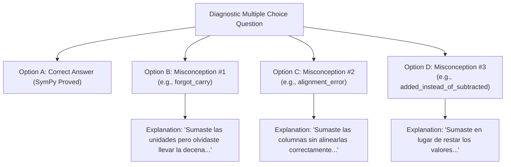
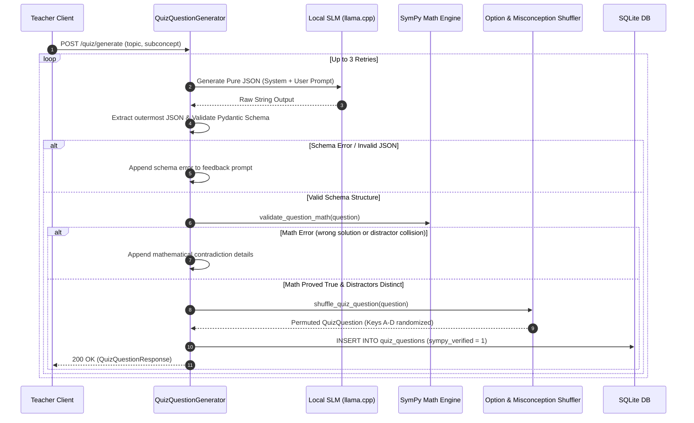

# Diagnostic Distractors & Misconception Taxonomy

Pedagogical architecture and classification model for **TutorBox Mode 1 (Classroom Quiz)** and transversal telemetry.

| 🏠 [TutorBox](../../README.md) | 📚 [Docs](../README.md) | ⚙️ [Backend](../../backend/README.md) | 📱 [PWA](../../pwa/README.md) | 🔌 [Infra](../../infra/README.md) |
| :---: | :---: | :---: | :---: | :---: |

📍 **Docs** › **Architecture** › **Diagnostic Distractors** • **Related:** [REST API Reference](../api-reference.md) • [Database Schema](../database-schema.md)

---

## 1. Pedagogical Philosophy: "Wrong Answers Are the Content"

In conventional computerized assessments, multiple-choice distractors are frequently generated by adding random offsets (e.g., $correct \pm 1$, $correct \pm 2$). When a student chooses an arbitrary number, the teacher only learns that the student failed—not *why* they failed.

TutorBox adopts a **Diagnostic Distractor Model**:
* Every multiple-choice question contains **exactly 1 mathematically proven correct answer and exactly 3 diagnostic distractors**.
* Each distractor corresponds to a **specific, researched cognitive error or conceptual misconception** common in primary-school mathematics (grades 3–6).
* Each distractor is paired with an **age-appropriate, empathetic Spanish explanation**.

When >51% of participating classroom students choose a specific diagnostic distractor during a live classroom quiz, the NVIDIA Jetson Orin Nano edge appliance triggers its offline neural TTS engine to speak that distractor's conceptual explanation aloud to the room.

---

## 2. Curriculum Taxonomy & Misconception Catalog

The diagnostic system categorizes primary mathematics into 4 core domains, 10 subconcepts, and 32 validated misconception error signatures:

```mermaid
flowchart TD
    classDef rootStyle fill:#0F172A,stroke:#020617,stroke-width:2px,color:#FFFFFF,font-weight:bold,font-size:14px;
    classDef arithDomain fill:#1D4ED8,stroke:#1E40AF,stroke-width:2px,color:#FFFFFF,font-weight:bold,font-size:13px;
    classDef fracDomain fill:#7E22CE,stroke:#6B21A8,stroke-width:2px,color:#FFFFFF,font-weight:bold,font-size:13px;
    classDef algDomain fill:#047857,stroke:#065F46,stroke-width:2px,color:#FFFFFF,font-weight:bold,font-size:13px;
    classDef decDomain fill:#C2410C,stroke:#9A3412,stroke-width:2px,color:#FFFFFF,font-weight:bold,font-size:13px;

    classDef arithSub fill:#EFF6FF,stroke:#93C5FD,stroke-width:1.5px,color:#1E3A8A,font-weight:bold,font-size:12px;
    classDef fracSub fill:#FAF5FF,stroke:#D8B4FE,stroke-width:1.5px,color:#581C87,font-weight:bold,font-size:12px;
    classDef algSub fill:#ECFDF5,stroke:#6EE7B7,stroke-width:1.5px,color:#064E3B,font-weight:bold,font-size:12px;
    classDef decSub fill:#FFF7ED,stroke:#FDBA74,stroke-width:1.5px,color:#7C2D12,font-weight:bold,font-size:12px;

    classDef leafNode fill:#FFFFFF,stroke:#CBD5E1,stroke-width:1.5px,color:#0F172A,font-size:11px;

    Root["🎯 Curriculum Taxonomy (Primary Mathematics Grades 3–6)"]:::rootStyle

    Root --> D1["🔢 Arithmetic<br/><code>arithmetic</code>"]:::arithDomain
    Root --> D2["🍰 Fractions<br/><code>fractions</code>"]:::fracDomain
    Root --> D3["📐 Pre-Algebra<br/><code>pre_algebra</code>"]:::algDomain
    Root --> D4["📊 Decimals & Percentages<br/><code>decimals_percentages</code>"]:::decDomain

    %% Arithmetic
    D1 --> S1_1["➕➖ Addition & Subtraction"]:::arithSub
    D1 --> S1_2["✖️➗ Multiplication & Division"]:::arithSub
    D1 --> S1_3["🔢 Order of Operations"]:::arithSub

    S1_1 --> M1["• <code>sign_error</code> (Sign Confusion)<br/>• <code>borrowing_error</code> (Borrowing / Regrouping)<br/>• <code>alignment_error</code> (Place-Value Alignment)<br/>• <code>added_instead_of_subtracted</code> (Op Inversion)"]:::leafNode
    S1_2 --> M2["• <code>table_lookup_error</code> (Table Lookup)<br/>• <code>remainder_ignored</code> (Ignored Remainder)<br/>• <code>inverted_division</code> (Inverted Divisor)<br/>• <code>forgot_carry</code> (Forgotten Carry)"]:::leafNode
    S1_3 --> M3["• <code>left_to_right_precedence</code> (Strict L-to-R)<br/>• <code>addition_before_multiplication</code> (Add Before Mul)<br/>• <code>ignored_parentheses</code> (Ignored Parentheses)"]:::leafNode

    %% Fractions
    D2 --> S2_1["➕➖ Addition & Subtraction"]:::fracSub
    D2 --> S2_2["✖️➗ Multiplication & Division"]:::fracSub
    D2 --> S2_3["✂️ Simplification"]:::fracSub

    S2_1 --> M4["• <code>added_denominators</code> (Direct Denom Add)<br/>• <code>ignored_common_denominator</code> (Ignored LCD)<br/>• <code>subtracted_denominators</code> (Direct Denom Sub)"]:::leafNode
    S2_2 --> M5["• <code>cross_multiplied_for_product</code> (Cross-Mul Mixup)<br/>• <code>forgot_to_invert_divisor</code> (Forgot Reciprocal)<br/>• <code>multiplied_only_numerators</code> (Numerator Only)"]:::leafNode
    S2_3 --> M6["• <code>divided_only_numerator</code> (Numerator Only)<br/>• <code>subtracted_to_reduce</code> (Subtracted to Reduce)<br/>• <code>partial_factor_division</code> (Partial Factor)"]:::leafNode

    %% Pre-Algebra
    D3 --> S3_1["1️⃣ One-Step Equations"]:::algSub
    D3 --> S3_2["2️⃣ Two-Step Equations"]:::algSub

    S3_1 --> M7["• <code>sign_flip_error</code> (Transposition Sign Flip)<br/>• <code>wrong_inverse_operation</code> (Wrong Inverse Op)<br/>• <code>applied_op_to_one_side_only</code> (Unbalanced Op)"]:::leafNode
    S3_2 --> M8["• <code>divided_before_subtracting</code> (Inverted Step Order)<br/>• <code>forgot_division</code> (Forgot Final Division)<br/>• <code>subtracted_instead_of_divided</code> (Subtracted Coeff)<br/>• <code>sign_inversion_error</code> (Two-Step Sign Inversion)"]:::leafNode

    %% Decimals & Percentages
    D4 --> S4_1["🔘 Decimal Operations"]:::decSub
    D4 --> S4_2["💯 Percentages"]:::decSub

    S4_1 --> M9["• <code>misplaced_decimal_point</code> (Misplaced Point)<br/>• <code>ignored_decimal_places</code> (Ignored Decimals)<br/>• <code>added_without_aligning_decimal</code> (Unaligned Decimal)"]:::leafNode
    S4_2 --> M10["• <code>multiplied_by_percentage_directly</code> (Raw Percent Mul)<br/>• <code>confused_fraction_with_percent</code> (Fraction/Percent Mixup)<br/>• <code>subtracted_percentage_as_raw_number</code> (Raw Percent Sub)"]:::leafNode
```

---

## 3. The Rejection & Regeneration Pipeline

When a teacher requests on-demand question generation via `POST /quiz/generate`, the backend executes a multi-stage validation loop:

### Deterministic Invariants Enforced by SymPy
1. **Mathematical Truth**: `extract_and_solve_problem(question_text)` evaluates the canonical expected solution. The option marked `correct_option` must evaluate symbolically to this truth.
2. **Distractor Collision Prevention**: No distractor expression may evaluate to the canonical expected solution.
3. **No Duplicate Choices**: All 4 options ($A, B, C, D$) must evaluate to distinct mathematical or numerical values.

### Anti-Guessing Option & Misconception Permutation
To prevent students from inferring correct answers through positional biases (e.g. LLM few-shot template bias always emitting correct answers in option `A`) or predictable distractor ordering:
* **Uniform Correct Option Distribution**: The correct answer key is randomly permuted across `{"A", "B", "C", "D"}` with uniform ~25% probability per option slot.
* **Misconception De-Correlation**: The 3 diagnostic distractors and their underlying misconceptions are permuted randomly across the remaining keys, preventing predictable distractor sequencing.
* **Diagnostic Binding Invariant**: The 1-to-1 association between each distractor option value, its misconception slug, and its pedagogical Spanish explanation is strictly preserved during permutation.

---

## 4. Curated Seed Question Bank

TutorBox ships out-of-the-box with **$\ge 50$ curated, SymPy-verified questions** across all taxonomy topics:
* **Arithmetic**: Basic addition/subtraction, column carries, multiplication, division, and PEMDAS order of operations.
* **Fractions**: Like/unlike denominators, fraction multiplication/division, and fraction simplification.
* **Pre-Algebra**: One-step and two-step linear equations.
* **Decimals & Percentages**: Decimal arithmetic, alignment, and percent calculations.

All seed questions are automatically verified and seeded into SQLite on appliance boot without requiring an active internet connection.

---

## 5. Versioned JSON Schema Contract (`v1.0.0`)

Every multiple-choice diagnostic quiz question in TutorBox is governed by an immutable JSON Schema contract (Draft 2020-12):
* **Schema Version**: `1.0.0`
* **Canonical Schema URI (`$id`)**: `https://tutorbox.local/schemas/v1/quiz_question.schema.json`
* **Static Repository Artifact**: `backend/schemas/v1/quiz_question.schema.json`
* **Dynamic Inspection Endpoint**: `GET /quiz/schema` (public, unauthenticated)
* **Anti-Drift CI Gate**: Automated unit tests (`backend/tests/quiz/contracts/test_schema.py`) strictly guarantee that Pydantic contract definitions, static repository schema files, and API endpoints remain 100% synchronized.

---

## Next Steps

* **[REST API Reference](../api-reference.md)**: Explore the endpoint contracts for `/quiz/schema`, `/quiz/generate`, `/quiz/validate`, `/quiz/questions`, and `/quiz/topics`.
* **[Database Schema Reference](../database-schema.md)**: Inspect the `quiz_questions` table specification and migration changelog.
* **[Backend Guide](../../backend/README.md)**: Run tests and inspect backend implementation details.
