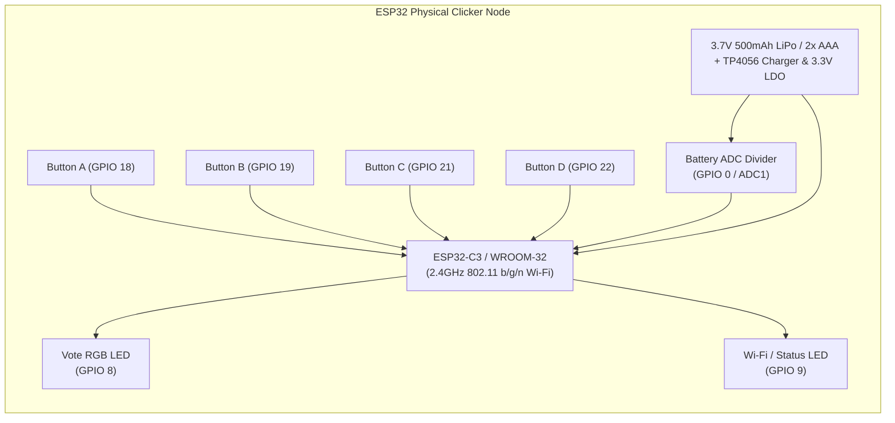
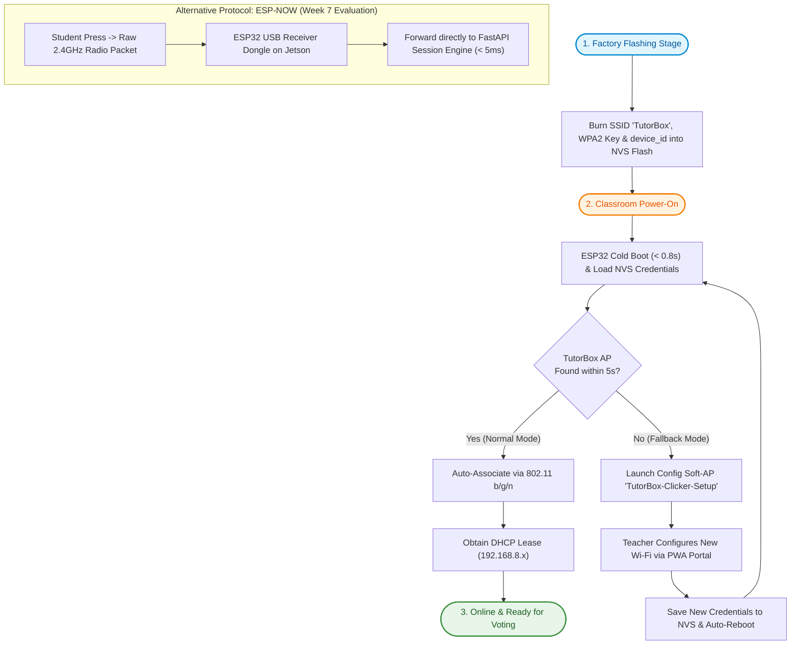
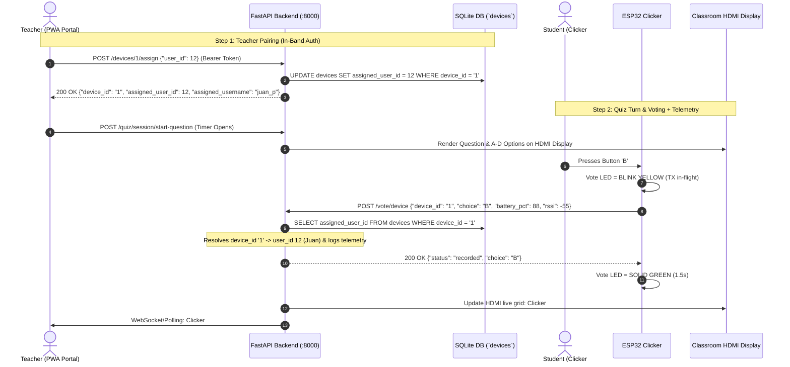
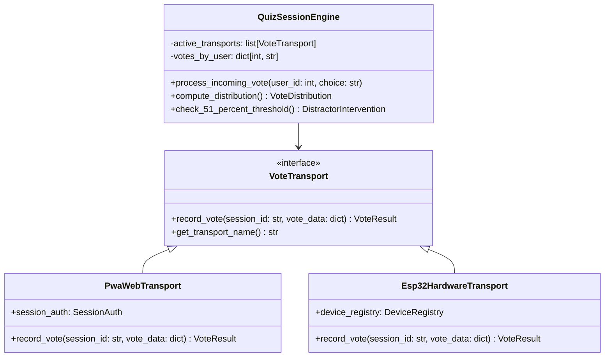
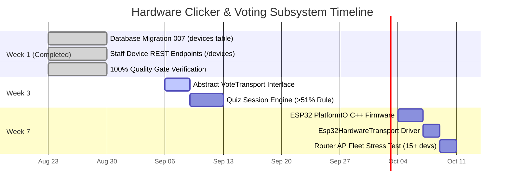

# ESP32 Hardware Clicker Architecture & Transport Specification

Comprehensive engineering specification for the **TutorBox Physical Clicker Subsystem**, detailing hardware design, network transport, AP association, telemetry monitoring, teacher pairing lifecycle, and the abstract `VoteTransport` interface.

<div align="center">

| 🏠 [TutorBox](../../README.md) | 📚 [Docs](../README.md) | ⚙️ [Backend](../../backend/README.md) | 📱 [PWA](../../pwa/README.md) | 🔌 [Infra](../../infra/README.md) |
| :---: | :---: | :---: | :---: | :---: |

📍 **Docs** › **Architecture** › **ESP32 Clicker Transport** • **Related:** [Hardware Topology](hardware-topology.md) • [Three Modes](three-modes.md) • [Database Schema](../database-schema.md)

</div>

---

> [!NOTE]
> **Work in Progress & Tentative Engineering Blueprint**:
> This document represents an evolving architectural specification prepared ahead of the hardware development milestones. The interface contracts, transport protocols, telemetry payloads, and hardware benchmarks will be expanded and refined during **Week 3 (Session Engine & Abstract Transport)** and finalized in **Week 7 (ESP32 Hardware Clickers & Fleet Testing)**.

---

## Table of Contents
- [1. Subsystem Overview & Pedagogical Purpose](#1-subsystem-overview--pedagogical-purpose)
- [2. Hardware Specifications & Bill of Materials](#2-hardware-specifications--bill-of-materials)
- [3. Wi-Fi AP Association & Provisioning Mechanisms](#3-wi-fi-ap-association--provisioning-mechanisms)
- [4. End-to-End Communication Flow & Pairing Model](#4-end-to-end-communication-flow--pairing-model)
- [5. Abstract `VoteTransport` Architecture (Week 3 & Week 7 Bridge)](#5-abstract-votetransport-architecture-week-3--week-7-bridge)
- [6. Visual Feedback & Dual LED State Machines](#6-visual-feedback--dual-led-state-machines)
- [7. Fleet Health Telemetry & Teacher PWA Dashboard](#7-fleet-health-telemetry--teacher-pwa-dashboard)
- [8. Concurrency, Latency & Edge Case Resilience](#8-concurrency-latency--edge-case-resilience)
- [9. Implementation Roadmap & Milestones](#9-implementation-roadmap--milestones)
- [Next Steps](#next-steps)

---

## 1. Subsystem Overview & Pedagogical Purpose

In rural and primary classroom environments (grades 1–6, ages 6–12), asking students to type alphanumeric usernames and PINs on small screens is a significant pedagogical friction point.

The **TutorBox Physical Clicker Subsystem** provides a dedicated, tactile 4-button hardware alternative (A, B, C, D) for the **Classroom Quiz Mode**:
* **Zero Student Setup**: Students pick up their numbered clicker (e.g. `#5`) and immediately participate.
* **Delegated Authorization**: The teacher links clicker IDs to student accounts via the Teacher PWA in seconds.
* **Dual Feedback Loop**: Both the handheld RGB LED and the classroom HDMI projector visually confirm vote ingestion.
* **Centralized Fleet Health**: Battery levels and connectivity are automatically reported to the teacher's dashboard, removing hardware management cognitive load from young students.
* **Decoupled Engine**: Built on the abstract `VoteTransport` interface, allowing the session engine to process votes identically regardless of whether the source is a mobile web client (PWA) or an ESP32 hardware clicker.

---

## 2. Hardware Specifications & Bill of Materials



### Component Breakdown:
| Component | Specification | Purpose |
| :--- | :--- | :--- |
| **Microcontroller (MCU)** | ESP32-C3-MINI-1 or ESP32-WROOM-32D | 160MHz RISC-V/Xtensa core, 2.4GHz Wi-Fi, ultra-low power deep sleep. |
| **Input Buttons** | 4x Momentary Tactile Push Buttons (12mm) | Physical options A, B, C, D with 200ms software debounce. |
| **Vote / Feedback LED** | 1x Common-Cathode RGB LED or WS2812B (GPIO 8) | Handheld voting status (transmitting, confirmed, error). |
| **Status / Wi-Fi LED** | 1x Dedicated Blue/Red LED (GPIO 9) | AP association progress and local hardware fault indicator. |
| **Battery Sense (ADC)** | 2x 100kΩ resistor divider to ADC (GPIO 0) | Measures battery voltage ($3.0\text{V} - 4.2\text{V}$) for telemetry. |
| **Power & Charging** | 3.7V 500mAh LiPo battery + TP4056 USB-C module | 8+ hours of continuous classroom active usage per charge. |
| **Physical Enclosure** | 3D-printed PLA / Injection Molded Case | Durable casing with visible laser-engraved/sticker number (e.g. `1`..`30`). |

---

## 3. Wi-Fi AP Association & Provisioning Mechanisms

A common question in offline hardware design is: **How does each physical clicker connect to the appliance's local Wi-Fi Access Point without a screen or keyboard?**

TutorBox evaluates three connectivity strategies, with **Factory Fleet Provisioning** serving as the primary design:



### 1. Primary Strategy: Appliance Factory Provisioning (Zero-Touch)
* **Pre-Shared Appliance Network**: Every TutorBox appliance kit includes a pre-configured router (GL-AR300M16) with fixed network parameters:
  - **SSID**: `TutorBox`
  - **WPA2 Pre-Shared Key**: Configured in appliance manufacturing
  - **Backend Gateway**: `192.168.8.1:8000` (static router IP)
* **Firmware Embedding**: When the batch of 30 clickers is flashed in Week 7, the Wi-Fi credentials, gateway IP, and unique `device_id` (e.g. `"1"`, `"2"`, `"ESP32_01"`) are burned into the ESP32 Non-Volatile Storage (NVS).
* **Classroom Experience**: The student simply turns on the device switch. The ESP32 boots in $< 0.8\text{s}$, automatically associates to the `TutorBox` AP, and enters the low-power listening loop. **Zero configuration is required in the classroom.**

### 2. Secondary Strategy: Captive Portal / BLE Provisioning Fallback
* If the appliance router SSID or security key is modified:
  - If the ESP32 fails to connect after 5 seconds, it enters provisioning mode (blinking blue).
  - It hosts a temporary setup soft-AP (`TutorBox-Clicker-Config`) allowing the teacher or administrator to update network credentials once from a mobile phone browser.

### 3. Alternative Protocol: ESP-NOW Direct Radio Broadcast (Week 7 Exploration)
* **How It Works**: ESP-NOW is a connectionless 2.4GHz protocol developed by Espressif that transmits raw peer-to-peer radio packets without Wi-Fi association or IP stack overhead.
* **Benefits**:
  - Eliminates Wi-Fi association times (transmission takes $< 5\text{ms}$).
  - Bypasses router client association limits (supports 100+ concurrent clickers without saturating the router's DHCP pool).
  - A small ESP32 USB dongle connected to the Jetson Orin Nano receives raw radio packets and forwards them to FastAPI via local serial or loopback.

---

## 4. End-to-End Communication Flow & Pairing Model

TutorBox utilizes a **Teacher-Delegated Trust Model** to eliminate student authentication barriers on hardware clickers while maintaining strict tenant isolation.



---

## 5. Abstract `VoteTransport` Architecture (Week 3 & Week 7 Bridge)

To enforce **System Guardrail #5 (Hardware-Agnostic Transport)**, voting logic is completely decoupled behind an abstract `VoteTransport` interface:



---

## 6. Visual Feedback & Dual LED State Machines

The clicker incorporates two separate visual indicators: a **Primary RGB Vote LED** (front-facing for student quiz feedback) and a **Secondary Status LED** (for connection and power diagnostics).

### A. Primary RGB Vote LED (Quiz Feedback)
| State | LED Color / Pattern | Duration | Trigger Condition |
| :--- | :--- | :--- | :--- |
| **Idle / Standby** | `OFF` | Continuous | Waiting for student button press. |
| **Transmitting** | 🟡 **Blinking Yellow** (100ms) | Until HTTP response | Button pressed, transmitting packet. |
| **Vote Confirmed** | 🟢 **Solid Green** | 1.5 seconds | Server returned `200 OK` (`{"status": "recorded"}`). |
| **Error / Rejected** | 🔴 **Blinking Red** (3x 150ms) | ~1.0 second | Server returned `403` (unassigned), `409` (voting closed), or network timeout. |

### B. Secondary Status LED (Wi-Fi & Power Diagnostics)
| State | LED Color / Pattern | Duration | Condition |
| :--- | :--- | :--- | :--- |
| **Associating to Wi-Fi**| 🔵 **Fast Blinking Blue** | Boot until connected | Searching and associating to `TutorBox` AP. |
| **Wi-Fi Connected** | 🔵 **Solid Blue (3s then OFF)** | 3.0 seconds | DHCP lease acquired; device is online. |
| **Connection Failed** | 🔴 **Slow Blinking Red** | Continuous | Cannot associate with AP / wrong credentials. |
| **Low Battery Alert** | 🔴 **Pulsing Red** | Continuous | Battery voltage $< 3.3\text{V}$ ($< 15\%$). |
| **Charging (USB-C)** | 🟢 **Solid Green** (TP4056 LED) | While plugged in | Charging via 5V USB-C. |

---

## 7. Fleet Health Telemetry & Teacher PWA Dashboard

While the physical clicker has local LED warnings, **primary school students should not be responsible for diagnosing battery or network issues**.

Instead, TutorBox transmits real-time telemetry from every clicker directly to the **Teacher PWA Fleet Dashboard**:

### 1. In-Flight Telemetry Payload
Whenever a vote or 60-second periodic heartbeat is sent, the ESP32 includes hardware vitals:
```json
{
  "device_id": "1",
  "choice": "B",
  "battery_pct": 88,
  "voltage_mv": 3950,
  "rssi": -55
}
```

### 2. Teacher Fleet Health View (PWA UI)
In the Teacher Device Management view (`GET /devices`), the teacher sees a live status grid:

| Clicker # | Assigned Student | Status | Battery Level | Signal (RSSI) | Quick Action |
| :--- | :--- | :--- | :--- | :--- | :--- |
| **`#01`** | Juan Pérez | 🟢 Online | 🔋 88% | 📶 -55 dBm *(Good)* | `[Unpair]` |
| **`#02`** | María Gómez | 🟢 Online | 🔋 92% | 📶 -48 dBm *(Strong)* | `[Unpair]` |
| **`#03`** | Carlos Ruiz | 🟢 Online | 🪫 14% *(Low Alert)* | 📶 -62 dBm *(Moderate)* | `[Unpair]` |
| **`#04`** | *(Unassigned)* | ⚪ Standby | 🔋 100% | 📶 -50 dBm *(Strong)* | `[Pair Student]` |
| **`#05`** | Ana Morales | 🔴 Offline | ❓ Unknown | ❌ No Signal | `[Unpair]` |

* **Low-Battery Proactive Alerts**: If a clicker drops below $20\%$, the teacher sees a yellow warning icon and can swap the unit before starting a quiz.
* **Signal Quality (RSSI)**: Detects if a student is sitting in a Wi-Fi blind spot in the classroom.
* **Zero Student Confusion**: Students only interact with the simple 4 buttons and the green confirmation light.

---

## 8. Concurrency, Latency & Edge Case Resilience

### 1. Button Debounce & Lockout
* Clicker firmware enforces a **200ms hardware debounce** timer to eliminate contact bounce jitter.
* While transmitting or showing solid green, further button presses are ignored until the LED cycle completes.

### 2. In-Window Vote Overrides
* If the teacher's quiz timer is still running (e.g. 30-second window), a student who changes their mind can press a different button (e.g. 'C'). The backend updates `votes_by_user[user_id] = 'C'` and returns `200 OK`.

### 3. Unassigned Clicker Defense
* If an unassigned clicker sends a vote, the backend rejects with `403 Forbidden` (`{"detail": "Device is not assigned to any student."}`). The clicker blinks red 3 times to prompt the student to notify the teacher.

### 4. Router AP Capacity & Connection Budget
* The **GL-AR300M16 router** handles up to 30 simultaneous 802.11 b/g/n Wi-Fi stations on the 2.4GHz band.
* ESP32 firmware utilizes static IP assignment or cached DHCP leases to maintain connection latency under **150ms** per vote packet.

---

## 9. Implementation Roadmap & Milestones



---

## Next Steps

* **[REST API Reference](../api-reference.md)**: Explore the `/devices` and `/users` endpoint specifications.
* **[Database Schema Reference](../database-schema.md)**: Review table definitions and ER relationships.
* **[Hardware Topology](hardware-topology.md)**: Explore overall edge appliance hardware and RAM budgets.
