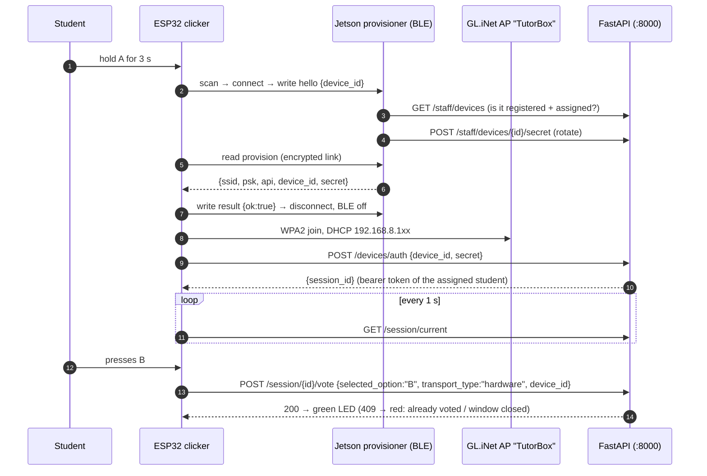
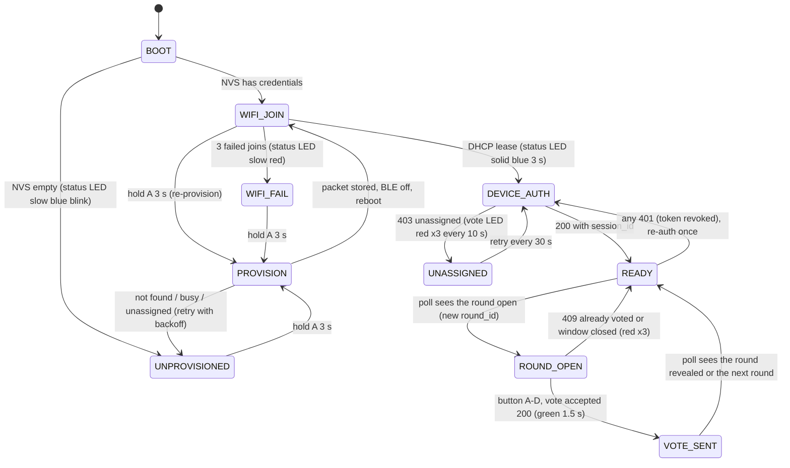

# ESP32 Clicker Protocol — BLE Appliance Provisioning & Voting

How a physical ESP32 clicker gets onto the classroom Wi-Fi **from the appliance itself** (Jetson Orin Nano, Bluetooth always on), proves who it is, and then votes through the same REST API as the student phones.

<div align="center">

| 🏠 [TutorBox](../../README.md) | 📚 [Docs](../README.md) | ⚙️ [Backend](../../backend/README.md) | 📱 [PWA](../../pwa/README.md) | 🔌 [Infra](../../infra/README.md) |
| :---: | :---: | :---: | :---: | :---: |

📍 [Docs](../README.md) › **Architecture** › **ESP32 Protocol** • **Related:** [ESP32 Clicker Transport](esp32-clicker-transport.md) • [GL.iNet AP Setup](../../infra/glinet/initial.md) • [Devices API](../api/devices.md) • [Sessions API](../api/sessions.md)

</div>

---

> [!NOTE]
> **Design document for Week 7 (ESP32 Hardware Clickers).** Nothing in this page is implemented yet.
> It replaces the "factory flashing" strategy in [ESP32 Clicker Transport §3](esp32-clicker-transport.md#3-wi-fi-ap-association--provisioning-mechanisms)
> with provisioning over Bluetooth from the appliance; hardware, LED tables and the `VoteTransport`
> principle from that document still apply and are not repeated here.

---

## Table of Contents
- [1. The Idea in One Page](#1-the-idea-in-one-page)
- [2. What You Need Before Writing Code](#2-what-you-need-before-writing-code)
- [3. End-to-End Flow](#3-end-to-end-flow)
- [4. BLE Provisioning Protocol](#4-ble-provisioning-protocol)
- [5. Trust Model: Why "Bluetooth Always On" Is Safe](#5-trust-model-why-bluetooth-always-on-is-safe)
- [6. Backend Additions](#6-backend-additions)
- [7. Jetson Provisioner Service](#7-jetson-provisioner-service)
- [8. ESP32 Firmware](#8-esp32-firmware)
- [9. Network & Capacity Considerations](#9-network--capacity-considerations)
- [10. Failure Modes & Bring-Up Checklist](#10-failure-modes--bring-up-checklist)
- [11. Week 7 Work Breakdown](#11-week-7-work-breakdown)
- [Next Steps](#next-steps)

---

## <a id="1-the-idea-in-one-page"></a>1. The Idea in One Page

| Question | Answer |
| :--- | :--- |
| Who is the Bluetooth **server**? | The Jetson. It runs a small always-on service that advertises a `TutorBox` BLE GATT service and answers reads. It never initiates anything. |
| Who is the Bluetooth **client**? | The ESP32, and only while provisioning. A long press on button **A (3 s)** makes it scan for the `TutorBox` service, connect, exchange two small JSON messages, disconnect, and switch Bluetooth off. |
| What is in "the packet"? | SSID, WPA2 passphrase, the API base URL, the clicker's `device_id`, and a **device secret** (see below). ~200 bytes of JSON, read from one encrypted GATT characteristic. |
| Why a device secret? | Voting requires a student bearer token (`POST /api/v1/session/{id}/vote`). A clicker has no PIN, so it exchanges its secret for a token of the student the teacher assigned to it — over Wi-Fi, every boot. Re-assigning the clicker to another child tomorrow needs **no Bluetooth step**. |
| How often does provisioning happen? | Once per clicker, and again only if the router passphrase changes. Not per class, not per student. |
| After provisioning? | Pure Wi-Fi + HTTP. The clicker polls `GET /api/v1/session/current` and votes exactly like a phone (`transport_type: "hardware"`). Host page and HDMI screen need no changes. |



---

## <a id="2-what-you-need-before-writing-code"></a>2. What You Need Before Writing Code

### Jetson Orin Nano
- **A Bluetooth radio.** The Developer Kit ships an M.2 Key-E module (Realtek RTL8822CE: Wi-Fi 5 + **Bluetooth 5.0**). Check with `bluetoothctl show` — if no controller is listed, use any BlueZ-supported USB dongle (CSR8510, Intel AX200) rather than fighting the driver.
- **BlueZ ≥ 5.50** (JetPack 5 / 6 ship 5.53 / 5.64). GATT servers are exposed over D-Bus (`org.bluez.GattManager1`, `org.bluez.LEAdvertisingManager1`); the provisioner is a Python process talking to that bus.
- **Turn the Jetson's own Wi-Fi off** (`nmcli radio wifi off`). The appliance is wired to the router (see [hardware topology](hardware-topology.md)); BT and Wi-Fi share the same RTL8822CE radio and coexistence only costs you BLE reliability.
- **The appliance must know the Wi-Fi it hands out.** The GL.iNet SSID/passphrase are set in [`infra/glinet/initial.md` §4](../../infra/glinet/initial.md#4-step-2--wi-fi-ssid-tutorbox); the provisioner reads them from its own env file (§7). Keep that file `0600`, owned by the service user.
- **A stable API address**: the Jetson holds the static lease `192.168.8.2` (`infra/glinet/initial.md` §5), so the packet can carry `http://192.168.8.2:8000/api/v1` (or `http://tutorbox/api/v1` once Nginx fronts the backend on :80 — either way it is *data in the packet*, not something baked into firmware).

### ESP32
- **ESP32-S2 has no Bluetooth at all** — it cannot be used with this design. Original ESP32 (WROOM-32), ESP32-S3, ESP32-C3 and C6 all have BLE. The C3 / WROOM-32 in the [BOM](esp32-clicker-transport.md#2-hardware-specifications--bill-of-materials) are fine.
- Use the **NimBLE** stack (Arduino: `NimBLE-Arduino`; ESP-IDF: NimBLE host). Bluedroid costs ~100 KB more RAM and the classic ESP32 needs that RAM for Wi-Fi + TLS-free HTTP.
- BLE and Wi-Fi share one radio on the ESP32 too. Do not run them together: provision with Wi-Fi off, then `NimBLEDevice::deinit(true)` and reboot into Wi-Fi mode. Simpler than coexistence tuning and frees ~50 KB heap.
- BLE range is ~10 m indoors. Provisioning is done **next to the appliance** (teacher's desk), never from the back of the room.

### Backend
- `devices` table + `/api/v1/staff/devices*` already exist ([Devices API](../api/devices.md)); `device_id` must match `^[A-Za-z0-9_.-]{1,32}$` (`backend/src/core/security/validation.py`).
- `POST /api/v1/session/{id}/vote` already accepts `transport_type: "hardware"` and `device_id`, and enforces **first-press locking** (`UNIQUE(round_id, student_id)` → `409`). The older spec's "change your mind within the window" is **not** how the engine behaves; the firmware must treat 409 as final.
- `GET /api/v1/session/current` (public) returns the live match and its open round; the clicker needs no session id.
- Missing today and specified in §6: a way for a *device* to obtain a student bearer token.

---

## <a id="3-end-to-end-flow"></a>3. End-to-End Flow

Clicker lifecycle, as a state machine. LED patterns are the ones in [Clicker Transport §6](esp32-clicker-transport.md#6-visual-feedback--dual-led-state-machines); only the two provisioning states are new.



Two rules that keep the firmware simple:
1. **One request in flight at a time.** Buttons are ignored while the vote LED is busy (transmitting / green / red), exactly as the transport spec's debounce rule says.
2. **The backend is the only clock.** The clicker never runs its own countdown; it votes when the round is `open` and accepts whatever the server answers.

---

## <a id="4-ble-provisioning-protocol"></a>4. BLE Provisioning Protocol

### 4.1 Advertising (what "broadcasting" actually is)
The Jetson advertises continuously: flags + the 128-bit service UUID + local name `TutorBox`. **The advertisement carries no credentials** — 31 bytes would not fit them and anyone with a phone could read them. Credentials are only readable after connecting and encrypting the link (§4.4). The name lets a human verify with any BLE scanner app that the appliance is alive.

### 4.2 GATT layout

| Item | UUID (custom base `5f8c0000-4c2b-4a7e-9d5e-7b1a2e3c4d5f`) | Properties | Direction |
| :--- | :--- | :--- | :--- |
| Provisioning service | `5f8c0001-4c2b-4a7e-9d5e-7b1a2e3c4d5f` | primary | — |
| `hello` characteristic | `5f8c0002-…` | `write` | ESP32 → Jetson: who am I |
| `provision` characteristic | `5f8c0003-…` | `encrypt-read` | Jetson → ESP32: the packet |
| `result` characteristic | `5f8c0004-…` | `write` | ESP32 → Jetson: stored / failed |

All values are UTF-8 JSON, **≤ 512 bytes** (the ATT maximum attribute length). The ESP32 requests an MTU of 256 so the packet arrives in one read; if the negotiated MTU is smaller, NimBLE's `readValue()` transparently issues *Read Blob* requests, so the code path is the same.

### 4.3 Messages

**`hello`** — written first, immediately after connecting:
```json
{"v": 1, "device_id": "ESP32-A4CF12", "fw": "0.1.0", "batt": 88}
```
`device_id` is derived from the Wi-Fi station MAC (`ESP32-` + last six hex digits, upper-case) so it is stable across re-flashes, printable on the case label, and matches the `device_id` regex. The same string is later sent with every vote.

**`provision`** — read after `hello`. One of:
```json
{"v": 1, "status": "assigned", "ssid": "TutorBox", "psk": "<classroom passphrase>",
 "api": "http://192.168.8.2:8000/api/v1", "device_id": "ESP32-A4CF12",
 "username": "ana", "secret": "3f9c2a8e6b1d4c7f0a5e9d3b8c2f6a1e"}
```
```json
{"v": 1, "status": "unregistered"}
```
```json
{"v": 1, "status": "unassigned", "device_id": "ESP32-A4CF12"}
```
```json
{"v": 1, "status": "busy"}
```
Only `assigned` carries credentials. The firmware **must verify `device_id` equals its own** before storing anything (§4.5 explains why) and must treat every other status as "try again later" with a distinct LED hint.

**`result`** — written last, before disconnecting:
```json
{"ok": true}
```
```json
{"ok": false, "err": "nvs_write_failed"}
```
The provisioner logs it (`device_provisioned` / `device_provision_failed` in the audit log) and clears its per-device state.

### 4.4 Link security
- `provision` is flagged `encrypt-read`. BlueZ refuses the read with *Insufficient Encryption* until the link is encrypted, which makes the ESP32 (central) start pairing.
- Pairing mode: **LE Secure Connections, Just Works, no bonding**. Neither side has a keyboard or display, so there is no MITM protection to gain from a passkey; encryption of the link is what we want. `NimBLEDevice::setSecurityAuth(/*bond*/ false, /*mitm*/ false, /*sc*/ true)` on the ESP32; a `NoInputNoOutput` agent registered by the provisioner on the Jetson so pairing never prompts.
- **Why no bonding:** with bonding, BlueZ stores a long-term key per clicker MAC. Re-flash a clicker (or let it use a resolvable private address) and the next connection fails with *Authentication Failed* until someone runs `bluetoothctl remove <mac>`. Pairing fresh on every provisioning avoids the entire class of "it worked yesterday" bugs at the cost of ~300 ms.

### 4.5 One clicker at a time
BlueZ delivers `ReadValue(options)` with `options["device"]`, so a D-Bus implementation *can* keep one packet per connected central. High-level helpers such as `bluezero` do not pass the caller to the read callback, and 30 clickers pairing simultaneously is not a scenario worth engineering for — provisioning is a desk-side, once-per-device task. The design therefore **serializes**:

- The provisioner keeps one `current` slot `{device_id, packet, expires_at}`.
- A `hello` while the slot is taken (and not expired, 10 s) makes `provision` answer `{"status":"busy"}`.
- A `result` write or the 10 s timeout frees the slot.
- Because the `provision` value is shared, a late reader could see another clicker's packet — hence the **mandatory `device_id` check** in firmware: a mismatch is discarded and retried after a random 1–5 s backoff. The check makes the race harmless; the serialization makes it rare.

### 4.6 Timeouts
| Step | Budget | On expiry |
| :--- | :--- | :--- |
| Scan for the service | 5 s | status LED red ×3, back to `UNPROVISIONED` |
| Connect + MTU + pairing | 5 s | same |
| `hello` → `provision` read | 3 s | same |
| Whole provisioning | 15 s | BLE off, reboot |

---

## <a id="5-trust-model-why-bluetooth-always-on-is-safe"></a>5. Trust Model: Why "Bluetooth Always On" Is Safe

The radio being always on is only a problem if it hands out something valuable to anyone who asks. It does not:

| Layer | What an attacker with a laptop next to the school gets |
| :--- | :--- |
| Advertisement | The name `TutorBox` and a UUID. |
| Connect + `hello` with a made-up `device_id` | The device is auto-registered (`POST /staff/devices`, capped at 100 rows) and `provision` says `unregistered`. No Wi-Fi passphrase. The teacher sees an unknown clicker appear in the roster and simply never assigns it. |
| Guess a registered but unassigned `device_id` | `unassigned`. Still no passphrase. |
| Guess an **assigned** `device_id` (printed on a real clicker's label) | The Wi-Fi passphrase of an isolated LAN with no internet, plus a device secret that is **rotated on every provisioning** — so the real clicker's next provisioning invalidates it. This is the residual risk, and it is equivalent to reading the passphrase off the router's sticker. |

Rules that follow from this:
- Credentials go **only** to devices with `assigned_user_id` set — the teacher's assignment *is* the trust decision, and it is already an audited staff action.
- The device secret is stored **hashed** (bcrypt, like PINs) and shown exactly once, to the provisioner, which forwards it over the encrypted BLE link. It never appears in logs — same "zero plaintext credential leakage" rule as PINs and tokens.
- The student bearer token obtained with the secret lives **only in clicker RAM**; a reboot re-authenticates.
- `POST /staff/devices/{id}/unassign` revokes the device's active sessions immediately (§6.4), so a clicker taken away from a child stops voting as that child within one poll.
- Rotating the classroom passphrase invalidates every clicker; re-provision the fleet (a minute per 10 clickers at the desk). Plan it with the router change, not after.
- Later hardening, not needed for the capstone: ESP32 NVS encryption + flash encryption (someone with physical access and a USB cable can otherwise dump the passphrase), and app-layer AES-GCM of the packet with a fleet key burned at flashing time — which reintroduces the flashing step this design removes, so weigh it honestly.

---

## <a id="6-backend-additions"></a>6. Backend Additions

Everything a clicker needs from the API except one thing exists. Four small changes, all in Week 7, all following patterns already in the codebase.

### 6.1 Migration `011_add_device_secret.sql`
```sql
-- 011_add_device_secret.sql
-- Device secret for hardware clicker authentication, and the device a session was issued to.
ALTER TABLE devices ADD COLUMN secret_hash TEXT NULL;
ALTER TABLE devices ADD COLUMN secret_issued_at TIMESTAMP NULL;
ALTER TABLE sessions ADD COLUMN device_id TEXT NULL;
```
Same shape as `004_add_must_change_pin.sql`; add the migration test and the `docs/database` entry as usual.

### 6.2 `POST /api/v1/staff/devices/{device_id}/secret` — teacher / admin
Issues (or rotates) the secret. Called by the provisioner during every provisioning.
```json
{"device_id": "ESP32-A4CF12", "secret": "3f9c2a8e6b1d4c7f0a5e9d3b8c2f6a1e"}
```
- `secrets.token_hex(16)`; store `hash_pin(secret)` (`backend/src/core/security/auth.py` — bcrypt, 32 chars is well inside bcrypt's limit); `record_audit(action="device_secret_issued")`. The plaintext is returned exactly once.
- `404` unknown device. No role difference between teacher and admin.

### 6.3 `POST /api/v1/devices/auth` — public, rate-limited
Exchanges the secret for a bearer session of the assigned student.
```json
{"device_id": "ESP32-A4CF12", "secret": "3f9c2a8e6b1d4c7f0a5e9d3b8c2f6a1e"}
```
```json
{"session_id": "9b1deb4d-3b7d-4bad-9bdd-2b0d7b3dcb6d", "username": "ana", "device_id": "ESP32-A4CF12"}
```
- `check_rate_limit(device_id)` + `login_rate_limiter.record_failure/success` exactly like `api/auth/login.py`, so a secret cannot be brute-forced faster than a PIN.
- `401` for unknown device **or** wrong secret (single message, same as login's anti-oracle symmetry); `403 "Device is not assigned to any student."` for a valid secret on an unassigned device (the clicker shows the "tell the teacher" pattern); `422` on regex failure.
- On success: the same `INSERT INTO sessions (id, user_id, is_active)` as login, plus `device_id`. The resulting `AuthContext` is the student's, so `POST /session/{id}/vote` records `student_id = assigned_user_id` with `transport_type="hardware"` and the `device_id` — nothing in the session engine changes. This is the `VoteTransport` seam in practice.
- Lives in a new `api/devices/` package (`auth.py`, `schemas.py`), mounted at `/api/v1/devices` in `api/router.py` — keeps `api/staff/` teacher-only and each module under the 150-line ceiling.

### 6.4 Revocation on unassign
`api/staff/device_pairing.py::unassign_device` additionally runs
`UPDATE sessions SET is_active = 0 WHERE device_id = ? AND is_active = 1`. Assigning a device to a different student should do the same for the previous assignment.

### 6.5 Configuration
Entries in `.env.example`, read only by the provisioner (§7):
```
PROVISIONER_USERNAME=provisioner      # admin account created once with POST /staff/users
PROVISIONER_PIN=
CLICKER_WIFI_SSID=TutorBox
CLICKER_WIFI_PSK=
CLICKER_API_BASE=http://192.168.8.2:8000/api/v1
```
The provisioner logs in with `POST /auth/login` at start-up and re-logs on any `401`, exactly as the old Pilas server did with the teacher account.

---

## <a id="7-jetson-provisioner-service"></a>7. Jetson Provisioner Service

A separate process (`infra/provisioner/tutorbox_provisioner.py`) with its own systemd unit. It is deliberately **not** inside FastAPI: BlueZ needs a GLib main loop, and a BLE stack hiccup must never take the quiz API down.

### 7.1 Host setup (once)
```bash
sudo apt install bluez python3-dbus python3-gi        # D-Bus + GLib bindings for BlueZ
sudo rfkill unblock bluetooth
sudo nmcli radio wifi off                              # appliance is wired; free the shared radio
# /etc/bluetooth/main.conf
#   [General]  Name = TutorBox
#   [Policy]   AutoEnable = true                       # adapter powers on at boot
sudo systemctl enable --now bluetooth
bluetoothctl show                                      # expect "Powered: yes"
pip install bluezero                                   # or: bless — either wraps the D-Bus GATT API
```

### 7.2 Behaviour
1. Register a `NoInputNoOutput` agent (`org.bluez.AgentManager1`) and make it default, so Just Works pairing needs no console.
2. Publish the service from §4.2 and start advertising (`LEAdvertisingManager1`, local name `TutorBox`, service UUID included).
3. On `hello`: parse → validate `device_id` against the regex → if the slot is busy, set `provision` to `busy` → else
   `GET /staff/devices`; unknown → `POST /staff/devices` and `unregistered`; no `assigned_user_id` → `unassigned`;
   otherwise `POST /staff/devices/{id}/secret` and set the `assigned` packet with SSID/PSK/API base from the env file. Claim the slot for 10 s.
4. On `result`: log locally, clear the packet value, free the slot.
5. On any backend error: answer `busy` (never a half-packet), log, keep advertising.

### 7.3 Sketch
```python
# infra/provisioner/tutorbox_provisioner.py  (sketch — bluezero peripheral API)
import json, os, time
from bluezero import adapter, peripheral
from tutorbox_api import backend        # thin urllib client: login(), devices(), register(), issue_secret()

SVC, HELLO, PROV, RESULT = (f"5f8c000{i}-4c2b-4a7e-9d5e-7b1a2e3c4d5f" for i in (1, 2, 3, 4))
slot = {"device_id": None, "until": 0.0}

def packet_for(device_id: str) -> dict:
    if slot["device_id"] not in (None, device_id) and time.monotonic() < slot["until"]:
        return {"v": 1, "status": "busy"}
    dev = backend.devices().get(device_id)
    if dev is None:
        backend.register(device_id)                         # appears in the teacher's roster
        return {"v": 1, "status": "unregistered"}
    if dev["assigned_user_id"] is None:
        return {"v": 1, "status": "unassigned", "device_id": device_id}
    slot.update(device_id=device_id, until=time.monotonic() + 10)
    return {"v": 1, "status": "assigned", "device_id": device_id, "username": dev["assigned_username"],
            "ssid": os.environ["CLICKER_WIFI_SSID"], "psk": os.environ["CLICKER_WIFI_PSK"],
            "api": os.environ["CLICKER_API_BASE"], "secret": backend.issue_secret(device_id)}

def on_hello(value, options):
    hello = json.loads(bytes(value))
    prov.set_value(json.dumps(packet_for(hello["device_id"])).encode())

def on_result(value, options):
    prov.set_value(b"{}")                                   # never leave a packet readable
    slot.update(device_id=None, until=0.0)

p = peripheral.Peripheral(adapter.Adapter().address, local_name="TutorBox")
p.add_service(srv_id=1, uuid=SVC, primary=True)
p.add_characteristic(srv_id=1, chr_id=1, uuid=HELLO, value=[], notifying=False, flags=["write"], write_callback=on_hello)
p.add_characteristic(srv_id=1, chr_id=2, uuid=PROV, value=[], notifying=False, flags=["encrypt-read"])
p.add_characteristic(srv_id=1, chr_id=3, uuid=RESULT, value=[], notifying=False, flags=["write"], write_callback=on_result)
prov = p.characteristics[1]
p.publish()                                                 # blocks on the GLib main loop
```
`tutorbox_api.backend` is ~40 lines of `urllib` (login, list devices, register, issue secret) — the same stdlib style as `core/llm/client.py`. Memory: ~30 MB RSS, negligible against the 8 GB budget.

### 7.4 systemd unit
```ini
# /etc/systemd/system/tutorbox-provisioner.service
[Unit]
Description=TutorBox BLE clicker provisioner
After=bluetooth.target network-online.target tutorbox-backend.service
Wants=bluetooth.target

[Service]
EnvironmentFile=/etc/tutorbox/provisioner.env     # mode 0600
ExecStart=/usr/bin/python3 /opt/tutorbox/infra/provisioner/tutorbox_provisioner.py
Restart=on-failure
RestartSec=3
User=tutorbox
SupplementaryGroups=bluetooth

[Install]
WantedBy=multi-user.target
```
`Restart=on-failure` is what makes "Bluetooth always on" true in practice: BlueZ occasionally drops the advertisement after an adapter reset, and the restart re-registers it.

---

## <a id="8-esp32-firmware"></a>8. ESP32 Firmware

`firmware/clicker/` — PlatformIO, Arduino framework, libraries: `NimBLE-Arduino`, `ArduinoJson`, built-in `WiFi`, `HTTPClient`, `Preferences` (NVS). Pins, debounce and LED patterns per [Clicker Transport §2 and §6](esp32-clicker-transport.md).

### 8.1 NVS layout (namespace `tb`)
| Key | Type | Notes |
| :--- | :--- | :--- |
| `ssid`, `psk` | string | from the packet |
| `api` | string | API base, e.g. `http://192.168.8.2:8000/api/v1` |
| `dev` | string | `device_id` (also recomputed from MAC; stored for the mismatch check) |
| `secret` | string | rotated on every provisioning |
| — | — | the bearer token is **never** written to NVS |

### 8.2 Provisioning routine (sketch)
```cpp
// hold A for 3 s → provision(); Wi-Fi is off at this point
bool provision() {
  NimBLEDevice::init("");
  NimBLEDevice::setSecurityAuth(false, false, true);          // no bond, no MITM, LE Secure Connections
  NimBLEDevice::setSecurityIOCap(BLE_HS_IO_NO_INPUT_OUTPUT);
  NimBLEDevice::setMTU(256);

  NimBLEScan* scan = NimBLEDevice::getScan();
  scan->setActiveScan(true);
  NimBLEScanResults found = scan->start(5, false);
  const NimBLEAdvertisedDevice* jetson = nullptr;
  for (int i = 0; i < found.getCount(); i++)
    if (found.getDevice(i).isAdvertisingService(NimBLEUUID(SVC_UUID))) { jetson = &found.getDevice(i); break; }
  if (!jetson) return fail("no_appliance");

  NimBLEClient* c = NimBLEDevice::createClient();
  if (!c->connect(jetson)) return fail("connect");
  NimBLERemoteService* svc = c->getService(SVC_UUID);
  svc->getCharacteristic(HELLO_UUID)->writeValue(helloJson(), true);
  std::string raw = svc->getCharacteristic(PROV_UUID)->readValue();   // encrypt-read → NimBLE pairs, then reads
  StaticJsonDocument<512> doc;
  if (deserializeJson(doc, raw) || strcmp(doc["status"] | "", "assigned") != 0 ||
      strcmp(doc["device_id"] | "", myDeviceId()) != 0) {              // MUST: reject another clicker's packet
    svc->getCharacteristic(RESULT_UUID)->writeValue("{\"ok\":false,\"err\":\"status\"}", true);
    c->disconnect(); return fail(doc["status"] | "bad_packet");        // caller retries with 1–5 s backoff
  }
  Preferences nvs; nvs.begin("tb", false);
  nvs.putString("ssid", doc["ssid"].as<const char*>());  nvs.putString("psk", doc["psk"].as<const char*>());
  nvs.putString("api",  doc["api"].as<const char*>());   nvs.putString("dev", doc["device_id"].as<const char*>());
  nvs.putString("secret", doc["secret"].as<const char*>());
  nvs.end();
  svc->getCharacteristic(RESULT_UUID)->writeValue("{\"ok\":true}", true);
  c->disconnect();
  NimBLEDevice::deinit(true);                                 // free the radio and ~50 KB heap
  ESP.restart();                                              // boots straight into WIFI_JOIN
  return true;
}
```

### 8.3 Runtime loop (sketch)
```cpp
String token;                       // RAM only
String lastRound, seenRound;        // round_id already voted / last seen open
uint32_t roundSeenAt = 0;

bool deviceAuth() {                 // 200 → token; 403 → UNASSIGNED pattern; 401 → wrong secret → re-provision hint
  HTTPClient http; http.begin(api + "/devices/auth"); http.addHeader("Content-Type", "application/json");
  int code = http.POST("{\"device_id\":\"" + dev + "\",\"secret\":\"" + secret + "\"}");
  if (code == 200) { StaticJsonDocument<256> d; deserializeJson(d, http.getString()); token = d["session_id"].as<String>(); }
  http.end(); return code == 200;
}

void loop() {
  if (millis() - lastPoll > 1000) {                            // the backend is the only clock
    lastPoll = millis();
    HTTPClient http; http.begin(api + "/session/current");     // 404 = no match yet: stay READY
    if (http.GET() == 200) {
      StaticJsonDocument<1024> s; deserializeJson(s, http.getStream());
      const char* status = s["current_round"]["status"] | "";
      String rid = s["current_round"]["round_id"] | "";
      sessionId = s["id"].as<String>();
      armed = (strcmp(status, "open") == 0 && rid != lastRound);
      if (armed && rid != seenRound) { seenRound = rid; roundSeenAt = millis(); }
    } else armed = false;
    http.end();
  }
  char pressed = readButtonDebounced();                        // 'A'..'D' or 0; ignored while the LED is busy
  if (pressed && armed) vote(pressed);
  if (longPressA(3000)) { WiFi.disconnect(true); provision(); }
}

void vote(char option) {
  ledYellowBlink();
  HTTPClient http; http.begin(api + "/session/" + sessionId + "/vote");
  http.addHeader("Content-Type", "application/json"); http.addHeader("Authorization", "Bearer " + token);
  int code = http.POST(String("{\"selected_option\":\"") + option + "\",\"transport_type\":\"hardware\",\"device_id\":\"" + dev +
                       "\",\"response_time_ms\":" + (millis() - roundSeenAt) + "}");
  http.end();
  if (code == 200)      { lastRound = seenRound; ledGreen(1500); }
  else if (code == 401) { if (deviceAuth()) return vote(option); ledRed3(); }   // token revoked → re-auth once
  else if (code == 403) { ledRed3(); /* unassigned: avisa al maestro */ }
  else                  { lastRound = seenRound; ledRed3(); }                    // 409: already voted / window closed
}
```
Details worth keeping in mind:
- `WiFi.setSleep(true)` (modem sleep) roughly halves idle current; polling once a second still works.
- `response_time_ms` is measured from the moment the clicker *saw* the round open, which is up to one poll interval late — good enough for the weekly report, and the same bias as the phones.
- 30 clickers × 1 poll/s ≈ 30 req/s on `/session/current`: four cheap SQLite reads each, well within the Jetson's budget. If it ever isn't, the upgrade path is one SSE endpoint the clicker subscribes to; the firmware loop above changes only where `armed` is set.
- Keep the HTTP client on plain `http://` inside the isolated LAN; TLS on a WROOM-32 costs RAM and certificates that nobody can renew offline.

---

## <a id="9-network--capacity-considerations"></a>9. Network & Capacity Considerations

| Topic | Consideration |
| :--- | :--- |
| Addresses | Clickers take DHCP leases from `192.168.8.100–159` (60 addresses). 30 clickers + 20 phones fits; widen `dhcp.lan.limit` before adding a second class set. |
| Client isolation | `isolate='1'` on the AP blocks station↔station traffic only. Clickers talk to the Jetson on the **wired** LAN, so isolation costs nothing here and must stay on. |
| WPA2 only | Keep `psk2+ccmp`. ESP32 WPA3/SAE support exists but is the most common cause of silent join failures on this hardware class. |
| 2.4 GHz congestion | ESP32 is 2.4 GHz only; `HT20` and an empirically chosen channel (1/6/11) per the router runbook. BLE also lives in 2.4 GHz but only during the seconds of provisioning. |
| Join time | Cold boot → DHCP lease ≈ 2–4 s. A cached BSSID/channel in NVS (`WiFi.begin(ssid, psk, channel, bssid)`) cuts it to ≈ 1 s; optional. |
| Router reboot mid-quiz | Clickers re-associate automatically (`WiFi.setAutoReconnect(true)`); the token survives (it is server-side state), so no re-auth is needed. |
| No NTP on the LAN | Irrelevant to the clicker: it never compares timestamps. (The Jetson's own clock drift is a separate, documented issue.) |
| Battery | ~80 mA average while polling with modem sleep on a WROOM-32; a 500 mAh LiPo covers a school day. Deep sleep between lessons is a later optimisation. |

---

## <a id="10-failure-modes--bring-up-checklist"></a>10. Failure Modes & Bring-Up Checklist

### Failure modes
| Symptom | Likely cause | Fix |
| :--- | :--- | :--- |
| Clicker never finds `TutorBox` | Jetson adapter blocked/off; provisioner not running; clicker too far | `rfkill list`, `bluetoothctl show`, `systemctl status tutorbox-provisioner`; provision at the desk |
| Read fails with *Authentication Failed* | Stale bond on either side | Design uses no bonding; if a bond exists from experiments: `bluetoothctl remove <clicker MAC>` and erase NVS on the clicker |
| Read returns 20 bytes / truncated JSON | MTU not negotiated and long reads disabled | Request MTU 256 before the read; keep the packet ≤ 512 B |
| `status: busy` in a loop | A previous provisioning never wrote `result` | Slot expires after 10 s; check provisioner log |
| Joins Wi-Fi, then vote LED red every 10 s | Device unassigned (403) | Teacher assigns a student in the roster; clicker re-auths within 30 s |
| Every vote 401 | Secret rotated by another provisioning, or session revoked on unassign | Re-provision (hold A 3 s) |
| Every vote 409 | Already voted this round / window closed | Expected; first press locks |
| Nothing joins after a router change | Passphrase rotated | Re-provision the fleet |
| Some clickers get no IP | DHCP pool exhausted | Widen the pool (`infra/glinet/initial.md` §5) |

### Bring-up checklist (in this order)
- [ ] `bluetoothctl show` on the Jetson lists a powered controller; `btmon` shows advertising after `systemctl start tutorbox-provisioner`.
- [ ] A phone BLE scanner sees `TutorBox` with service `5f8c0001-…`; reading `provision` from the phone without a `hello` returns `{}` / `busy` — never credentials.
- [ ] `python3 tutorbox_provisioner.py --dry-run ESP32-A4CF12` prints the packet the clicker would receive (secrets redacted in the log line).
- [ ] Backend: `pytest backend/tests/api/devices` green; `curl -X POST /api/v1/devices/auth` with a wrong secret → 401, unassigned → 403, assigned → 200 with a `session_id`.
- [ ] One clicker: serial log shows `hello → assigned → nvs ok → reboot → wifi 192.168.8.1xx → auth 200`.
- [ ] Teacher starts a match on `/maestro/`; the clicker's vote raises `votes_cast` on the host page and `/pantalla/` within one second; reveal shows it in the bars.
- [ ] Unassign the clicker from the roster → its next vote is 401 → it re-auths and gets 403 → red pattern. Re-assign → votes again without any Bluetooth step.
- [ ] Fleet: 15 clickers provisioned at the desk in under 3 minutes; all 15 vote in a 5-question match with zero lost votes (Week 7 acceptance criterion).

---

## <a id="11-week-7-work-breakdown"></a>11. Week 7 Work Breakdown

In the order each piece unblocks the next:

1. **Backend (Copilot A, ~1 day)** — migration 011, `api/devices/auth.py` + schemas, `staff/devices/{id}/secret`, revocation in `unassign`/`assign`, `.env.example` entries, tests (`tests/api/devices/`, migration test), `docs/api/devices.md` + `docs/database`. Testable with `curl` before any hardware exists.
2. **Provisioner (Pilot B, ~1 day)** — `infra/provisioner/` script + systemd unit + `--dry-run`; verified with a phone BLE scanner app and the checklist above.
3. **Firmware (Pilot B, ~2 days)** — provisioning routine, NVS, runtime loop, LED mapping; one clicker end-to-end against the real backend.
4. **Fleet test (both, ½ day)** — 15+ clickers, router association limits, latency comparison ESP32 vs. PWA (roadmap Week 7 deliverable).
5. **Pilas roster** — optional: show `GET /staff/devices` (device, assigned student, `secret_issued_at`) with assign/unassign buttons on `/maestro/`, so the "unregistered → assign → press again" loop never needs Swagger.

---

## Next Steps

* **[ESP32 Clicker Transport](esp32-clicker-transport.md)**: hardware BOM, pin map, LED state tables and the `VoteTransport` interface this protocol plugs into.
* **[GL.iNet AP Setup](../../infra/glinet/initial.md)**: the SSID, passphrase, DHCP pool and static lease the packet advertises.
* **[Devices API](../api/devices.md)** and **[Sessions API](../api/sessions.md)**: the endpoints the clicker and the provisioner call.
