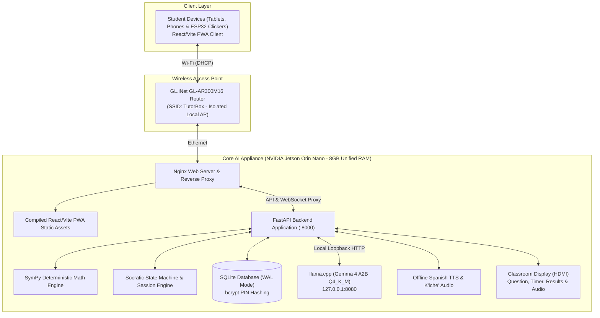

# Hardware Architecture & Offline Network Topology

| 🏠 [TutorBox](../../README.md) | 📚 [Docs](../README.md) | ⚙️ [Backend](../../backend/README.md) | 📱 [PWA](../../pwa/README.md) | 🔌 [Infra](../../infra/README.md) |
| :---: | :---: | :---: | :---: | :---: |

📍 **Docs** › **Architecture** › **Hardware Topology** • **Related:** [Three Modes](three-modes.md) • [Socratic Pedagogy](socratic-pedagogy.md) • [Infra Guide](../../infra/README.md)

---

The entire **TutorBox** platform operates **100% offline** as an integrated single-appliance edge system without WAN or internet connectivity.

---

## 1. Network & Appliance Topology

---

## 2. Hardware Nodes & Responsibilities

| Node | Hardware Specs | Responsibilities & Software |
| :--- | :--- | :--- |
| **Core AI Appliance** | **NVIDIA Jetson Orin Nano** (8GB Unified RAM) | Hosts all software services: Nginx reverse proxy, static PWA hosting, FastAPI backend, `llama.cpp` SLM inference, offline Spanish & K'iche' neural TTS, SymPy validation engine, SQLite database, and direct HDMI classroom display/audio. |
| **Wireless AP** | **GL.iNet GL-AR300M16 Router** | Isolated local router broadcasting SSID `TutorBox` with local DHCP IP assignment for student devices. |

---

## 3. Unified Memory & Resource Budget (8GB Unified RAM)

On the **NVIDIA Jetson Orin Nano (8GB)**, CPU and GPU share a single unified LPDDR5 memory bus. After bootloader and kernel hardware carveouts, total usable system RAM is **$\approx 7.5\text{ GiB}$**.

### Component-by-Component RAM Allocation

| Subsystem | Baseline (Idle) | Runtime Buffers & Context | Total Allocation | Technical Details & Assumptions |
| :--- | :---: | :---: | :---: | :--- |
| **OS & Kernel Baseline** | 600 MB | 200 MB | **~0.8 GB** | Headless Ubuntu 22.04 LTS (GUI disabled, 25W mode, `jetson_clocks`). |
| **HDMI Classroom UI** | 400 MB | 200 MB | **~0.6 GB** | Lightweight Chromium kiosk rendering question timer and live voting charts. |
| **FastAPI + SQLite + Nginx** | 300 MB | 200 MB | **~0.5 GB** | Python 3.10 runtime, SymPy AST engine, SQLite WAL cache, and Nginx proxy. |
| **Offline Neural TTS (Spanish & K'iche')** | 100 MB | 200 MB | **~0.3 GB** | ONNX Runtime (`Piper-TTS` / `Sherpa-ONNX` VITS model). |
| **SLM Inference (`llama.cpp`)** | 1,500 MB | 700 MB | **~2.2 GB** | • **Model Weights (`Q4_K_M`)**: ~1.5 GB (Dense 2B class) • **CUDA Runtime Context**: ~400 MB • **KV Cache (2K context)**: ~300 MB |
| **Dynamic Classroom Pool** | — | 500 MB | **~0.5 GB** | Active WebSocket buffers and concurrent state for 15–20 student sessions. |
| **OS Safety & Page Cache** | — | — | **~2.6 GB** | Inactive page cache and emergency headroom to prevent kernel OOM killer. |
| **Total Usable Budget** | — | — | **~7.5 GB** | **100% of available physical memory safely budgeted.** |

> [!WARNING]
> **MoE vs. Dense Parameter Constraint**: If an MoE model with 2B active parameters has a larger total parameter count (e.g. 8B–12B total), **all parameters must reside in RAM**, requiring ~4.5–6.0 GB for weights alone. Therefore, TutorBox targets a **Dense 2B parameter class** (or QAT-optimized edge equivalent) to guarantee the required headroom for TTS, HDMI display, and OS page cache.
