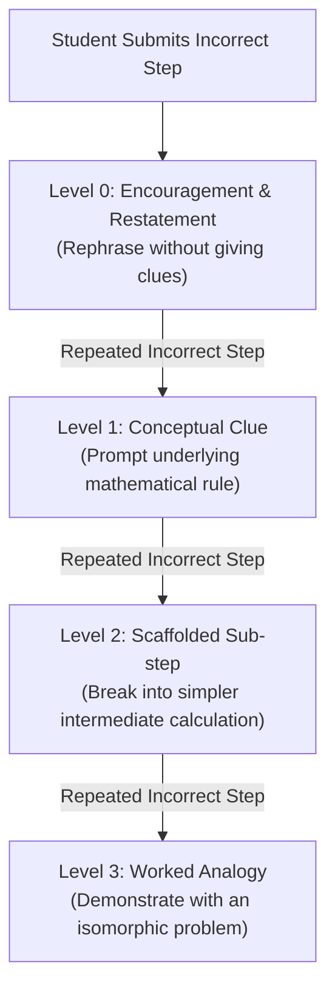
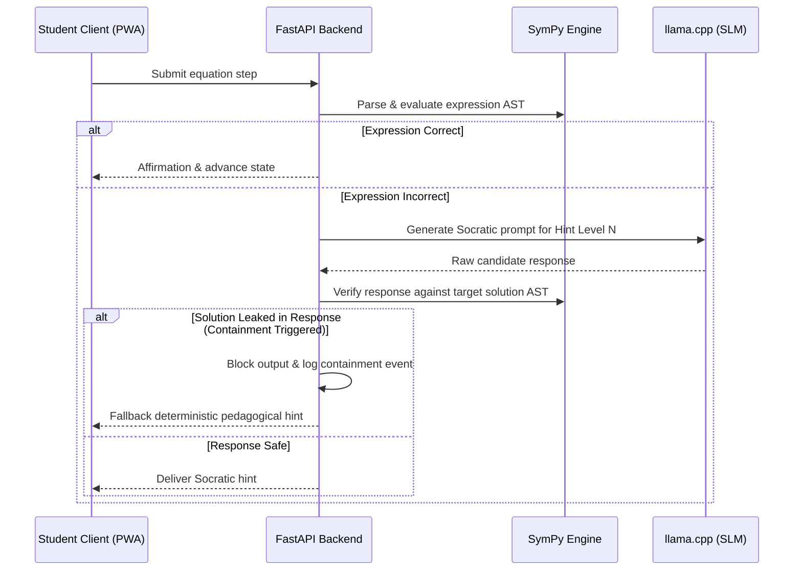

# Socratic Pedagogical Model & Math Containment Guardrails

> [TutorBox](../../README.md) / [Documentation](../README.md) / **Socratic Pedagogy**

TutorBox guides basic education students in rural Guatemala using an adaptive Socratic pedagogy. The system communicates via voice and text in **K'iche'** (`quc_Latn`) and **Spanish**.

---

## 1. The Socratic Principle
The AI tutor **never** provides direct answers or calculations. When a student makes an error, the system diagnoses the misconception and guides the student step-by-step using a deterministic 4-tier hint escalation ladder.

---

## 2. Hint Escalation Ladder ($0 \to 3$)

* **Level 0 (Encouragement & Restatement)**: Acknowledges student input, verifies the objective, and prompts the student to look at the current expression again.
* **Level 1 (Conceptual Clue)**: Identifies the operation type (e.g., adding vs. subtracting across the equality sign) without doing arithmetic.
* **Level 2 (Scaffolded Sub-step)**: Isolates a sub-expression for the student to solve first (e.g., *"What is $3 \times 4$ first?"*).
* **Level 3 (Worked Analogy)**: Illustrates the algebraic principle on a parallel equation (e.g., demonstrating $2x + 1 = 5$ when the student is solving $3x + 2 = 8$).

---

## 3. Mathematical Containment Guardrail

To guarantee zero mathematical hallucination and prevent accidental solution leakage:

### Core Invariants:
1. **SymPy as Single Source of Truth**: All mathematical equality, factoring, and equation solving is evaluated strictly by SymPy.
2. **Deterministic Fallbacks**: If an SLM response fails containment, a pre-validated fallback pedagogical template is selected.
3. **Bilingual Neural Speech Synthesis**: Spoken explanations are synthesized in Spanish and K'iche' using offline neural TTS (Piper-TTS / Sherpa-ONNX) running locally on the Jetson appliance.
