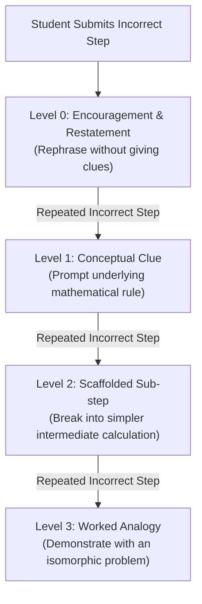
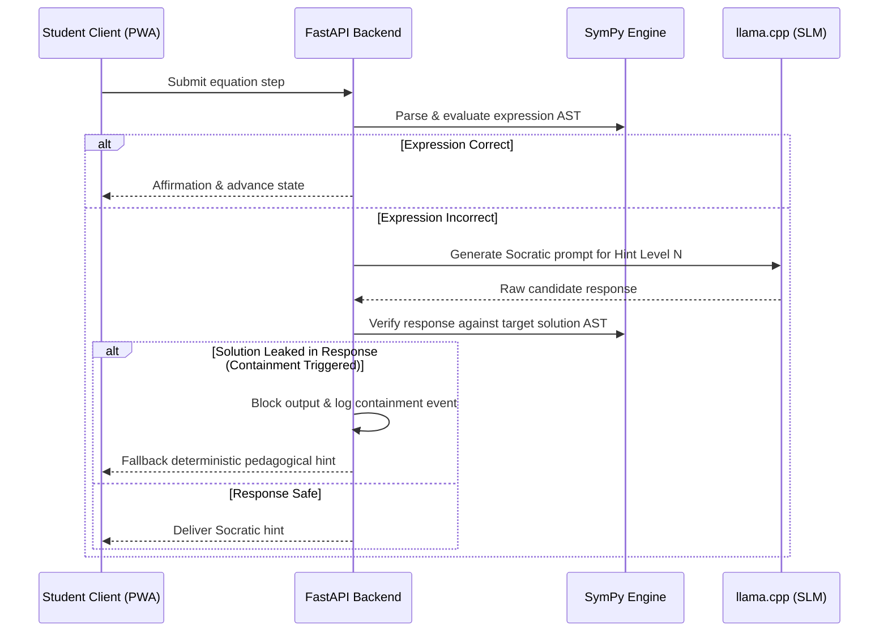

# Socratic Pedagogical Model & Math Containment Guardrails

| 🏠 [TutorBox](../../README.md) | 📚 [Docs](../README.md) | ⚙️ [Backend](../../backend/README.md) | 📱 [PWA](../../pwa/README.md) | 🔌 [Infra](../../infra/README.md) |
| :---: | :---: | :---: | :---: | :---: |

📍 [Docs](../README.md) › **Architecture** › **Socratic Pedagogy** • **Related:** [Three Modes](three-modes.md) • [ESP32 Clicker Transport](esp32-clicker-transport.md) • [Hardware Topology](hardware-topology.md)

---

TutorBox guides basic education students in rural Guatemala using an adaptive Socratic pedagogy. The system communicates via voice and text in **K'iche'** (`quc_Latn`) and **Spanish**.

---

## 1. The Socratic Principle
The AI tutor **never** provides direct answers or calculations. When a student makes an error, the system diagnoses the misconception and guides the student step-by-step using a deterministic 4-tier hint escalation ladder.

---

## 2. Hint Escalation Ladder ($0 \to 3$)

```mermaid
graph TD
    Start["Student Submits Incorrect Step"] --> L0["Level 0: Encouragement & Restatement<br/>(Rephrase without giving clues)"]
    L0 -->|"Repeated Incorrect Step"| L1["Level 1: Conceptual Clue<br/>(Prompt underlying mathematical rule)"]
    L1 -->|"Repeated Incorrect Step"| L2["Level 2: Scaffolded Sub-step<br/>(Break into simpler intermediate calculation)"]
    L2 -->|"Repeated Incorrect Step"| L3["Level 3: Worked Analogy<br/>(Demonstrate with an isomorphic problem)"]
```

* **Level 0 (Encouragement & Restatement)**: Acknowledges student input, verifies the objective, and prompts the student to look at the current expression again.
* **Level 1 (Conceptual Clue)**: Identifies the operation type (e.g., adding vs. subtracting across the equality sign) without doing arithmetic.
* **Level 2 (Scaffolded Sub-step)**: Isolates a sub-expression for the student to solve first (e.g., *"What is $3 \times 4$ first?"*).
* **Level 3 (Worked Analogy)**: Illustrates the algebraic principle on a parallel equation (e.g., demonstrating $2x + 1 = 5$ when the student is solving $3x + 2 = 8$).

---

## 3. Mathematical Containment Guardrail

To guarantee zero mathematical hallucination and prevent accidental solution leakage:

```mermaid
sequenceDiagram
    participant Student as Student Client (PWA)
    participant FastAPI as FastAPI Backend
    participant SymPy as SymPy Engine
    participant LLM as llama.cpp (SLM)

    Student->>FastAPI: Submit equation step
    FastAPI->>SymPy: Parse & evaluate expression AST
    alt Expression Correct
        FastAPI-->>Student: Affirmation & advance state
    else Expression Incorrect
        FastAPI->>LLM: Generate Socratic prompt for Hint Level N
        LLM-->>FastAPI: Raw candidate response
        FastAPI->>SymPy: Verify response against target solution AST
        alt Solution Leaked in Response (Containment Triggered)
            FastAPI->>FastAPI: Block output & log containment event
            FastAPI-->>Student: Fallback deterministic pedagogical hint
        else Response Safe
            FastAPI-->>Student: Deliver Socratic hint
        end
    end
```

### Core Invariants:
1. **SymPy as Single Source of Truth**: All mathematical equality, factoring, and equation solving is evaluated strictly by SymPy.
2. **Deterministic Fallbacks**: If an SLM response fails containment, a pre-validated fallback pedagogical template is selected.
3. **Offline Speech Synthesis**: Spoken explanations are synthesized locally on the Jetson appliance through the shared offline multi-tier TTS router (`Qwen3-TTS` -> `Sherpa-ONNX` -> `Piper` -> `eSpeak-ng`) behind the same `GET /api/v1/session/{id}/speech` contract, with Spanish (`es`) and K'iche' (`quc`) routing.

---

## 4. Implementation in Mode 2

The code is in `backend/src/modes/socratic/`; the endpoints and guard table are in the [Tutor API](../api/tutor.md).

**Dialogue state machine.** `planner.py` turns each message and the stored `Conversation` (problem and hint level) into the next move without the model. Number words are read as digits first ("doscientos más cien"). A new problem starts at level 0, and every wrong answer or request for help sets `min(level + 1, 3)`. The ladder therefore stops at level 3 and repeats it until the child solves the problem, which resets the conversation.

| Level | Operations (`operation_hints.py`, `hints.py`) | Equations (`equation_hints.py`) |
| :---: | :--- | :--- |
| 0 | Restates the goal with the child's numbers | Restates the equation |
| 1 | The operation's meaning ("sumar es juntar") | Which operation undoes what was done to the unknown |
| 2 | A smaller step: the units, counting on, one row less of the table | The first step to undo, not its result (`¿Cuánto es 14 - 4?` for `2x + 4 = 14`) |
| 3 | A worked example with other numbers | A parallel equation solved (`2 × x + 1 = 7`) |

Fractions, decimals, percentages and combined operations get a concept clue at level 1 and generic texts at the other levels.

**SymPy containment.** `containment.py` decides whether a text gives the answer away. A text does if, outside the problem itself, it states an accepted answer in digits or in words, or contains an expression or assignment that SymPy evaluates to it (`safe_parse` and `are_values_equivalent`, the equality the quiz validator uses). A model rewording also may not add a number or a calculation the hint did not have. Every hint template passes the same check before it is used, which is what makes it a safe fallback: a failing model reply is discarded, the turn records `containment_triggered`, and the child gets the template.

**Labeled problem bank.** `problem_bank.json` holds 48 problems for 1.º–5.º primaria: 24 arithmetic (+ − × ÷) and 24 pre-algebra (12 one-step and 12 two-step equations). Each has the text a child types, the same problem as SymPy reads it, the answer, the quiz's `CURRICULUM_TAXONOMY` topic and subconcept, and the CNB grade and topic. `test_problem_bank.py` proves every answer with SymPy, checks each structure with the quiz's validators, and walks every problem through four distinct, leak-free hints and the 0 → 3 climb. `test_containment_dialogues.py` is the Week 5 acceptance run: 30 turns, 10 "dame la respuesta" probes answered by a complying model, 0 answers shown.
