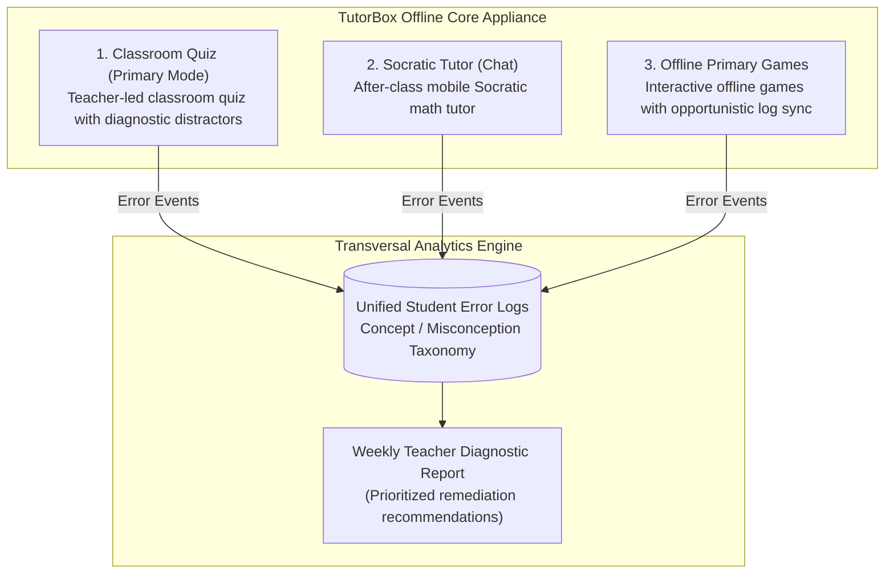

# The Three Appliance Modes & Transversal Telemetry

| 🏠 [TutorBox](../../README.md) | 📚 [Docs](../README.md) | ⚙️ [Backend](../../backend/README.md) | 📱 [PWA](../../pwa/README.md) | 🔌 [Infra](../../infra/README.md) |
| :---: | :---: | :---: | :---: | :---: |

📍 **Docs** › **Architecture** › **Three Modes** • **Related:** [Hardware Topology](hardware-topology.md) • [ESP32 Clicker Transport](esp32-clicker-transport.md) • [Socratic Pedagogy](socratic-pedagogy.md)

---

**TutorBox** operates as a multi-mode offline educational appliance centered around diagnosing and addressing student conceptual misconceptions.

---

## 1. The Three Operating Modes

---

## 2. Mode Breakdown

### Mode 1: Classroom Quiz (Primary Classroom Mode)
* **Workflow**: The teacher initiates a quiz session from her mobile browser. Students connect over the local Wi-Fi AP using their devices (or ESP32 clickers in Week 7).
* **Diagnostic Distractors**: Every question contains 4 options (A–D). Every incorrect option (distractor) intentionally targets a specific conceptual error (e.g., adding before multiplying, inverted fractions).
* **The >51% Audio Intervention Rule**:
  * If **>51%** of participating students select the same diagnostic distractor, the Jetson Orin Nano speaks out loud via offline neural TTS (in Spanish or K'iche'), explaining the exact misconception to the classroom.
  * If students answer correctly or votes are scattered, the system proceeds silently.

### Mode 2: Socratic Tutor (Conversational Math Practice)
* **Workflow**: Individual practice mode for students after class.
* **Socratic Guardrails**: Uses SymPy to parse mathematical expressions and evaluate correctness. The LLM is mechanically blocked from delivering final solutions or worked answers.

### Mode 3: Offline Primary Games (Educational Games)
* **Workflow**: Local mirror of `primariaconk.uk` hosted on the appliance without CDN dependencies.
* **Opportunistic Sync**: Logs gameplay errors locally on the student device and synchronizes deduplicated events whenever the device reconnects to the classroom AP.

---

## 3. Unified Error Taxonomy & Weekly Reporting
All three modes classify errors using a shared concept taxonomy (`topic`, `subconcept`, `misconception_type`). The weekly analytics engine computes:
1. Top 3 classroom-wide misconceptions requiring direct teacher review.
2. Individual student risk scoring.
3. Printable PDF / CSV report generated completely offline.
