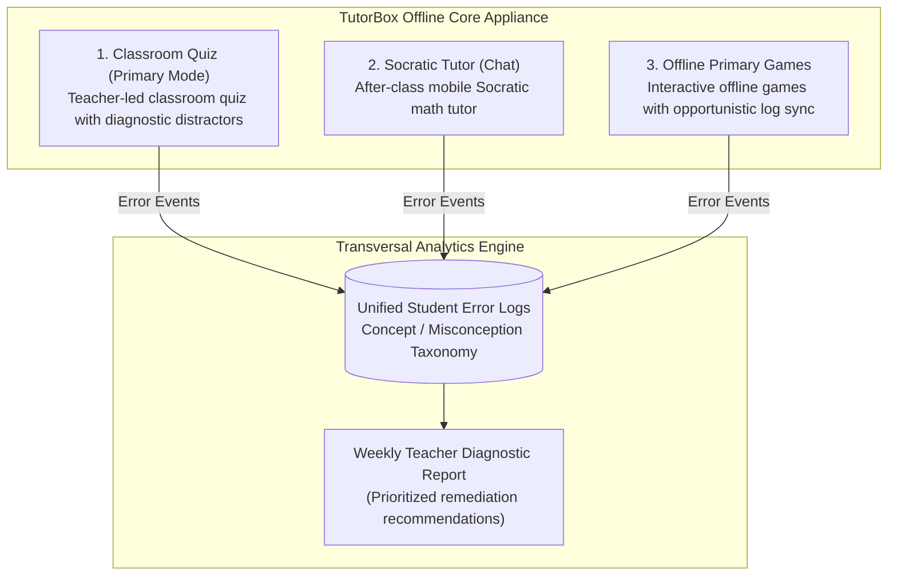

# The Three Appliance Modes & Transversal Telemetry

<div align="center">

| 🏠 [TutorBox](../../README.md) | 📚 [Docs](../README.md) | ⚙️ [Backend](../../backend/README.md) | 📱 [PWA](../../pwa/README.md) | 🔌 [Infra](../../infra/README.md) |
| :---: | :---: | :---: | :---: | :---: |

📍 **Docs** › **Architecture** › **Three Modes** • **Related:** [Diagnostic Distractors](diagnostic-misconceptions.md) • [Hardware Topology](hardware-topology.md) • [ESP32 Clicker Transport](esp32-clicker-transport.md) • [Socratic Pedagogy](socratic-pedagogy.md)

</div>

---

**TutorBox** operates as a multi-mode offline educational appliance centered around diagnosing and addressing student conceptual misconceptions.

---

## <a id="1-the-three-operating-modes"></a>1. The Three Operating Modes



---

## <a id="2-mode-breakdown"></a>2. Mode Breakdown

### <a id="mode-1-classroom-quiz"></a>Mode 1: Classroom Quiz (Primary Classroom Mode)
* **Workflow**: The teacher initiates a quiz session from her mobile browser. Students connect over the local Wi-Fi AP using their devices (or ESP32 clickers in Week 7).
* **Diagnostic Distractors**: Every question contains exactly 4 options (A–D): 1 mathematically correct answer and 3 diagnostic distractors. Each distractor intentionally maps to a concrete conceptual misconception and primary-school explanation.
* **The >51% Audio Intervention Rule**:
  * If **>51%** of participating students select the same diagnostic distractor, the Jetson Orin Nano speaks out loud via offline neural TTS (in Spanish or K'iche'), explaining the exact misconception to the classroom.
  * If students answer correctly or votes are scattered, the system proceeds silently.

#### Diagnostic Question JSON Schema Contract (Week 2):
```json
{
  "id": "q_math_001",
  "topic": "pre_algebra",
  "subconcept": "inverse_operations",
  "question_text": "¿Cuál es el valor de x en la ecuación 2x + 4 = 12?",
  "options": {
    "A": "4",
    "B": "8",
    "C": "3",
    "D": "6"
  },
  "correct_option": "A",
  "distractors": {
    "B": {
      "misconception": "forgot_division",
      "explanation": "Restaste 4 de 12 obteniendo 8, pero olvidaste dividir entre 2."
    },
    "C": {
      "misconception": "subtracted_instead_of_divided",
      "explanation": "Restaste 2 en vez de dividir 8 entre 2."
    },
    "D": {
      "misconception": "divided_before_subtracting",
      "explanation": "Dividiste 12 entre 2 antes de restar 4."
    }
  }
}
```

* **Deterministic SymPy Authority**: SymPy verifies that `correct_option` is mathematically true and that all 3 distractors are false.

---

### <a id="mode-2-socratic-tutor"></a>Mode 2: Socratic Tutor (Conversational Math Practice)
* **Workflow**: Individual practice mode for students after class.
* **Socratic Guardrails**: Uses SymPy to parse mathematical expressions and evaluate correctness. The SLM is mechanically blocked from delivering final solutions or worked answers via the deterministic hint escalation ladder ($0 \to 3$).

---

### <a id="mode-3-offline-primary-games"></a>Mode 3: Offline Primary Games (Educational Games)
* **Workflow**: Local mirror of `primariaconk.uk` hosted on the appliance without CDN dependencies.
* **Opportunistic Sync**: Logs gameplay errors locally on the student device and synchronizes deduplicated events whenever the device reconnects to the classroom AP.

---

## <a id="3-unified-error-taxonomy--weekly-reporting"></a>3. Unified Error Taxonomy & Weekly Reporting
All three modes classify errors using a shared concept taxonomy (`topic`, `subconcept`, `misconception_type`). The weekly analytics engine computes:
1. Top 3 classroom-wide misconceptions requiring direct teacher review.
2. Individual student risk scoring.
3. Printable PDF / CSV report generated completely offline.

---

## Next Steps

* **[10-Week Engineering Roadmap](../milestones/roadmap.md)**: Review Week 2 Quiz Contract & Diagnostic Distractors milestones.
* **[Hardware Topology](hardware-topology.md)**: Review memory budgets and edge runtime architecture.
* **[ESP32 Clicker Transport](esp32-clicker-transport.md)**: Explore the abstract `VoteTransport` and hardware clicker pairing.
