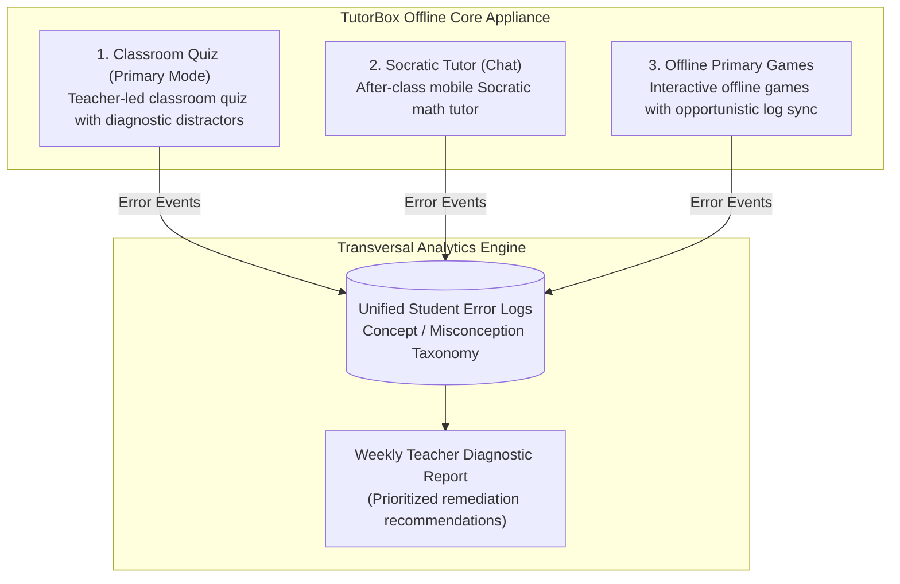

# The Three Appliance Modes & Transversal Telemetry

<div align="center">

| 🏠 [TutorBox](../../README.md) | 📚 [Docs](../README.md) | ⚙️ [Backend](../../backend/README.md) | 📱 [PWA](../../pwa/README.md) | 🔌 [Infra](../../infra/README.md) |
| :---: | :---: | :---: | :---: | :---: |

📍 [Docs](../README.md) › **Architecture** › **Three Modes** • **Related:** [Diagnostic Distractors](diagnostic-distractors.md) • [Hardware Topology](hardware-topology.md) • [ESP32 Clicker Transport](esp32-clicker-transport.md) • [Socratic Pedagogy](socratic-pedagogy.md)

</div>

---

**TutorBox** operates as a multi-mode offline educational appliance centered around diagnosing and addressing student conceptual misconceptions.

---

## <a id="1-the-three-operating-modes"></a>1. The Three Operating Modes


```mermaid
graph TD
    subgraph Core ["TutorBox Offline Core Appliance"]
        M1["1. Classroom Quiz (Primary Mode)<br/>Teacher-led classroom quiz with diagnostic distractors"]
        M2["2. Socratic Tutor (Chat)<br/>After-class mobile Socratic math tutor"]
        M3["3. Offline Primary Games<br/>Interactive offline games with opportunistic log sync"]
    end

    subgraph Telemetry ["Transversal Analytics Engine"]
        Logs[("Unified Student Error Logs<br/>Concept / Misconception Taxonomy")]
        Report["Weekly Teacher Diagnostic Report<br/>(Prioritized remediation recommendations)"]
    end

    M1 -->|Error Events| Logs
    M2 -->|Error Events| Logs
    M3 -->|Error Events| Logs
    Logs --> Report
```

---

## <a id="2-mode-breakdown"></a>2. Mode Breakdown

### <a id="mode-1-classroom-quiz"></a>Mode 1: Classroom Quiz (Primary Classroom Mode)
* **Workflow**: The teacher initiates a quiz session from her mobile browser. Students connect over the local Wi-Fi AP using their devices (or ESP32 clickers in Week 7).
* **Diagnostic Distractors**: Every question contains exactly 4 options (A–D): 1 mathematically correct answer and 3 diagnostic distractors. Each distractor intentionally maps to a concrete conceptual misconception and primary-school explanation.
* **The >51% Audio Intervention Rule**:
  * If **>51%** of participating students select the same diagnostic distractor, the appliance synthesizes the misconception explanation offline using the `qwen3-tts -> sherpa -> piper -> espeak` Spanish fallback chain, and the teacher's device reads it out loud to the classroom. The threshold is strict: exactly 51% stays silent.
  * If students answer correctly or votes are scattered, the system proceeds silently.

#### Diagnostic Question JSON Schema Contract (Week 2):
```json
{
  "id": "q_math_001",
  "topic": "pre_algebra",
  "subconcept": "two_step_equations",
  "question_text": "¿Cuál es el valor de x en la ecuación 2x + 4 = 12?",
  "options": {
    "A": "4",
    "B": "8",
    "C": "3",
    "D": "6"
  },
  "correct_option": "A",
  "distractors": {
    "B": {
      "misconception": "forgot_division",
      "explanation": "Restaste 4 de 12 obteniendo 8, pero olvidaste dividir entre 2."
    },
    "C": {
      "misconception": "subtracted_instead_of_divided",
      "explanation": "Restaste 2 en vez de dividir 8 entre 2."
    },
    "D": {
      "misconception": "divided_before_subtracting",
      "explanation": "Dividiste 12 entre 2 antes de restar 4."
    }
  }
}
```

* **Deterministic SymPy Authority**: SymPy verifies that `correct_option` is mathematically true and that all 3 distractors are false.

---

### <a id="mode-2-socratic-tutor"></a>Mode 2: Socratic Tutor (Conversational Math Practice)
* **Workflow**: Individual practice mode for students after class.
* **Socratic Guardrails**: Uses SymPy to parse mathematical expressions and evaluate correctness. The SLM is mechanically blocked from delivering final solutions or worked answers via the deterministic hint escalation ladder ($0 \to 3$).
* **Implementation**: a text-only chat on `/alumno/`, limited to the CNB mathematics of 1.º–5.º primaria. The DeepSeek-R1-Distill-Qwen-1.5B model only rewords the deterministic hint or explains a concept, and an output guard rejects any reply that states the answer, adds numbers, or is not plain Spanish ([Tutor API](../api/tutor.md#3-guardrails)).

---

### <a id="mode-3-offline-primary-games"></a>Mode 3: Offline Primary Games (Educational Games)
* **Workflow**: One math app per grade (Primero, Segundo, Tercero) in `pwa/tareas/`, served by the appliance at `/tareas/<grade>/` without CDN dependencies and taken home as an offline Android APK ([§4](#4-choosing-the-mode)). The roadmap names them `primariaconk.uk`.
* **Opportunistic Sync**: The appliance receives one event per answer tapped at `POST /api/v1/games/events`, labels it with the concept its lesson practises and stores each client event id once, so a phone can resend what it could not confirm ([Games API](../api/games.md)). The queue in the games that sends the events is not built yet, and the APK sends nothing by design ([Week 6 tracking](../milestones/week-6-games-sync.md)).

---

## <a id="3-unified-error-taxonomy--weekly-reporting"></a>3. Unified Error Taxonomy & Weekly Reporting
All three modes classify errors using a shared concept taxonomy (`topic`, `subconcept`, `misconception_type`). The Mode 2 tutor now labels each turn in `turn_logs` with the shared `topic` / `subconcept` of the concept it practises and, on a wrong answer, the misconception. Mode 3 events in `game_events` carry the same `topic` / `subconcept` pair and CNB topic, without a misconception. The weekly analytics engine computes:
1. Top 3 classroom-wide misconceptions requiring direct teacher review.
2. Individual student risk scoring.
3. Printable PDF / CSV report generated completely offline.

---

## <a id="4-choosing-the-mode"></a>4. Choosing the Mode (the teacher's phone is the remote)

The Jetson has a screen but no keyboard. It boots straight into the classroom screen
(`/pantalla/`, [kiosk](../../infra/README.md)), and the **teacher picks one mode for the whole class**
from `/maestro/` on a phone. The choice is stored on the appliance (`appliance_state`,
[`GET`/`PUT /api/v1/mode`](../api/system.md#classroom-mode)), so it survives a reboot, and every screen
polls it every 3 s:

| Mode | Teacher (`/maestro/`) | Class screen (`/pantalla/`) | Student phone (`/alumno/`, opened by the captive portal) |
| :--- | :--- | :--- | :--- |
| `quiz` | Quiz setup and live rounds | Quiz idle / question / tally | Login, then the quiz |
| `tutor` | Where students join, and the live list of students using the tutor ([Tutor API](../api/tutor.md)) | "Practica con el tutor" + `tutorbox/alumno` | Login, then the Socratic math chat |
| `apps` | Notice with the download address | Q'uq' + `tutorbox/descargas` | Grade menu (Primero, Segundo, Tercero): download that grade's Android APK or play it in the browser |

The switch is refused (`409`) while a quiz round is live. Take-home mode is how mode 3 reaches
families today: the grade-specific apps in [`pwa/tareas/`](../../pwa/README.md#3-tareas--take-home-math-apps-tareas)
(Primero first), installed as an offline Android app from the appliance.

Code: `pwa/app/src/features/mode/` (API client, polling hook, picker and cards).

---

## Next Steps

* **[10-Week Engineering Roadmap](../milestones/roadmap.md)**: Review Week 2 Quiz Contract & Diagnostic Distractors milestones.
* **[Hardware Topology](hardware-topology.md)**: Review memory budgets and edge runtime architecture.
* **[ESP32 Clicker Transport](esp32-clicker-transport.md)**: Explore the abstract `VoteTransport` and hardware clicker pairing.
