```mermaid
erDiagram
    users ||--o{ sessions : "has"
    users ||--o| devices : "assigned to"
    users ||--o{ quiz_generation_logs : "initiates"
    quiz_questions ||--o{ quiz_generation_logs : "records"
    sessions ||--o{ turn_logs : "records"
    users ||--o{ audit_logs : "actor / target"

    users {
        INTEGER id PK "AUTOINCREMENT"
        TEXT username UK "Anonymized on deletion"
        TEXT hashed_pin "Bcrypt hash ($2b$)"
        TEXT role "student | teacher | admin"
        TIMESTAMP created_at "DEFAULT CURRENT_TIMESTAMP"
        INTEGER must_change_pin "0: False | 1: True"
        TIMESTAMP deleted_at "NULL: Active | TIMESTAMP: Soft-deleted"
        TEXT former_username "Preserved original username"
    }

    devices {
        TEXT device_id PK "Hardware clicker ID (e.g. '1', 'ESP32_01')"
        INTEGER assigned_user_id UK "REFERENCES users(id) ON DELETE SET NULL"
        TIMESTAMP created_at "DEFAULT CURRENT_TIMESTAMP"
    }

    sessions {
        TEXT id PK "UUIDv4 Bearer Token"
        INTEGER user_id FK "REFERENCES users(id) ON DELETE CASCADE"
        TIMESTAMP created_at "DEFAULT CURRENT_TIMESTAMP"
        INTEGER is_active "1: Active | 0: Inactive"
    }

    turn_logs {
        INTEGER id PK "AUTOINCREMENT"
        TEXT session_id FK "REFERENCES sessions(id) ON DELETE CASCADE"
        TEXT user_input "Student raw prompt"
        TEXT sympy_evaluated_expression "Parsed mathematical AST"
        TEXT sympy_target_result "Expected canonical result"
        INTEGER sympy_is_correct "1: Correct | 0: Incorrect"
        TEXT llm_raw_response "Raw SLM output"
        INTEGER containment_triggered "1: Guardrail intervention | 0: Passed"
        TEXT final_response "Delivered response"
        INTEGER hint_level "0 to 3 escalation level"
        TIMESTAMP timestamp "DEFAULT CURRENT_TIMESTAMP"
    }

    quiz_questions {
        TEXT id PK "Question UUID / slug"
        TEXT topic "Curriculum topic slug"
        TEXT subconcept "Curriculum subconcept slug"
        TEXT question_text "Rendered question statement"
        TEXT options_json "JSON serialized options {A,B,C,D}"
        TEXT correct_option "A | B | C | D"
        TEXT distractors_json "JSON serialized diagnostic distractors"
        INTEGER sympy_verified "0: Unverified | 1: Verified"
        TEXT source "llm | seed | teacher"
        TIMESTAMP created_at "DEFAULT CURRENT_TIMESTAMP"
        TIMESTAMP deleted_at "NULL: Active | TIMESTAMP: Soft-deleted"
    }

    quiz_generation_logs {
        INTEGER id PK "AUTOINCREMENT"
        TEXT question_id FK "REFERENCES quiz_questions(id) ON DELETE SET NULL"
        INTEGER user_id FK "REFERENCES users(id)"
        TEXT topic "Curriculum topic slug"
        TEXT subconcept "Curriculum subconcept slug"
        TEXT model_name "LLM/SLM model identifier"
        INTEGER attempts "Generation retry count (>= 1)"
        REAL duration_ms "Wall-clock generation latency (ms)"
        INTEGER success "1: Success | 0: Failure"
        TEXT rejection_history_json "JSON serialized intermediate rejection errors"
        TIMESTAMP created_at "DEFAULT CURRENT_TIMESTAMP"
    }

    audit_logs {
        INTEGER id PK "AUTOINCREMENT"
        INTEGER actor_user_id "Caller user ID (NULL for signup)"
        TEXT action "Valid audit action string"
        INTEGER target_user_id "Target user ID"
        TIMESTAMP created_at "DEFAULT CURRENT_TIMESTAMP"
    }

    quiz_sessions ||--o{ quiz_session_rounds : "contains"
    quiz_session_rounds ||--o{ quiz_session_votes : "aggregates"
    users ||--o{ quiz_sessions : "hosts / teaches"
    users ||--o{ quiz_session_votes : "casts"
    quiz_questions ||--o{ quiz_session_rounds : "presents"

    quiz_sessions {
        TEXT id PK "Session UUID"
        TEXT title "Session human-readable title"
        TEXT topic "Curriculum topic slug"
        INTEGER teacher_id FK "REFERENCES users(id) ON DELETE SET NULL"
        TEXT status "lobby | active | completed | abandoned"
        INTEGER question_count "Total planned rounds"
        INTEGER current_round_index "Current round (0-based)"
        TIMESTAMP created_at "DEFAULT CURRENT_TIMESTAMP"
        TIMESTAMP started_at "Match start timestamp"
        TIMESTAMP ended_at "Match completion timestamp"
    }

    quiz_session_rounds {
        TEXT id PK "Round UUID"
        TEXT session_id FK "REFERENCES quiz_sessions(id) ON DELETE CASCADE"
        TEXT question_id FK "REFERENCES quiz_questions(id) ON DELETE SET NULL"
        INTEGER round_index "0-based round sequence index"
        TEXT status "pending | open | closed | revealed"
        TIMESTAMP opened_at "Voting window open timestamp"
        TIMESTAMP closed_at "Voting window close timestamp"
        INTEGER duration_seconds "Countdown window duration (sec)"
    }

    quiz_session_votes {
        TEXT id PK "Vote UUID"
        TEXT session_id FK "REFERENCES quiz_sessions(id) ON DELETE CASCADE"
        TEXT round_id FK "REFERENCES quiz_session_rounds(id) ON DELETE CASCADE"
        INTEGER student_id FK "REFERENCES users(id) ON DELETE CASCADE"
        TEXT transport_type "web | hardware | mock"
        TEXT device_id "Hardware clicker ID (optional)"
        TEXT selected_option "A | B | C | D"
        INTEGER is_correct "1: True | 0: False"
        TEXT misconception "Pedagogical misconception slug"
        REAL response_time_ms "Vote submission latency"
        TIMESTAMP created_at "DEFAULT CURRENT_TIMESTAMP"
    }

    schema_migrations {
        INTEGER version PK "Migration sequential version"
        TIMESTAMP applied_at "DEFAULT CURRENT_TIMESTAMP"
    }
```

# Database Schema Reference

Technical specification and Entity-Relationship model for the **TutorBox** SQLite database engine.

<div align="center">

| 🏠 [TutorBox](../README.md) | 📚 [Docs](README.md) | ⚙️ [Backend](../backend/README.md) | 📱 [PWA](../pwa/README.md) | 🔌 [Infra](../infra/README.md) |
| :---: | :---: | :---: | :---: | :---: |

📍 **Docs** › **Database Schema** • **Related:** [REST API Reference](api-reference.md) • [Backend Guide](../backend/README.md)

</div>

---

## Table of Contents
- [1. Engine Configuration & Pragmas](#1-engine-configuration--pragmas)
- [2. Entity-Relationship (ER) Diagram](#2-entity-relationship-er-diagram)
- [3. Data Dictionary](#3-data-dictionary)
  - [Table: `users`](#table-users)
  - [Table: `sessions`](#table-sessions)
  - [Table: `devices`](#table-devices)
  - [Table: `turn_logs`](#table-turn_logs)
  - [Table: `quiz_questions`](#table-quiz_questions)
  - [Table: `quiz_generation_logs`](#table-quiz_generation_logs)
  - [Table: `audit_logs`](#table-audit_logs)
  - [Table: `quiz_sessions`](#table-quiz_sessions)
  - [Table: `quiz_session_rounds`](#table-quiz_session_rounds)
  - [Table: `quiz_session_votes`](#table-quiz_session_votes)
  - [Table: `schema_migrations`](#table-schema_migrations)
- [4. Performance Indexes](#4-performance-indexes)
- [5. Data Lifecycle & Integrity Policies](#5-data-lifecycle--integrity-policies)
  - [A. Soft-Deletion & Username Freeing](#a-soft-deletion--username-freeing)
  - [B. Last-Admin Guard](#b-last-admin-guard)
  - [C. Device Unlinking on Deletion](#c-device-unlinking-on-deletion)
  - [D. Question Soft-Deletion & Diagnostic Integrity](#d-question-soft-deletion--diagnostic-integrity)
- [6. Migration Changelog](#6-migration-changelog)
- [Next Steps](#next-steps)

---

## <a id="1-engine-configuration--pragmas"></a>1. Engine Configuration & Pragmas

TutorBox utilizes a local SQLite database (`tutorbox.db`) optimized for high-concurrency, offline edge execution on the NVIDIA Jetson Orin Nano (supporting 15–20 concurrent classroom users).

All database connections initialized via `get_db_connection()` in [`backend/src/db/database.py`](../backend/src/db/database.py) execute the following runtime configuration:

```sql
PRAGMA foreign_keys = ON;
PRAGMA journal_mode = WAL;
PRAGMA busy_timeout = 5000;
```

* **`foreign_keys = ON`**: Enforces strict referential integrity across related tables (`sessions -> users`, `turn_logs -> sessions`, `devices -> users`, `quiz_generation_logs -> users / quiz_questions`).
* **`journal_mode = WAL`**: Write-Ahead Logging allows simultaneous non-blocking concurrent readers while a write transaction is committed.
* **`busy_timeout = 5000`**: Sets a 5-second lock acquisition timeout to prevent immediate busy errors under concurrent student load.

---

## <a id="2-entity-relationship-er-diagram"></a>2. Entity-Relationship (ER) Diagram



---

## <a id="3-data-dictionary"></a>3. Data Dictionary

### Table: `users`
Stores student and staff credentials, roles, and lifecycle states.

| Column | Type | Constraints | Default | Description |
| :--- | :--- | :--- | :--- | :--- |
| `id` | `INTEGER` | `PRIMARY KEY AUTOINCREMENT` | — | Unique internal user identifier. |
| `username` | `TEXT` | `UNIQUE NOT NULL` | — | User login handle (3–32 chars, `[A-Za-z0-9_.-]`). Anonymized to `deleted_user_{id}_{hex}` upon soft-deletion. |
| `hashed_pin` | `TEXT` | `NOT NULL` | — | Bcrypt hash (`$2b$`) of the 4–8 digit PIN. Plaintext PINs are never stored. |
| `role` | `TEXT` | `NOT NULL`, `CHECK(role IN ('student', 'teacher', 'admin'))` | `'student'` | Access role determining authorization boundaries. |
| `created_at` | `TIMESTAMP` | — | `CURRENT_TIMESTAMP` | UTC timestamp of account creation. |
| `must_change_pin`| `INTEGER` | `NOT NULL`, `CHECK(must_change_pin IN (0, 1))` | `0` | Flag forcing PIN change on next login (`1` = change required). |
| `deleted_at` | `TIMESTAMP` | `NULL` | `NULL` | Timestamp of account soft-deletion (`NULL` for active accounts). |
| `former_username`| `TEXT` | `NULL` | `NULL` | The username held prior to soft-deletion (for recovery / roster display). |

---

### Table: `devices`
Registry of physical ESP32 clickers and active 1:1 classroom pairings to student accounts.

| Column | Type | Constraints | Default | Description |
| :--- | :--- | :--- | :--- | :--- |
| `device_id` | `TEXT` | `PRIMARY KEY` | — | Unique hardware clicker identifier (1–32 chars, e.g. `'1'`, `'ESP32_01'`). |
| `assigned_user_id` | `INTEGER` | `UNIQUE`, `FOREIGN KEY -> users(id) ON DELETE SET NULL` | `NULL` | Currently linked student account ID (`NULL` when unassigned). |
| `created_at` | `TIMESTAMP` | — | `CURRENT_TIMESTAMP` | UTC timestamp when clicker was registered into the fleet. |

---

### Table: `sessions`
Tracks active and revoked bearer sessions.

| Column | Type | Constraints | Default | Description |
| :--- | :--- | :--- | :--- | :--- |
| `id` | `TEXT` | `PRIMARY KEY` | — | UUIDv4 string issued to client as Bearer token. |
| `user_id` | `INTEGER` | `NOT NULL`, `FOREIGN KEY -> users(id) ON DELETE CASCADE` | — | Foreign key referencing account owner. |
| `created_at` | `TIMESTAMP` | — | `CURRENT_TIMESTAMP` | UTC timestamp of session creation. |
| `is_active` | `INTEGER` | `CHECK(is_active IN (0, 1))` | `1` | `1` if session is active; `0` if revoked by logout, PIN change, reset, or deletion. |

---

### Table: `turn_logs`
Stores telemetry and pedagogical interaction history per educational dialogue turn.

> **Related Modules**: Populated by the Socratic pedagogical engine and SymPy validation pipeline during live student chat sessions.

| Column | Type | Constraints | Default | Description |
| :--- | :--- | :--- | :--- | :--- |
| `id` | `INTEGER` | `PRIMARY KEY AUTOINCREMENT` | — | Unique telemetry turn record ID. |
| `session_id` | `TEXT` | `NOT NULL`, `FOREIGN KEY -> sessions(id) ON DELETE CASCADE` | — | Foreign key referencing the originating dialogue session. |
| `user_input` | `TEXT` | `NOT NULL` | — | The student's raw text or multiple-choice input. |
| `sympy_evaluated_expression` | `TEXT` | `NULL` | `NULL` | Canonical AST representation parsed by SymPy. |
| `sympy_target_result` | `TEXT` | `NULL` | `NULL` | Target pedagogical expected result. |
| `sympy_is_correct` | `INTEGER` | `NULL`, `CHECK(sympy_is_correct IN (0, 1))` | `NULL` | `1` if mathematical expression is correct, `0` otherwise. |
| `llm_raw_response` | `TEXT` | `NULL` | `NULL` | Unfiltered output generated by the local SLM. |
| `containment_triggered` | `INTEGER` | `NOT NULL`, `CHECK(containment_triggered IN (0, 1))` | `0` | `1` if mathematical contradiction was intercepted. |
| `final_response` | `TEXT` | `NOT NULL` | — | Final validated response delivered to the student. |
| `hint_level` | `INTEGER` | `NOT NULL` | `0` | Socratic hint escalation level ($0$ to $3$). |
| `timestamp` | `TIMESTAMP` | — | `CURRENT_TIMESTAMP` | UTC timestamp of interaction turn. |

---

### Table: `quiz_questions`
Question bank repository storing generated, seeded, and teacher-authored diagnostic quiz questions.

| Column | Type | Constraints | Default | Description |
| :--- | :--- | :--- | :--- | :--- |
| `id` | `TEXT` | `PRIMARY KEY` | — | Unique question identifier (e.g., `'q_math_001'`, `'q_a1b2c3d4e5f6'`). |
| `topic` | `TEXT` | `NOT NULL` | — | Primary mathematics curriculum topic slug (e.g., `'arithmetic_integers'`, `'fractions'`). |
| `subconcept` | `TEXT` | `NOT NULL` | — | Granular curriculum subconcept slug (e.g., `'order_of_operations'`, `'simplification'`). |
| `question_text` | `TEXT` | `NOT NULL` | — | Natural language question statement in Spanish. |
| `options_json` | `TEXT` | `NOT NULL` | — | JSON-serialized dictionary of 4 choices: `{"A": "...", "B": "...", "C": "...", "D": "..."}`. |
| `correct_option`| `TEXT` | `NOT NULL`, `CHECK(correct_option IN ('A', 'B', 'C', 'D'))` | — | The single mathematically true option key. |
| `distractors_json`| `TEXT` | `NOT NULL` | — | JSON-serialized dictionary mapping the 3 incorrect options to diagnostic `misconception` and `explanation`. |
| `sympy_verified`| `INTEGER` | `NOT NULL`, `CHECK(sympy_verified IN (0, 1))` | `0` | `1` if mathematically proven and verified by SymPy, `0` otherwise. |
| `source` | `TEXT` | `NOT NULL`, `CHECK(source IN ('llm', 'seed', 'teacher'))` | `'llm'` | Provenance of the question record. |
| `created_at` | `TIMESTAMP` | — | `CURRENT_TIMESTAMP` | UTC timestamp of question insertion. |
| `deleted_at` | `TIMESTAMP` | `NULL` | `NULL` | Timestamp of soft-deletion (`NULL` for active questions). |

---

### Table: `quiz_generation_logs`
Dedicated telemetry trail capturing model identifiers, latency, retry counts, and rejection histories for every on-demand quiz generation request.

| Column | Type | Constraints | Default | Description |
| :--- | :--- | :--- | :--- | :--- |
| `id` | `INTEGER` | `PRIMARY KEY AUTOINCREMENT` | — | Unique generation log identifier. |
| `question_id` | `TEXT` | `NULL`, `FOREIGN KEY -> quiz_questions(id) ON DELETE SET NULL` | `NULL` | Foreign key referencing generated question if persisted (`NULL` for transient generations or failures). |
| `user_id` | `INTEGER` | `NOT NULL`, `FOREIGN KEY -> users(id)` | — | User ID of the teacher/admin who requested generation. |
| `topic` | `TEXT` | `NOT NULL` | — | Target mathematics curriculum topic slug. |
| `subconcept` | `TEXT` | `NULL` | `NULL` | Target curriculum subconcept slug. |
| `model_name` | `TEXT` | `NOT NULL` | — | Identifier of the SLM/LLM model executed. |
| `attempts` | `INTEGER` | `NOT NULL`, `CHECK(attempts >= 1)` | — | Number of generation attempts executed ($1$ to $N$). |
| `duration_ms` | `REAL` | `NOT NULL`, `CHECK(duration_ms >= 0.0)` | — | Total wall-clock execution time in milliseconds. |
| `success` | `INTEGER` | `NOT NULL`, `CHECK(success IN (0, 1))` | — | `1` if generation succeeded within max retries; `0` on unrecoverable failure. |
| `rejection_history_json` | `TEXT` | `NULL` | `NULL` | JSON-serialized list of chronological stage errors captured during intermediate rejection cycles. |
| `created_at` | `TIMESTAMP` | — | `CURRENT_TIMESTAMP` | UTC timestamp when generation request was executed. |

---

### Table: `audit_logs`
Append-only audit trail recording sensitive operational, staff, and hardware pairing actions.

| Column | Type | Constraints | Default | Description |
| :--- | :--- | :--- | :--- | :--- |
| `id` | `INTEGER` | `PRIMARY KEY AUTOINCREMENT` | — | Sequential audit log record ID. |
| `actor_user_id` | `INTEGER` | `NULL` | `NULL` | User ID of the caller who initiated the action (`NULL` for public self-signup). |
| `action` | `TEXT` | `NOT NULL` | — | Action identifier string (validated against `VALID_ACTIONS`). |
| `target_user_id` | `INTEGER` | `NULL` | `NULL` | User ID of the affected account. |
| `created_at` | `TIMESTAMP` | — | `CURRENT_TIMESTAMP` | UTC timestamp when event was recorded. |

#### Valid Audit Action Strings:
* `signup`: Student self-registration.
* `user_created`: Account created by staff.
* `pin_reset`: Temporary PIN issued by staff.
* `username_changed`: Username changed by user.
* `pin_changed`: PIN rotated by user.
* `account_deleted`: Account soft-deleted.
* `account_recovered`: Soft-deleted account restored.
* `device_registered`: Hardware clicker registered into appliance fleet.
* `device_assigned`: Clicker linked to student.
* `device_unassigned`: Clicker unlinked from student.
* `device_deleted`: Clicker removed from fleet.
* `quiz_question_generated`: Diagnostic question generated via LLM.
* `quiz_question_created`: Question authored manually by teacher/admin.
* `quiz_question_deleted`: Question soft-deleted.

---

### Table: `quiz_sessions`
Live classroom quiz sessions coordinating question presentation, real-time round progression, and vote collection.

| Column | Type | Constraints | Default | Description |
| :--- | :--- | :--- | :--- | :--- |
| `id` | `TEXT` | `PRIMARY KEY` | — | Unique session identifier (UUID string). |
| `title` | `TEXT` | `NOT NULL` | — | Human-readable title of the quiz session. |
| `topic` | `TEXT` | `NOT NULL` | — | Mathematics topic slug (e.g., `'fractions'`). |
| `teacher_id` | `INTEGER` | `NULL`, `FOREIGN KEY -> users(id) ON DELETE SET NULL` | `NULL` | Host teacher account identifier. |
| `status` | `TEXT` | `NOT NULL`, `CHECK(status IN ('lobby', 'active', 'completed', 'abandoned'))` | `'lobby'` | Current state of the session lifecycle. |
| `question_count` | `INTEGER` | `NOT NULL` | `0` | Planned number of question rounds in session. |
| `current_round_index` | `INTEGER` | `NOT NULL` | `0` | 0-based index of the currently active/latest round. |
| `created_at` | `TIMESTAMP` | — | `CURRENT_TIMESTAMP` | UTC timestamp of session creation. |
| `started_at` | `TIMESTAMP` | `NULL` | `NULL` | Timestamp when session transitioned out of lobby. |
| `ended_at` | `TIMESTAMP` | `NULL` | `NULL` | Timestamp when session completed or was abandoned. |

---

### Table: `quiz_session_rounds`
Sequential question turns within a quiz match, tracking voting window timers and status.

| Column | Type | Constraints | Default | Description |
| :--- | :--- | :--- | :--- | :--- |
| `id` | `TEXT` | `PRIMARY KEY` | — | Unique round identifier (UUID string). |
| `session_id` | `TEXT` | `NOT NULL`, `FOREIGN KEY -> quiz_sessions(id) ON DELETE CASCADE` | — | Reference to parent quiz session. |
| `question_id` | `TEXT` | `NULL`, `FOREIGN KEY -> quiz_questions(id) ON DELETE SET NULL` | `NULL` | Reference to diagnostic question bank entry. |
| `round_index` | `INTEGER` | `NOT NULL` | — | 0-based sequential sequence order of the round. |
| `status` | `TEXT` | `NOT NULL`, `CHECK(status IN ('pending', 'open', 'closed', 'revealed'))` | `'pending'` | Lifecycle state of this question round. |
| `opened_at` | `TIMESTAMP` | `NULL` | `NULL` | Timestamp when voting opened. |
| `closed_at` | `TIMESTAMP` | `NULL` | `NULL` | Timestamp when voting window closed. |
| `duration_seconds` | `INTEGER` | `NOT NULL` | `30` | Configured countdown timer duration in seconds. |

---

### Table: `quiz_session_votes`
Individual student vote submissions recorded immutably per round. Enforces first-press locking via a unique constraint.

| Column | Type | Constraints | Default | Description |
| :--- | :--- | :--- | :--- | :--- |
| `id` | `TEXT` | `PRIMARY KEY` | — | Unique vote identifier (UUID string). |
| `session_id` | `TEXT` | `NOT NULL`, `FOREIGN KEY -> quiz_sessions(id) ON DELETE CASCADE` | — | Reference to parent quiz session. |
| `round_id` | `TEXT` | `NOT NULL`, `FOREIGN KEY -> quiz_session_rounds(id) ON DELETE CASCADE` | — | Reference to active question round. |
| `student_id` | `INTEGER` | `NOT NULL`, `FOREIGN KEY -> users(id) ON DELETE CASCADE` | — | Reference to participating student. |
| `transport_type` | `TEXT` | `NOT NULL`, `CHECK(transport_type IN ('web', 'hardware', 'mock'))` | `'web'` | Ingestion transport channel. |
| `device_id` | `TEXT` | `NULL` | `NULL` | Hardware clicker ID if submitted via ESP32. |
| `selected_option` | `TEXT` | `NOT NULL`, `CHECK(selected_option IN ('A', 'B', 'C', 'D'))` | — | Option key chosen by student. |
| `is_correct` | `INTEGER` | `NOT NULL`, `CHECK(is_correct IN (0, 1))` | — | Correctness boolean flag. |
| `misconception` | `TEXT` | `NULL` | `NULL` | Diagnostic misconception tag for incorrect votes. |
| `response_time_ms` | `REAL` | `NULL`, `CHECK(response_time_ms IS NULL OR response_time_ms >= 0.0)` | `NULL` | Turnaround time from window opening to vote receipt. |
| `created_at` | `TIMESTAMP` | — | `CURRENT_TIMESTAMP` | UTC timestamp of vote submission. |

> **First Press Locks Constraint**: `UNIQUE(round_id, student_id)` ensures that a student can only submit a single vote per round, rejecting duplicates with `409 Conflict`.

---

### Table: `schema_migrations`
Internal schema migration tracker for automated migrations.

| Column | Type | Constraints | Default | Description |
| :--- | :--- | :--- | :--- | :--- |
| `version` | `INTEGER` | `PRIMARY KEY` | — | Sequential migration file integer version. |
| `applied_at` | `TIMESTAMP` | — | `CURRENT_TIMESTAMP` | UTC timestamp when migration was applied. |

---

## <a id="4-performance-indexes"></a>4. Performance Indexes

To ensure sub-millisecond query execution on edge NVMe/eMMC storage, the schema includes the following indexes:

| Index Name | Target Table | Target Columns | Purpose |
| :--- | :--- | :--- | :--- |
| `idx_sessions_user_id` | `sessions` | `(user_id)` | Fast lookup of active sessions by user ID during auth and logout. |
| `idx_turn_logs_session_id` | `turn_logs` | `(session_id)` | Fast lookup of dialogue history per student session. |
| `idx_audit_logs_actor` | `audit_logs` | `(actor_user_id)` | Fast filtering of audit logs by acting administrator/teacher. |
| `idx_audit_logs_target` | `audit_logs` | `(target_user_id)` | Fast filtering of audit logs by target account. |
| `idx_devices_assigned_user` | `devices` | `(assigned_user_id)` | Fast reverse-lookup of clicker assignment by student ID. |
| `idx_quiz_questions_topic` | `quiz_questions` | `(topic, subconcept)` | Fast filtering and random sampling by curriculum topic and subconcept. |
| `idx_quiz_questions_created` | `quiz_questions` | `(created_at)` | Fast pagination and chronological ordering of question banks. |
| `idx_quiz_gen_logs_user` | `quiz_generation_logs` | `(user_id)` | Fast filtering of generation telemetry by teacher user ID. |
| `idx_quiz_gen_logs_topic` | `quiz_generation_logs` | `(topic, subconcept)` | Fast aggregation and filtering of generation latency and retry counts by topic. |
| `idx_quiz_gen_logs_created` | `quiz_generation_logs` | `(created_at)` | Fast chronological sorting and time-window analytics. |
| `idx_quiz_sessions_status` | `quiz_sessions` | `(status)` | Fast filtering and lookup of active/lobby matches. |
| `idx_quiz_rounds_session` | `quiz_session_rounds` | `(session_id, round_index)` | Fast ordered retrieval of question rounds within a quiz match. |
| `idx_quiz_votes_round` | `quiz_session_votes` | `(round_id)` | Fast aggregation of student votes during round closure and reveal. |
| `idx_quiz_votes_student` | `quiz_session_votes` | `(student_id)` | Fast lookup of student participation and longitudinal performance. |
| `idx_quiz_votes_analytics` | `quiz_session_votes` | `(is_correct, misconception)` | High-speed indexing for longitudinal diagnostic error reporting. |

---

## <a id="5-data-lifecycle--integrity-policies"></a>5. Data Lifecycle & Integrity Policies

### <a id="a-soft-deletion--username-freeing"></a>A. Soft-Deletion & Username Freeing
When an account soft-deletion is executed:
1. `deleted_at` is set to `CURRENT_TIMESTAMP`.
2. `former_username` preserves the user's original username for roster display.
3. `username` is renamed to an anonymized placeholder (`deleted_user_{id}_{hex}`) to **immediately free** the original username for new registrations.
4. `hashed_pin` is replaced with an unmatchable bcrypt hash (`hash_pin(secrets.token_hex(16))`).
5. All active sessions in `sessions` are deactivated (`is_active = 0`).
6. **Telemetry Preservation**: Rows in `turn_logs` remain intact and joinable to `users` via `sessions.user_id`.

### <a id="b-last-admin-guard"></a>B. Last-Admin Guard
The application enforces that the appliance must never lose its final administrator. Deleting the last active user with `role = 'admin'` is rejected with `409 Conflict`.

### <a id="c-device-unlinking-on-deletion"></a>C. Device Unlinking on Deletion
When an account is deleted or soft-deleted, any associated hardware clicker has `assigned_user_id` set to `NULL`, automatically freeing the device for reassignment to another student.

### <a id="d-question-soft-deletion--diagnostic-integrity"></a>D. Question Soft-Deletion & Diagnostic Integrity
When a question soft-deletion is executed:
1. `deleted_at` is set to `CURRENT_TIMESTAMP`.
2. The question is excluded from default listings, random sampling, and session generation.
3. Historical session results and error telemetry linking to the question ID remain fully preserved for diagnostic reporting.

---

## <a id="6-migration-changelog"></a>6. Migration Changelog

Schema migrations are applied automatically at application startup in sequential order:

* **[`001_initial_schema.sql`](../backend/migrations/001_initial_schema.sql)**: Baseline schema establishing `schema_migrations`, `users`, `sessions`, and `turn_logs`.
* **[`002_add_user_role.sql`](../backend/migrations/002_add_user_role.sql)**: Adds `role` column with check constraint (`'student'`, `'teacher'`, `'admin'`).
* **[`003_add_lookup_indexes.sql`](../backend/migrations/003_add_lookup_indexes.sql)**: Adds foreign-key lookup indexes `idx_sessions_user_id` and `idx_turn_logs_session_id`.
* **[`004_add_must_change_pin.sql`](../backend/migrations/004_add_must_change_pin.sql)**: Adds `must_change_pin` column (`0` / `1`).
* **[`005_add_users_deleted_at.sql`](../backend/migrations/005_add_users_deleted_at.sql)**: Adds `deleted_at` and `former_username` columns.
* **[`006_add_audit_logs.sql`](../backend/migrations/006_add_audit_logs.sql)**: Creates `audit_logs` table and lookup indexes `idx_audit_logs_actor` and `idx_audit_logs_target`.
* **[`007_add_devices.sql`](../backend/migrations/007_add_devices.sql)**: Creates `devices` table and lookup index `idx_devices_assigned_user` for ESP32 clicker fleet pairing.
* **[`008_add_quiz_questions.sql`](../backend/migrations/008_add_quiz_questions.sql)**: Creates `quiz_questions` table and composite indexes `idx_quiz_questions_topic` and `idx_quiz_questions_created` for persistent question bank storage.
* **[`009_add_quiz_generation_logs.sql`](../backend/migrations/009_add_quiz_generation_logs.sql)**: Creates `quiz_generation_logs` table and lookup indexes `idx_quiz_gen_logs_user`, `idx_quiz_gen_logs_topic`, and `idx_quiz_gen_logs_created` for tracking SLM telemetry, latency, and rejection histories.
* **[`010_add_quiz_sessions_and_votes.sql`](../backend/migrations/010_add_quiz_sessions_and_votes.sql)**: Creates `quiz_sessions`, `quiz_session_rounds`, and `quiz_session_votes` tables with strict unique constraint on `(round_id, student_id)` to enforce first-press locking and support longitudinal analytics.

## Next Steps

* **[REST API Reference](api-reference.md)**: Explore the endpoint specifications, RBAC matrix, and request/response payloads.
* **[Documentation Portal](README.md)**: Return to the documentation hub.
* **[Backend Developer Guide](../backend/README.md)**: Setup, local execution, and testing procedures.
