```mermaid
erDiagram
    users ||--o{ sessions : "has"
    users ||--o| devices : "assigned to"
    users ||--o{ quiz_generation_logs : "initiates"
    quiz_questions ||--o{ quiz_generation_logs : "records"
    sessions ||--o{ turn_logs : "records"
    users ||--o{ audit_logs : "actor / target"

    users {
        INTEGER id PK "AUTOINCREMENT"
        TEXT username UK "Anonymized on deletion"
        TEXT hashed_pin "Bcrypt hash ($2b$)"
        TEXT role "student | teacher | admin"
        TIMESTAMP created_at "DEFAULT CURRENT_TIMESTAMP"
        INTEGER must_change_pin "0: False | 1: True"
        TIMESTAMP deleted_at "NULL: Active | TIMESTAMP: Soft-deleted"
        TEXT former_username "Preserved original username"
    }

    devices {
        TEXT device_id PK "Hardware clicker ID (e.g. '1', 'ESP32_01')"
        INTEGER assigned_user_id UK "REFERENCES users(id) ON DELETE SET NULL"
        TIMESTAMP created_at "DEFAULT CURRENT_TIMESTAMP"
    }

    sessions {
        TEXT id PK "UUIDv4 Bearer Token"
        INTEGER user_id FK "REFERENCES users(id) ON DELETE CASCADE"
        TIMESTAMP created_at "DEFAULT CURRENT_TIMESTAMP"
        INTEGER is_active "1: Active | 0: Inactive"
    }

    turn_logs {
        INTEGER id PK "AUTOINCREMENT"
        TEXT session_id FK "REFERENCES sessions(id) ON DELETE CASCADE"
        TEXT user_input "Student raw prompt"
        TEXT sympy_evaluated_expression "Parsed mathematical AST"
        TEXT sympy_target_result "Expected canonical result"
        INTEGER sympy_is_correct "1: Correct | 0: Incorrect"
        TEXT llm_raw_response "Raw SLM output"
        INTEGER containment_triggered "1: Guardrail intervention | 0: Passed"
        TEXT final_response "Delivered response"
        INTEGER hint_level "0 to 3 escalation level"
        TIMESTAMP timestamp "DEFAULT CURRENT_TIMESTAMP"
    }

    quiz_questions {
        TEXT id PK "Question UUID / slug"
        TEXT topic "Curriculum topic slug"
        TEXT subconcept "Curriculum subconcept slug"
        TEXT question_text "Rendered question statement"
        TEXT options_json "JSON serialized options {A,B,C,D}"
        TEXT correct_option "A | B | C | D"
        TEXT distractors_json "JSON serialized diagnostic distractors"
        INTEGER sympy_verified "0: Unverified | 1: Verified"
        TEXT source "llm | seed | teacher"
        TIMESTAMP created_at "DEFAULT CURRENT_TIMESTAMP"
        TIMESTAMP deleted_at "NULL: Active | TIMESTAMP: Soft-deleted"
    }

    quiz_generation_logs {
        INTEGER id PK "AUTOINCREMENT"
        TEXT question_id FK "REFERENCES quiz_questions(id) ON DELETE SET NULL"
        INTEGER user_id FK "REFERENCES users(id)"
        TEXT topic "Curriculum topic slug"
        TEXT subconcept "Curriculum subconcept slug"
        TEXT model_name "LLM/SLM model identifier"
        INTEGER attempts "Generation retry count (>= 1)"
        REAL duration_ms "Wall-clock generation latency (ms)"
        INTEGER success "1: Success | 0: Failure"
        TEXT rejection_history_json "JSON serialized intermediate rejection errors"
        TIMESTAMP created_at "DEFAULT CURRENT_TIMESTAMP"
    }

    audit_logs {
        INTEGER id PK "AUTOINCREMENT"
        INTEGER actor_user_id "Caller user ID (NULL for signup)"
        TEXT action "Valid audit action string"
        INTEGER target_user_id "Target user ID"
        TIMESTAMP created_at "DEFAULT CURRENT_TIMESTAMP"
    }

    quiz_sessions ||--o{ quiz_session_rounds : "contains"
    quiz_session_rounds ||--o{ quiz_session_votes : "aggregates"
    users ||--o{ quiz_sessions : "hosts / teaches"
    users ||--o{ quiz_session_votes : "casts"
    quiz_questions ||--o{ quiz_session_rounds : "presents"

    quiz_sessions {
        TEXT id PK "Session UUID"
        TEXT title "Session human-readable title"
        TEXT topic "Curriculum topic slug"
        INTEGER teacher_id FK "REFERENCES users(id) ON DELETE SET NULL"
        TEXT status "lobby | active | completed | abandoned"
        INTEGER question_count "Total planned rounds"
        INTEGER current_round_index "Current round (0-based)"
        TIMESTAMP created_at "DEFAULT CURRENT_TIMESTAMP"
        TIMESTAMP started_at "Match start timestamp"
        TIMESTAMP ended_at "Match completion timestamp"
    }

    quiz_session_rounds {
        TEXT id PK "Round UUID"
        TEXT session_id FK "REFERENCES quiz_sessions(id) ON DELETE CASCADE"
        TEXT question_id FK "REFERENCES quiz_questions(id) ON DELETE SET NULL"
        INTEGER round_index "0-based round sequence index"
        TEXT status "pending | open | closed | revealed"
        TIMESTAMP opened_at "Voting window open timestamp"
        TIMESTAMP closed_at "Voting window close timestamp"
        INTEGER duration_seconds "Countdown window duration (sec)"
    }

    quiz_session_votes {
        TEXT id PK "Vote UUID"
        TEXT session_id FK "REFERENCES quiz_sessions(id) ON DELETE CASCADE"
        TEXT round_id FK "REFERENCES quiz_session_rounds(id) ON DELETE CASCADE"
        INTEGER student_id FK "REFERENCES users(id) ON DELETE CASCADE"
        TEXT transport_type "web | hardware | mock"
        TEXT device_id "Hardware clicker ID (optional)"
        TEXT selected_option "A | B | C | D"
        INTEGER is_correct "1: True | 0: False"
        TEXT misconception "Pedagogical misconception slug"
        REAL response_time_ms "Vote submission latency"
        TIMESTAMP created_at "DEFAULT CURRENT_TIMESTAMP"
    }

    schema_migrations {
        INTEGER version PK "Migration sequential version"
        TIMESTAMP applied_at "DEFAULT CURRENT_TIMESTAMP"
    }
```

# Database Schema Reference & Storage Architecture

Technical specification, Entity-Relationship model, and indexing architecture for the **TutorBox** SQLite storage engine.

<div align="center">

| 🏠 [TutorBox](../../README.md) | 📚 [Docs](../README.md) | ⚙️ [Backend](../../backend/README.md) | 📱 [PWA](../../pwa/README.md) | 🔌 [Infra](../../infra/README.md) |
| :---: | :---: | :---: | :---: | :---: |

📍 [Docs](../README.md) › **Database Hub** • **Modular Schemas:** [Core Schema](core.md) • [Quiz Schema](quiz.md) • [Dialogue Telemetry](dialogue.md) • [Migrations](migrations.md)

</div>

---

## Table of Contents
- [1. Engine Configuration & Pragmas](#1-engine-configuration--pragmas)
- [2. Entity-Relationship (ER) Diagram](#2-entity-relationship-er-diagram)
- [3. Subsystem Schema Directory](#3-subsystem-schema-directory)
- [4. Performance Indexes](#4-performance-indexes)
- [Next Steps](#next-steps)

---

## <a id="1-engine-configuration--pragmas"></a>1. Engine Configuration & Pragmas

TutorBox utilizes a local SQLite database (`tutorbox.db`) optimized for high-concurrency, offline edge execution on the NVIDIA Jetson Orin Nano (supporting 15–20 concurrent classroom users).

All database connections initialized via `get_db_connection()` in [`backend/src/core/db/database.py`](../../backend/src/core/db/database.py) execute the following runtime configuration:

```sql
PRAGMA foreign_keys = ON;
PRAGMA journal_mode = WAL;
PRAGMA busy_timeout = 5000;
```

* **`foreign_keys = ON`**: Enforces strict referential integrity across related tables (`sessions -> users`, `turn_logs -> sessions`, `devices -> users`, `quiz_generation_logs -> users / quiz_questions`).
* **`journal_mode = WAL`**: Write-Ahead Logging allows simultaneous non-blocking concurrent readers while a write transaction is committed.
* **`busy_timeout = 5000`**: Sets a 5-second lock acquisition timeout to prevent immediate busy errors under concurrent student load.

---

## <a id="2-entity-relationship-er-diagram"></a>2. Entity-Relationship (ER) Diagram



---

## <a id="3-subsystem-schema-directory"></a>3. Subsystem Schema Directory

Detailed data dictionaries, column constraints, and data lifecycle policies are organized into modular domain specifications:

| Subsystem Domain | Specification Document | Included Tables | Core Policies & Invariants |
| :--- | :--- | :--- | :--- |
| **Core Identity & Fleet** | **[core.md](core.md)** | `users`<br>`sessions`<br>`devices`<br>`audit_logs` | • Soft-deletion with username freeing<br>• Last-admin protection guard<br>• Hardware clicker unlinking on deletion |
| **Mode 1: Quiz & Sessions** | **[quiz.md](quiz.md)** | `quiz_questions`<br>`quiz_generation_logs`<br>`quiz_sessions`<br>`quiz_session_rounds`<br>`quiz_session_votes` | • Strict first-press locking (`UNIQUE(round_id, student_id)`)<br>• Question soft-deletion telemetry preservation<br>• Monotonic timer round progression |
| **Mode 2: Socratic Dialogue** | **[dialogue.md](dialogue.md)** | `turn_logs` | • SymPy math AST evaluation and containment flag<br>• Deterministic 4-level hint escalation tracking ($0$ to $3$) |
| **Migrations & Versioning** | **[migrations.md](migrations.md)** | `schema_migrations` | • Numbered migrations (`001` to `010+`)<br>• Idempotent SQL execution & rollback procedures |

---

## <a id="4-performance-indexes"></a>4. Performance Indexes

To ensure sub-millisecond query execution on edge NVMe/eMMC storage, the schema enforces the following B-tree indexes:

| Index Name | Target Table | Target Columns | Purpose |
| :--- | :--- | :--- | :--- |
| `idx_sessions_user_id` | `sessions` | `(user_id)` | Fast lookup of active sessions by user ID during auth and logout. |
| `idx_turn_logs_session_id` | `turn_logs` | `(session_id)` | Fast lookup of dialogue history per student session. |
| `idx_audit_logs_actor` | `audit_logs` | `(actor_user_id)` | Fast filtering of audit logs by acting administrator/teacher. |
| `idx_audit_logs_target` | `audit_logs` | `(target_user_id)` | Fast filtering of audit logs by target account. |
| `idx_devices_assigned_user` | `devices` | `(assigned_user_id)` | Fast reverse-lookup of clicker assignment by student ID. |
| `idx_quiz_questions_topic` | `quiz_questions` | `(topic, subconcept)` | Fast filtering and random sampling by curriculum topic and subconcept. |
| `idx_quiz_questions_created` | `quiz_questions` | `(created_at)` | Fast pagination and chronological ordering of question banks. |
| `idx_quiz_gen_logs_user` | `quiz_generation_logs` | `(user_id)` | Fast filtering of generation telemetry by teacher user ID. |
| `idx_quiz_gen_logs_topic` | `quiz_generation_logs` | `(topic, subconcept)` | Fast aggregation and filtering of generation latency and retry counts by topic. |
| `idx_quiz_gen_logs_created` | `quiz_generation_logs` | `(created_at)` | Fast chronological sorting and time-window analytics. |
| `idx_quiz_sessions_status` | `quiz_sessions` | `(status)` | Fast filtering and lookup of active/lobby matches. |
| `idx_quiz_rounds_session` | `quiz_session_rounds` | `(session_id, round_index)` | Fast ordered retrieval of question rounds within a quiz match. |
| `idx_quiz_votes_round` | `quiz_session_votes` | `(round_id)` | Fast aggregation of student votes during round closure and reveal. |
| `idx_quiz_votes_student` | `quiz_session_votes` | `(student_id)` | Fast lookup of student participation and longitudinal performance. |
| `idx_quiz_votes_analytics` | `quiz_session_votes` | `(is_correct, misconception)` | High-speed indexing for longitudinal diagnostic error reporting. |

---

## Next Steps

* **[Core Identity & Fleet Schema](core.md)**: Explore user credentials, sessions, and device pairing.
* **[Classroom Quiz Schema](quiz.md)**: Explore question banks, generation telemetry, and session matches.
* **[Socratic Dialogue Schema](dialogue.md)**: Explore math AST and hint telemetry.
* **[Migrations Playbook](migrations.md)**: Review database migration history and authoring runbooks.
* **[REST API Specifications](../api/README.md)**: Explore API routes interacting with the storage engine.
