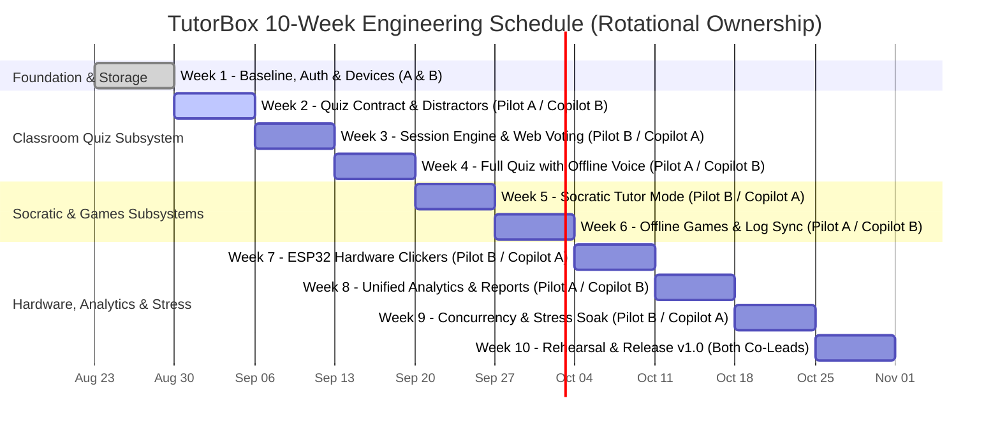

# TutorBox Engineering Roadmap (10-Week Plan)

| 🏠 [TutorBox](../../README.md) | 📚 [Docs](../README.md) | ⚙️ [Backend](../../backend/README.md) | 📱 [PWA](../../pwa/README.md) | 🔌 [Infra](../../infra/README.md) |
| :---: | :---: | :---: | :---: | :---: |

📍 **Docs** › **Milestones** › **Engineering Roadmap** • **Related:** [Week 1 Milestone](week-1-auth-storage.md)

---

This roadmap details the comprehensive 10-week engineering schedule for **TutorBox**, balancing development between **Student A** and **Student B** through a rotating **Pilot / Copilot** structure.

## Table of Contents
- [1. Operating Rules & Team Rotation](#1-operating-rules--team-rotation)
- [2. Engineering Schedule Gantt Chart](#2-engineering-schedule-gantt-chart)
- [3. Weekly Milestone Summary Table](#3-weekly-milestone-summary-table)
- [4. Detailed Weekly Milestone Breakdown](#4-detailed-weekly-milestone-breakdown)
  - [✅ Week 1 — Appliance Baseline & Storage Infrastructure (Completed)](#week-1)
  - [⏳ Week 2 — Quiz Contract & Diagnostic Distractors (Pilot: A · Copilot: B)](#week-2)
  - [⏳ Week 3 — Session Engine & Browser Voting (Pilot: B · Copilot: A)](#week-3)
  - [⏳ Week 4 — Full Quiz Mode with Offline Spanish Voice (Pilot: A · Copilot: B)](#week-4)
  - [⏳ Week 5 — Socratic Tutor Mode (Pilot: B · Copilot: A)](#week-5)
  - [⏳ Week 6 — Offline Primary Games & Log Synchronization (Pilot: A · Copilot: B)](#week-6)
  - [⏳ Week 7 — ESP32 Physical Clickers (Pilot: B · Copilot: A)](#week-7)
  - [⏳ Week 8 — Unified Analytics & Weekly Teacher Report (Pilot: A · Copilot: B)](#week-8)
  - [⏳ Week 9 — Concurrency & Full System Stress Testing (Pilot: B · Copilot: A)](#week-9)
  - [⏳ Week 10 — General Rehearsal, Documentation & Release v1.0 (Both as Co-Leads)](#week-10)
- [5. Ownership Balance at Closing](#5-ownership-balance-at-closing)

---

### 1. Operating Rules & Team Rotation

* **The Rotation Rule (Weeks 2–10)**: Each week has a **Pilot** (owner of architectural decisions and design) and a **Copilot** (implements substantial components of the same subsystem and code-reviews all of the Pilot's pull requests).
* **The Tuesday Presentation Rule**: The **Copilot** defends the weekly milestone to the evaluation jury. Because the engineer who did not lead the design must present, this guarantees deep cross-system understanding across both team members.
* **Hardware-Agnostic Transport**: The voting engine is built behind an abstract `VoteTransport` interface using mobile web clients (PWA) in Weeks 2–4. Physical ESP32 clickers are introduced in Week 7 as an additional transport layer without redesigning session logic.

---

## 2. Engineering Schedule Gantt Chart

---

## 3. Weekly Milestone Summary Table

| Week | Milestone | Key Deliverables & Targets | Pilot / Copilot |
| :---: | :--- | :--- | :---: |
| **1** ✅ | [Appliance Baseline & Storage](week-1-auth-storage.md) | Headless Jetson (RSS $\le 1.0$ GB) + isolated AP + SQLite auth (144 tests, 100% green) | A & B |
| **2** ⏳ | Quiz Contract & Diagnostic Distractors | JSON Schema contract, prompt rejection cycle, SymPy validator, $\ge 50$ questions | **A** / B |
| **3** ⏳ | Session Engine & Browser Voting | Agnostic `VoteTransport`, session engine (>51% rule), A–D web client (15 clients, 0 lost votes) | **B** / A |
| **4** ⏳ | Full Quiz Mode with Offline Spanish Voice | Jetson offline TTS ($\le 3$s latency), error explanation on >51%, classroom HDMI screen | **A** / B |
| **5** ⏳ | Socratic Tutor Mode | Socratic dialogue state machine + SymPy containment (0 direct solutions) + offline PWA | **B** / A |
| **6** ⏳ | Offline Games & Log Sync | `primariaconk.uk` offline, error event normalization, idempotent sync with 0 duplicates | **A** / B |
| **7** ⏳ | ESP32 Hardware Clickers | ESP32 clicker firmware + backend `VoteTransport` + AP fleet association test ($\ge 10$ clickers) | **B** / A |
| **8** ⏳ | Unified Analytics & Weekly Report | Cross-mode error report by concept + printable offline PDF/CSV + backup restoration | **A** / B |
| **9** ⏳ | Concurrency & Full System Stress | Combined load (30 quiz + 10 tutor + games) + 2h stable soak test without OOM/throttling | **B** / A |
| **10** ⏳ | Rehearsal, Documentation & Release v1.0 | User trial report, cold-rebuild runbook, teacher manual ($\le 10$p), 3-min video, tag `v1.0` | Both |

---

## 4. Detailed Weekly Milestone Breakdown

### ✅ Week 1 — Appliance Baseline & Storage Infrastructure (Completed)
* **Focus**: Establish foundational offline infrastructure — headless Jetson Orin Nano, isolated classroom AP, and backend auth/storage.
* **Student A Deliverables**: Monorepo with pre-commit + pytest, FastAPI REST API (`/health`, `/login`, `/users`, `/devices`), SQLite engine with migrations 001–007, 144 passing tests with 100% coverage.
* **Student B Deliverables**: JetPack on NVMe, desktop GUI disabled, 25W mode + persistent `jetson_clocks`, GL-AR300M16 router configured as isolated local AP without WAN.
* **Tuesday Defense**: *"Architecture of an offline educational appliance: from classroom to silicon"*.
* **Key Verification Metrics**: Local CI green with 100% coverage; Jetson headless idle RSS $\le 1.0$ GB; versioned network topology diagram.
* **Detailed Milestone Report**: [Week 1 Milestone Synthesis](week-1-auth-storage.md).

---

### ⏳ Week 2 — Quiz Contract & Diagnostic Distractors (Pilot: A · Copilot: B)
* **Focus**: Establish the core data format uniting the quiz appliance and generate pedagogically valid questions with diagnostic error mapping.
* **Student A (Pilot)**:
  * Formal JSON Schema specification for quiz questions (1 correct option + 3 diagnostic distractors, each mapping to a concrete conceptual misconception and primary-school explanation).
  * LLM generation prompt and automated rejection/regeneration cycle when distractors lack diagnostics or fail schema validation.
* **Student B (Copilot)**:
  * Deterministic SymPy validation pipeline (verifying correct answer is mathematically true and all distractors are false).
  * Handwritten golden test set of 20 benchmark questions for validation baseline; cross-review of prompt engineering.
* **Tuesday Defense (Presented by Copilot B)**: *"Diagnostic Distractors: Wrong answers are the pedagogical content"*
  1. Why random distractors lack educational value.
  2. Forcing LLM generation to target concrete arithmetic and pre-algebra misconceptions.
  3. Qualitative results and error taxonomy from human review of generated question pool.
* **Acceptance Criteria & Deliverables**:
  * Versioned JSON Schema with green automated validation test suite.
  * $\ge 50$ generated questions, with $\ge 90\%$ of distractors classified as valid in human pedagogical review.

---

### ⏳ Week 3 — Session Engine & Browser Voting (Pilot: B · Copilot: A)
* **Focus**: The complete question lifecycle (open $\to$ vote $\to$ aggregate $\to$ decide) using web browsers as the initial transport layer.
* **Student B (Pilot)**:
  * Device-agnostic `VoteTransport` abstract interface.
  * Lightweight mobile web voting client (A–D buttons) for student smartphones/tablets.
  * Teacher management web app to select topics and launch quiz sessions.
* **Student A (Copilot)**:
  * Real-time session engine (voting window timer, vote aggregation, distribution calculation).
  * Implementation of the **>51% Rule** with documented edge cases (ties, partial turnout).
  * Database persistence of each student vote for longitudinal analytics.
* **Tuesday Defense (Presented by Copilot A)**: *"From Button to Pedagogical Decision: Anatomy of a Quiz Turn"*
  1. Data flow of a single vote from client touch to server aggregation.
  2. Rationale behind the 51% threshold and edge-case behavior.
  3. Benefits of decoupling session logic behind an abstract transport interface.
* **Acceptance Criteria & Deliverables**:
  * Live 5-question test match conducted with 15 simultaneous web clients with 0 lost votes.
  * Unit test suite verifying `VoteTransport` against simulated mock transports.

---

### ⏳ Week 4 — Full Quiz Mode with Offline Spanish Voice (Pilot: A · Copilot: B)
* **Focus**: Complete the end-to-end Classroom Quiz mode with spoken conceptual explanations.
* **Student A (Pilot)**:
  * Offline Spanish TTS engine on Jetson Orin Nano integrated to read distractor explanations out loud.
  * Text adaptation for primary-school clarity; synthesis latency and RAM footprint profiling.
* **Student B (Copilot)**:
  * Classroom HDMI display interface (presenting question, timer, and aggregate voting charts) decoupled from teacher admin portal.
  * Physical audio output verification and integration of TTS triggers into the match flow.
* **Tuesday Defense (Presented by Copilot B)**: *"Voice Feedback: When the system speaks and when it stays silent"*
  1. Offline TTS architecture, acoustic model selection, and memory impact on Jetson.
  2. Voice explanation as a targeted intervention rather than continuous narration.
  3. End-to-end live demonstration of a complete quiz turn.
* **Acceptance Criteria & Deliverables**:
  * 10-question match where TTS speaks explanations strictly when $>51\%$ choose a distractor and remains silent otherwise.
  * Text-to-audio synthesis latency $\le 3$ seconds.
  * Updated RAM memory profile with co-resident TTS, SLM (`llama.cpp`), and FastAPI.

---

### ⏳ Week 5 — Socratic Tutor Mode (Pilot: B · Copilot: A)
* **Focus**: Launch Mode 2 (Conversational Math Practice) reusing the local inference backend.
* **Student B (Pilot)**:
  * Installable offline PWA tutor client with student login and persistent session state across visits.
  * Dialogue turn telemetry logging (concept, error type, scaffolding strategy applied).
* **Student A (Copilot)**:
  * Socratic dialogue management engine with bounded 4-tier hint escalation ladder ($0 \to 3$).
  * SymPy containment guardrail mechanically blocking direct solution leakage.
  * Initial labeled problem bank of $\ge 40$ arithmetic and pre-algebra questions.
* **Tuesday Defense (Presented by Copilot A)**: *"Socratic Tutoring with Mechanical Guarantees"*
  1. Why the tutor never reveals answers and how mechanical containment replaces prompt reliance.
  2. Deterministic hint escalation ladder and termination bounds.
  3. Architectural differences between Quiz mode and Tutor mode.
* **Acceptance Criteria & Deliverables**:
  * Automated test suite of 30 dialogue turns including 10 adversarial "give me the answer" probes resulting in 0 solution leaks.
  * PWA tutor successfully installed and functioning offline on 3 test devices.
  * Problem bank of $\ge 40$ validated questions in CI.

---

### ⏳ Week 6 — Offline Primary Games & Log Synchronization (Pilot: A · Copilot: B)
* **Focus**: Mode 3 (`primariaconk.uk`) operating 100% offline with resilient data synchronization.
* **Student A (Pilot)**:
  * Ingestion REST endpoint normalizing game error events to the unified concept taxonomy.
  * Idempotent event deduplication based on unique client event identifiers.
* **Student B (Copilot)**:
  * Host `primariaconk.uk` games directly from the appliance without external CDN dependencies.
  * Client-side local error logging (IndexedDB/LocalStorage) with automatic background sync upon AP reconnection.
* **Tuesday Defense (Presented by Copilot B)**: *"Opportunistic Synchronization: Data that survives disconnection"*
  1. Offline-first game hosting and caching architecture.
  2. Client-side event queuing and deduplicated background synchronization.
  3. Conceptual error alignment across Quiz, Tutor, and Games modes.
* **Acceptance Criteria & Deliverables**:
  * Games playable completely offline from the appliance on 3 client devices.
  * Disconnection sync test: play offline, reconnect to AP, verify 100% of error events ingested with 0 duplicates.

---

### ⏳ Week 7 — ESP32 Physical Clickers (Pilot: B · Copilot: A)
* **Focus**: Introduce physical hardware clickers as an additional transport without modifying session logic.
* **Student B (Pilot)**:
  * ESP32 firmware (Wi-Fi AP association, persistent device ID, 4 physical buttons, LED vote confirmation, auto-reconnect).
  * Physical assembly and flashing of the initial clicker hardware batch.
* **Student A (Copilot)**:
  * Backend `VoteTransport` driver for ESP32 clickers.
  * Fleet association stress test (15 simultaneous devices on the router) to establish physical connection limits and measure latency vs. web clients.
* **Tuesday Defense (Presented by Copilot A)**: *"One More Transport: Integrating hardware without redesigning the system"*
  1. Architectural modularity allowing hardware integration without session engine refactoring.
  2. Router AP association limits and latency comparison (ESP32 vs. Web PWA).
  3. Reliability and classroom ergonomics of physical clickers.
* **Acceptance Criteria & Deliverables**:
  * Live 10-question match conducted with $\ge 10$ physical ESP32 clickers with 0 lost votes.
  * Fleet benchmark report detailing connection limits and packet latency.

---

### ⏳ Week 8 — Unified Analytics & Weekly Teacher Report (Pilot: A · Copilot: B)
* **Focus**: Synthesize cross-mode error logs into actionable pedagogical recommendations for teachers.
* **Student A (Pilot)**:
  * Weekly reporting engine computing top error concepts, students requiring remediation, and suggested review order via deterministic SQL queries.
* **Student B (Copilot)**:
  * Dashboard visualization + printable PDF/CSV report export without internet access.
  * Appliance telemetry alerts (thermal, memory, disconnected clickers) and automated nightly backup with verified restoration script.
* **Tuesday Defense (Presented by Copilot B)**: *"From Errors to Lesson Planning: The Weekly Report"*
  1. Attribution of student errors to conceptual categories across all 3 operating modes.
  2. Pedagogical decisions enabled by weekly error metrics.
  3. Live report generation demo using accumulated longitudinal test data.
* **Acceptance Criteria & Deliverables**:
  * Single CLI command generating deterministic weekly report from fixture data.
  * Clean, formatted PDF report exported and printable offline.
  * Verified database restoration from automated backup.

---

### ⏳ Week 9 — Concurrency & Full System Stress Testing (Pilot: B · Copilot: A)
* **Focus**: Prove the appliance withstands real classroom load with all 3 operating modes running concurrently.
* **Student B (Pilot)**:
  * 2-hour soak test with real client devices, continuous `tegrastats` monitoring, and verification of zero CPU/GPU throttling, OOM panics, or swap thrashing.
  * Measurement of router wireless bandwidth and packet saturation.
* **Student A (Copilot)**:
  * Combined load generator simulating 30 quiz voters + 10 active tutor sessions + background game ingestion.
  * Profiling of p50 and p95 latency percentiles and strict verification of tenant data isolation under concurrency.
* **Tuesday Defense (Presented by Copilot A)**: *"Performance Results: The appliance under classroom load"*
  1. Identification of empirical bottlenecks under full load.
  2. Thermal and RAM stability over the 2-hour soak test.
  3. Evidence-backed upper limit of supported concurrent classroom users.
* **Acceptance Criteria & Deliverables**:
  * Full combined load report demonstrating 0 lost votes and 0 dropped tutor turns.
  * 2-hour soak test logs with attached thermal, CPU, and RAM graphs proving zero OOM errors.

---

### ⏳ Week 10 — General Rehearsal, Documentation & Release v1.0 (Both as Co-Leads)
* **Focus**: Final system integration, user rehearsal, complete operational documentation, and release tagging.
* **Student A (Co-Lead)**:
  * Full rehearsal with adult participants executing scripted student scenarios across all 3 modes.
  * Audit log analysis and generation of anonymized data export for capstone thesis.
* **Student B (Co-Lead)**:
  * Cold-rebuild runbook verified via blind cross-execution (executed by Student A without external guidance).
  * Teacher quick-start manual ($\le 10$ pages), 3-minute video walkthrough, and Git release tag `v1.0` with SHA-256 checksums.
* **Tuesday Defense (Presented by Both)**: *"Final Demonstration and Lessons Learned"*
  1. Live demonstration of all 3 operating modes.
  2. Final verification metrics benchmarked against original project goals.
  3. Technical limitations and future research directions.
* **Acceptance Criteria & Deliverables**:
  * User trial report and anonymized research dataset.
  * Verified cold-rebuild runbook, teacher manual ($\le 10$p), demo video, and signed `v1.0` release tag.

---

## 5. Ownership Balance at Closing

| Engineer | Modules Piloted | Modules Co-Piloted | Total Subsystems Covered |
| :--- | :--- | :--- | :--- |
| **Student A** | Quiz Gen & Distractors (W2), Voice TTS (W4), Games Sync (W6), Analytics (W8), Rehearsal (W10) | Base Infra (W1), Session Engine (W3), Socratic Tutor (W5), ESP32 (W7), Stress (W9) | **10 / 10** |
| **Student B** | Session Engine (W3), Socratic Tutor (W5), ESP32 (W7), Stress (W9), Rehearsal (W10) | Base Infra (W1), Quiz Gen (W2), Voice TTS (W4), Games Sync (W6), Analytics (W8) | **10 / 10** |

This guarantees that **100% of the codebase** is co-owned, thoroughly peer-reviewed, and defendable by either engineer before the evaluation jury.
