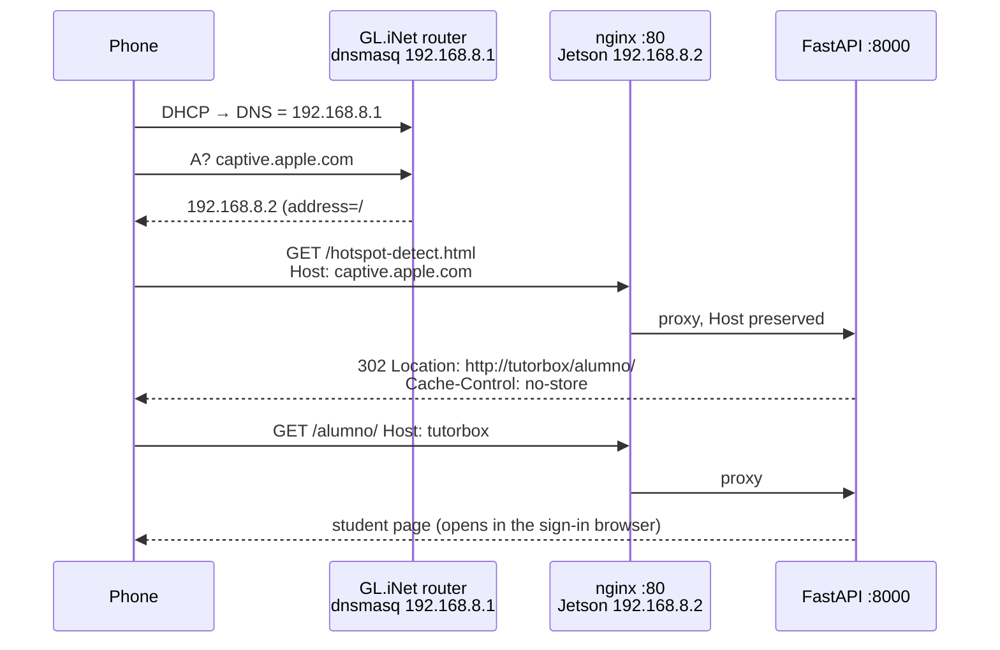

# Captive Portal — Auto-Open the Student Page on Wi-Fi Join

<div align="center">

| 🏠 [TutorBox](../README.md) | 📚 [Docs](../docs/README.md) | ⚙️ [Backend](../backend/README.md) | 📱 [PWA](../pwa/README.md) | 🔌 [Infra](README.md) |
| :---: | :---: | :---: | :---: | :---: |

📍 [Infra](README.md) › **Captive Portal** • **Related:** [GL.iNet Setup](glinet/initial.md) • [Hardware Topology](../docs/architecture/hardware-topology.md) • [System API](../docs/api/system.md)

</div>

---

When a phone joins the `TutorBox` Wi-Fi, its browser opens `http://tutorbox/alumno/` by itself —
no address to type, no QR code. This page explains the mechanism, the three pieces that make it
work, what it can *not* do, and how to verify it.

## Table of Contents
- [1. How Phones Detect a Captive Portal](#1-how-phones-detect-a-captive-portal)
- [2. The Three Pieces](#2-the-three-pieces)
- [3. Backend Behaviour](#3-backend-behaviour)
- [4. Port 80 on the Jetson (nginx + systemd)](#4-port-80-on-the-jetson-nginx--systemd)
- [5. Router Prerequisites](#5-router-prerequisites)
- [6. Limitations & Field Notes](#6-limitations--field-notes)
- [7. Verification](#7-verification)

---

## <a id="1-how-phones-detect-a-captive-portal"></a>1. How Phones Detect a Captive Portal

Every mainstream OS fires a plain-HTTP request to a fixed URL the moment it associates. If the answer
is *exactly* what it expects, the network is "online"; if it gets a redirect (or any other page), the OS
assumes a hotel-style sign-in page and opens it in a dedicated mini-browser:

| Client | Probe (all plain `http://`, port 80) | Expects | TutorBox answers |
| :--- | :--- | :--- | :--- |
| Android, ChromeOS, Chrome | `connectivitycheck.gstatic.com/generate_204` (also `android.com`, `clients3.google.com`, `play.googleapis.com`, `www.google.com/gen_204`) | `204 No Content` | `302 → /alumno/` |
| Xiaomi / Huawei / Samsung builds | `connect.rom.miui.com/generate_204`, `connectivitycheck.platform.hicloud.com/generate_204`, … | `204` | `302 → /alumno/` |
| iOS / macOS | `captive.apple.com/hotspot-detect.html`, `www.apple.com/library/test/success.html` | `<TITLE>Success</TITLE>` | `302 → /alumno/` |
| Windows 10/11 | `www.msftconnecttest.com/connecttest.txt`, `/redirect`; Win 7/8 `www.msftncsi.com/ncsi.txt` | `Microsoft Connect Test` | `302 → /alumno/` |
| Firefox | `detectportal.firefox.com/success.txt`, `/canonical.html` | `success` | `302 → /alumno/` |
| NetworkManager / KDE / GNOME | `connectivity-check.ubuntu.com/`, `networkcheck.kde.org/`, `nmcheck.gnome.org/check_network_status.txt` | vendor text | `302 → /alumno/` |

What happens next differs slightly per OS:

- **iOS** opens the *Captive Network Assistant* (CNA) sheet automatically on every join.
- **Android** opens `CaptivePortalLogin` automatically when the user joins from the Wi-Fi picker; on an
  automatic reconnect it posts a "Sign in to network" notification instead — tapping it opens the page.
- **Windows** shows an "Action needed / Open browser" toast; clicking it opens the default browser.

---

## <a id="2-the-three-pieces"></a>2. The Three Pieces



1. **Router DNS** answers every name with the Jetson's address ([§5](#5-router-prerequisites)).
2. **nginx on :80** forwards to the backend — probes never use another port ([§4](#4-port-80-on-the-jetson-nginx--systemd)).
3. **Backend** answers the probe paths — and any unknown page on a hijacked name — with a `302` ([§3](#3-backend-behaviour)).

Router-level interception (DNAT) is *not* an option here: Wi-Fi clients and the Jetson sit in the same
bridge (`br-lan`), so their traffic is switched at layer 2 and never crosses the router's netfilter.

---

## <a id="3-backend-behaviour"></a>3. Backend Behaviour

Implemented in [`backend/src/api/captive.py`](../backend/src/api/captive.py), wired from
`api/router.py` and `main.py`; unit-tested in `backend/tests/api/test_captive.py`.

| Request | Answer |
| :--- | :--- |
| `GET`/`HEAD` on a probe path (`/generate_204`, `/gen_204`, `/hotspot-detect.html`, `/library/test/success.html`, `/connecttest.txt`, `/ncsi.txt`, `/redirect`, `/success.txt`, `/canonical.html`, `/check_network_status.txt`) — **any** `Host` | `302 Found`, `Location: <CAPTIVE_PORTAL_URL>`, `Cache-Control: no-store` |
| `GET /` with a **foreign** `Host` (e.g. a student typing `google.com`, NetworkManager's root probe) | same `302` to the canonical URL, so the browser keeps one origin for its stored login |
| `GET /` with an appliance `Host` | `307 → /alumno/` (unchanged) |
| Unknown page (`404`) with a **foreign** `Host`, `GET`/`HEAD` | same `302` — the walled garden: any address a student types lands on the student page |
| Unknown page with an appliance `Host`, or any method other than `GET`/`HEAD` | plain `{"detail": "Not Found"}` |
| Anything under `/api/`, `/health`, `/maestro/`, `/alumno/`, `/pantalla/`, `/static/`, `/tareas/`, `/descargas/` | **never redirected** — API 404s keep their JSON body; a missing asset stays a 404 |

*Appliance host* = `localhost`, any IP literal (`192.168.8.2`, `[fd00::2]`), or the hostname of
`CAPTIVE_PORTAL_URL` (`tutorbox` by default). Everything else only resolves to the box because of the
catch-all DNS, hence "foreign". The `/api/*` exemption matters for the ESP32 clickers: their HTTP client
treats any non-`200` as a failure ([ESP32 protocol](../docs/architecture/esp32-protocol.md)).

**Configuration** (`.env`, see [`.env.example` §6](../.env.example)):

| Variable | Default | Effect |
| :--- | :--- | :--- |
| `CAPTIVE_PORTAL_ENABLED` | `true` | `false` answers probes and foreign-host 404s with a plain 404 (phones just say "no internet"). |
| `CAPTIVE_PORTAL_URL` | `http://tutorbox/alumno/` | Absolute redirect target. Use `http://192.168.8.2/alumno/` if the router does not resolve `tutorbox`. Its hostname is always treated as the appliance, so a misconfigured value cannot loop. |

The probes are hidden from `/openapi.json`. The same behaviour is active on the dev port `:8000`, which
makes the curl checks in [§7](#7-verification) runnable on a laptop.

---

## <a id="4-port-80-on-the-jetson-nginx--systemd"></a>4. Port 80 on the Jetson (nginx + systemd)

Two files, both with their install commands in their header comments:

- [`infra/nginx/tutorbox.conf`](nginx/tutorbox.conf) — `listen 80 default_server; server_name _;`
  proxying to `127.0.0.1:8000` with `proxy_set_header Host $host` (the backend needs the original
  name to tell appliance from foreign hosts) and `proxy_redirect off` (the backend writes its own
  `Location`). Remove Ubuntu's `sites-enabled/default`, which also claims `default_server`.
  **Install `nginx-light` while the Jetson still has an internet uplink** — the classroom has none.
- [`infra/systemd/tutorbox-backend.service`](systemd/tutorbox-backend.service) — uvicorn on
  `0.0.0.0:8000` from this checkout as user `damarti` (three `ADJUST` lines for another layout), single
  worker, no `EnvironmentFile` (the app reads `<repo>/.env` itself). Port `8000` stays reachable so dev
  URLs and the planned clicker base URL keep working; `:80` is the classroom-facing address.

uvicorn trusts `X-Forwarded-*` from `127.0.0.1` by default, so nothing changes in the backend command.

---

## <a id="5-router-prerequisites"></a>5. Router Prerequisites

All in [`infra/glinet/initial.md` §5](glinet/initial.md#5-step-3--lan-dhcp--the-jetson-static-lease); the
two that used to be optional are now **required**:

| Setting | Why the portal needs it |
| :--- | :--- |
| Static lease `192.168.8.2` with `name='tutorbox'` and `dns='1'` | The redirect target `http://tutorbox/alumno/` must resolve, and to a fixed address. |
| Catch-all `address='/#/192.168.8.2'` | Probe names (`captive.apple.com`, …) must resolve *to the Jetson* rather than fail — a DNS failure means "no internet", not "sign-in page". |
| `noresolv='1'`, no upstream (§7) | Keeps every lookup local; with the catch-all there is nothing to forward anyway. |

Not used, on purpose:

- **DHCP option 114 / RFC 8910** ("captive-portal API URL"). Modern phones honour it, but the API it
  points to (RFC 8908) must be served over HTTPS with a trusted certificate — impossible on an offline
  LAN. The legacy HTTP probes above are what every OS still falls back to.
- **IPv6 tweaks.** The catch-all only answers `A` records; `AAAA` lookups return no address, so probes
  stay on IPv4. Leave `ip6assign`/RA alone unless devices misbehave.

---

## <a id="6-limitations--field-notes"></a>6. Limitations & Field Notes

- **The sign-in browser is a sandbox.** iOS CNA and Android `CaptivePortalLogin` keep their own
  cookies and `localStorage`. The student can log in and vote there, but the `tb_token` stored inside
  the sandbox is not shared with Safari/Chrome — opening the page later in the real browser means
  logging in again.
- **The network stays "no internet".** TutorBox never answers the probe with the expected `204`/`Success`
  (doing so once the page is shown would make the OS *close* the sign-in browser mid-quiz). Phones keep
  a "Sign in to network" / "No internet" badge; students can tap **Use without internet** (iOS) or
  **Use this network as is** (Android ⋮ menu) and continue in the normal browser at
  `http://tutorbox/alumno/`.
- **Android + mobile data.** Until the student accepts the network, an unvalidated Wi-Fi is not
  Android's default route; Chrome may resolve `tutorbox` over cellular and fail. Accepting the network
  or turning mobile data off fixes it. Android **Private DNS** in *strict* mode (a named DoT server)
  blocks detection entirely — use *Automatic*.
- **Auto-open needs a manual join on Android.** Auto-reconnects only show a notification.
- **HTTPS probes cannot be intercepted** (Android also tries `https://www.google.com/generate_204`).
  They fail fast — nothing listens on `:443` — and do not prevent the HTTP-probe redirect.
- **The catch-all affects the Jetson too.** Its wired NIC uses the router for DNS, so during
  development with the home Wi-Fi uplink still up, public names may resolve to `192.168.8.2` depending
  on interface priority. Expected offline; confusing on the bench.
- **Cached probes.** Some phones cache a successful probe for minutes. When testing, *forget* the
  network and rejoin instead of toggling Wi-Fi.

---

## <a id="7-verification"></a>7. Verification

**Backend (any host, dev port is fine):**

```bash
H=127.0.0.1:8000     # or 192.168.8.2 once nginx is up
curl -sI -H 'Host: connectivitycheck.gstatic.com' http://$H/generate_204 | grep -E '^(HTTP|Location|Cache)'
#  HTTP/1.1 302 Found · Location: http://tutorbox/alumno/ · Cache-Control: no-store
curl -sI -H 'Host: captive.apple.com' http://$H/hotspot-detect.html | head -1     # 302
curl -sI -H 'Host: www.google.com'    http://$H/search               | head -1     # 302 (walled garden)
curl -si -H 'Host: 192.168.8.2'       http://$H/search               | tail -1     # {"detail":"Not Found"}
curl -si -H 'Host: captive.apple.com' http://$H/api/v1/nope          | tail -1     # {"detail":"Not Found"} — never 302
curl -s  -o /dev/null -w '%{http_code}\n' http://$H/api/v1/session/current      # 200/404, as before
```

**Router** (from any device on the classroom Wi-Fi):

```bash
nslookup captive.apple.com 192.168.8.1      # → 192.168.8.2
nslookup tutorbox 192.168.8.1               # → 192.168.8.2
```

**Phones** — forget the network first so DNS/probe caches are cold:

- [ ] iPhone: join → the CNA sheet shows the student page; a student can log in and vote from it.
- [ ] Android: join from the Wi-Fi picker → `CaptivePortalLogin` opens the student page.
- [ ] Windows laptop: "Open browser" toast → student page.
- [ ] After **Use without internet** / **Use this network as is**, `http://tutorbox/alumno/` works in the normal browser.
- [ ] Clicker-style check from a laptop: `curl -s -o /dev/null -w '%{http_code}' http://192.168.8.2/api/v1/session/current` is never `302`.

---

## Next Steps

* **[GL.iNet Initial Setup](glinet/initial.md)**: Apply the static lease and catch-all DNS the portal depends on.
* **[System & Health API](../docs/api/system.md)**: The unversioned probe endpoints alongside `/health`.
* **[PWA Guide](../pwa/README.md)**: What the student page does once it opens.
